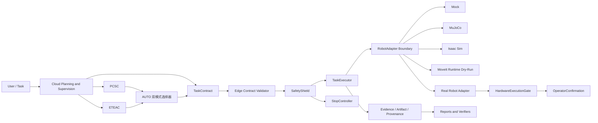

# BIG-small

BIG-small 是一个面向边缘智能场景的小型机械臂云边协同控制系统，采用云端智能规划、边缘安全执行架构。

## 1. 项目概述

本项目研究云端大模型/规划服务与边缘机器人运行时的协同控制。云端负责高层任务规划、周期监督、局部重规划和风险决策；边缘端负责契约校验、状态机执行、安全盾检查、恢复策略和最终执行拒绝权。

系统实现两类云边协同模式：`PCSC` 周期云端监督和 `ETEAC` 事件触发边缘自治。`AUTO` 双模式选择器只在两者之间做受限切换，不是第三种执行引擎。

当前验证边界包括 Mock、MuJoCo、Isaac Sim、ROS 2 / MoveIt safety、Synthetic Dry-Run 和 MoveIt Runtime Dry-Run。真实机械臂 read-only 和 motion 验证尚未开始。

## 2. 当前状态

| 能力层 | 当前状态 | 是否涉及真实硬件 |
| --- | --- | --- |
| Core runtime | Accepted | No |
| PCSC / ETEAC / AUTO | Accepted | No |
| Phase 8 experiment platform | Accepted | No |
| MuJoCo | Accepted | No |
| ROS 2 / MoveIt safety | Accepted | No |
| Isaac Sim | Accepted | No |
| Cross-backend | Accepted | No |
| Synthetic Dry-Run | Accepted | No |
| MoveIt Runtime Dry-Run | Accepted | No |
| Real Robot Read-Only | Not started | Yes |
| Real Robot Motion | Not started | Yes |

当前权威项目状态包含 `PHASE9_2_ACCEPTED` 和 `PHASE10_MOVEIT_DRY_RUN_ACCEPTED`。这不等于真实机械臂验证完成：`real_robot_validation=NOT_STARTED`，当前最高真实硬件验收级别为 `NONE`，没有连接真实控制器，也没有执行物理运动。

## 3. 核心能力

- **Contracts and traceability**: `TaskContract`、`Telemetry`、`CloudCommand`、`FailureSummary` 等 Pydantic 模型提供任务版本、命令序号、时间戳和 schema 追踪。
- **Edge runtime**: `TaskExecutor`、`TaskStateMachine`、Repository、AuditLog 和 restart recovery 组成边缘执行闭环。
- **SafetyShield**: 在技能执行前后检查速度、工作空间、碰撞、急停、过期数据和故障状态，边缘端拥有最终拒绝权。
- **Cloud planning and supervision**: 云端规划、周期监督、失败摘要和局部重规划只生成高层契约或监督决策。
- **Event-triggered autonomy**: `ETEAC` 通过事件检测、本地恢复预算、局部重规划和 outbox 完成边缘自治流程。
- **Skill Cache and risk scheduling**: Skill Cache 缓存高层技能模板；RiskEvaluator 和 AUTO 选择器在安全边界内选择协同模式。
- **Experiment platform**: Phase 8+ 提供虚拟时钟、网络故障、重启恢复、消融实验、统计汇总和 artifact provenance。
- **Simulation backends**: MuJoCo 和 Isaac Sim 用于物理仿真与跨后端对比，不是硬件验证。
- **ROS 2 / MoveIt integration**: ROS 2 runtime 和 MoveIt safety 已验证；MoveIt Runtime Dry-Run 只规划，不调用 execute。
- **Real robot safety readiness**: Phase 10 提供配置门禁、HardwareExecutionGate、OperatorConfirmation 和 sequential acceptance levels。

## 4. 系统架构



完整架构、时序图和边界说明见 [docs/architecture.md](docs/architecture.md)。

## 5. 快速开始

```bash
python3 -m venv .venv
. .venv/bin/activate
python -m pip install -e ".[dev,sim-mujoco,sim-analysis]"
python -m pytest -q
python scripts/verify_project.py --profile ci
```

常用入口：

```bash
python scripts/run_fixed_pick_place.py --adapter mock
python scripts/verify_phase9.py
python scripts/verify_phase10_0.py
python scripts/verify_phase10_1.py
python scripts/verify_phase10_2a.py --skip-runtime
```

MoveIt Runtime Dry-Run 需要 ROS 2 / MoveIt 环境：

```bash
source scripts/phase9/activate_ros2_moveit_env.sh
python scripts/verify_phase10_moveit_dry_run.py --output artifacts/phase10/moveit_dry_run
```

更多命令见 [docs/verification.md](docs/verification.md) 和 [scripts/README.md](scripts/README.md)。

## 6. 验证配置

- **CI-safe**: compile、ruff、mypy、pytest、文档检查、Mock/MuJoCo/Phase 10 软件门禁，不需要 Isaac、MoveIt 或真实硬件。
- **Environment-specific**: ROS 2 / MoveIt、Isaac Sim 和 cross-backend verifier 需要对应主机环境和 artifacts。
- **Real-hardware-only**: Level 0+ 真实机械臂验收必须由现场操作员执行，默认不会由 CI 或统一入口自动运行。

## 7. 文档导航

- [docs/README.md](docs/README.md): 完整文档门户。
- [docs/architecture.md](docs/architecture.md): 当前权威系统架构。
- [docs/project_status.md](docs/project_status.md): 能力域状态、verifier 和 evidence。
- [docs/repository_structure.md](docs/repository_structure.md): 仓库目录职责。
- [docs/verification.md](docs/verification.md): 验证 profile 和命令说明。
- [docs/real_robot_safety.md](docs/real_robot_safety.md): 真实机械臂安全边界。
- [docs/roadmap.md](docs/roadmap.md): 后续路线图。
- [CONTRIBUTING.md](CONTRIBUTING.md): 贡献和提交规范。
- [CHANGELOG.md](CHANGELOG.md): 阶段变更记录。

## 8. 安全声明

浏览器、云端模型和用户自然语言任务不能直接驱动关节。所有动作必须经过 `TaskContract`、`EdgeContractValidator`、`SafetyShield`、`TaskExecutor` 和对应 adapter 边界。

Synthetic Dry-Run 和 MoveIt Runtime Dry-Run 都不是硬件执行。`hardware_motion_observed=false` 表示没有观察到真实机械臂运动，也不构成 read-only 或 motion 验收。

在完成 Level 0 read-only 验收前，不得开展任何运动测试。首次真实运动测试必须现场隔离、急停可达、双人监督，且人员不得进入工作空间。

## 9. 项目用途

本仓库用于云边协同机械臂控制系统的研究、仿真验证、运行证据管理和真实硬件接入前安全门禁建设。仓库当前没有新增许可证声明；使用边界以本 README、文档和配置中的安全说明为准。
