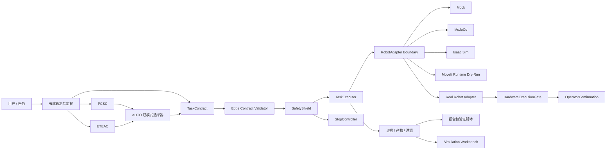

# BIG-small

BIG-small 是一个面向边缘智能场景的小型机械臂云边协同控制系统，采用云端智能规划、边缘安全执行架构。

## 1. 项目概述

本项目研究云端大模型/规划服务与边缘机器人运行时的协同控制。云端负责高层任务规划、周期监督、局部重规划和风险决策；边缘端负责契约校验、状态机执行、安全盾检查、恢复策略和最终执行拒绝权。

系统实现两类云边协同模式：`PCSC` 周期云端监督和 `ETEAC` 事件触发边缘自治。`AUTO` 双模式选择器只在两者之间做受限切换，不是第三种执行引擎。

当前验证边界包括 Mock、MuJoCo、Isaac Sim、ROS 2 / MoveIt 安全验证、Synthetic Dry-Run、MoveIt Runtime Dry-Run、Phase 11 Simulation Workbench、Phase 11.1 Simulation Runtime、Phase 11.2 Model Control Center 和 Phase 12 Final Evaluation。真实机械臂只读框架只完成 fake/framework 验证，真实控制器连接和运动验证尚未开始。

## 2. 当前状态

| 能力层 | 当前状态 | 是否涉及真实硬件 |
| --- | --- | --- |
| 核心运行时 | 已验收 | 否 |
| PCSC / ETEAC / AUTO | 已验收 | 否 |
| Phase 8 实验平台 | 已验收 | 否 |
| MuJoCo | 已验收 | 否 |
| ROS 2 / MoveIt 安全验证 | 已验收 | 否 |
| Isaac Sim | 已验收 | 否 |
| 跨后端对比 | 已验收 | 否 |
| Synthetic Dry-Run | 已验收 | 否 |
| MoveIt Runtime Dry-Run | 已验收 | 否 |
| Simulation Workbench | Phase 11 已实现 | 否 |
| Simulation Runtime | Phase 11.1 已实现 | 否 |
| Model Control Center | Phase 11.2 已接受 | 否 |
| Simulation AI Console | Phase 11.2 已接受 | 否 |
| Phase 12 Final Evaluation | smoke/validation/full 分层 | 否 |
| 真实机械臂只读 | 未开始 | 是 |
| 真实机械臂运动 | 未开始 | 是 |

当前权威项目状态见 [docs/current_authoritative_status.md](docs/current_authoritative_status.md)。已接受状态包含 `PHASE9_2_ACCEPTED`、`PHASE10_MOVEIT_DRY_RUN_ACCEPTED`、`PHASE10_2B_CONSOLE_ACCEPTED`、`PHASE10_LEVEL0_FRAMEWORK_ACCEPTED`、`PHASE11_SIMULATION_WORKBENCH_ACCEPTED`、`PHASE11_1_SIMULATION_RUNTIME_ACCEPTED`、`PHASE11_2_MODEL_CONTROL_CENTER_ACCEPTED` 和 `PHASE11_2_SIMULATION_AI_CONSOLE_ACCEPTED`。这不等于真实机械臂验证完成：`real_robot_validation=NOT_STARTED`，当前最高真实硬件验收级别为 `NONE`。仓库没有连接真实控制器，也没有执行物理运动。

## 3. 核心能力

- **契约与追踪**：`TaskContract`、`Telemetry`、`CloudCommand`、`FailureSummary` 等 Pydantic 模型记录任务版本、命令序号、时间戳和结构版本。
- **边缘运行时**：`TaskExecutor`、`TaskStateMachine`、Repository、AuditLog 和重启恢复组成边缘执行闭环。
- **安全盾**：技能执行前后检查速度、工作空间、碰撞、急停、过期数据和故障状态。边缘端保留最终拒绝权。
- **云端规划与监督**：云端规划、周期监督、失败摘要和局部重规划只生成高层契约或监督决策。
- **事件触发自治**：`ETEAC` 通过事件检测、本地恢复预算、局部重规划和 outbox 完成边缘自治流程。
- **技能缓存与风险调度**：Skill Cache 缓存高层技能模板；RiskEvaluator 和 AUTO 选择器只在安全边界内选择协同模式。
- **实验平台**：Phase 8 之后提供虚拟时钟、网络故障、重启恢复、消融实验、统计汇总和证据溯源。
- **仿真后端**：MuJoCo 和 Isaac Sim 用于物理仿真与跨后端对比，不构成硬件验证。
- **ROS 2 / MoveIt 集成**：ROS 2 运行时和 MoveIt 安全验证已完成；MoveIt Runtime Dry-Run 只规划，不调用 execute。
- **仿真工作台**：Phase 11 提供 S01-S15 场景浏览、配置编辑、Batch、Sweep、多 seed、模式比较、跨后端比较、实时监控、指标分析、复现和导出。
- **仿真运行时**：Phase 11.1 提供异步队列、SQLite 持久化、worker lease、cancel、timeout、retry、恢复、持久 WebSocket replay 和 MuJoCo runtime acceptance。
- **模型控制中心**：Phase 11.2 提供 Planner profile、secret 安全、endpoint policy、Ollama 管理和 planner dry-run；本地模型 runtime 尚未接受。
- **最终评估**：Phase 12 提供 RQ1-RQ7、F01-F20、统计分析、图表、表格、论文素材和答辩包导出。
- **真机安全准备**：Phase 10 提供配置门禁、HardwareExecutionGate、OperatorConfirmation 和分级验收。

## 4. 系统架构



完整架构、时序图和边界说明见 [docs/architecture.md](docs/architecture.md)。

## 5. 快速开始

```bash
# 快速开始：安装仿真和分析依赖，仅运行软件侧验证。
python3 -m venv .venv
. .venv/bin/activate
python -m pip install -e ".[dev,sim-mujoco,sim-analysis]"
python -m pytest -q
python scripts/verify_project.py --profile ci
```

常用入口：

```bash
# 常用入口：只运行 Mock、仿真和只读验证，不连接真实控制器。
python scripts/run_fixed_pick_place.py --adapter mock
python scripts/verify_phase9.py
python scripts/verify_phase10_0.py
python scripts/verify_phase10_1.py
python scripts/verify_phase10_2a.py --skip-runtime
python scripts/verify_phase11_simulation_workbench.py --skip-e2e
python scripts/verify_phase11_1_simulation_runtime.py --ci
python scripts/verify_phase11_2_model_control.py --ci
python scripts/run_phase12_experiments.py --profile smoke
python scripts/analyze_phase12_results.py --profile smoke
python scripts/export_phase12_thesis_assets.py --profile smoke
python scripts/verify_phase12.py --smoke
```

MoveIt Runtime Dry-Run 需要 ROS 2 / MoveIt 环境：

```bash
# MoveIt dry-run 只做规划安全验证，不调用 execute。
source scripts/phase9/activate_ros2_moveit_env.sh
python scripts/verify_phase10_moveit_dry_run.py --output artifacts/phase10/moveit_dry_run
```

更多命令见 [docs/verification.md](docs/verification.md) 和 [scripts/README.md](scripts/README.md)。

## 6. 验证配置

- **CI 可运行**：compile、ruff、mypy、pytest、文档检查、Mock/MuJoCo/Phase 10 软件门禁，不需要 Isaac、MoveIt 或真实硬件。
- **依赖环境**：ROS 2 / MoveIt、Isaac Sim 和跨后端验证需要对应主机环境和 artifacts。
- **仅限真实硬件现场**：Level 0+ 真实机械臂验收必须由现场操作员执行，默认不会由 CI 或统一入口自动运行。

## 7. 文档导航

- [docs/README.md](docs/README.md): 完整文档门户。
- [docs/architecture.md](docs/architecture.md): 当前权威系统架构。
- [docs/project_status.md](docs/project_status.md): 能力域状态、验证入口和证据。
- [docs/current_authoritative_status.md](docs/current_authoritative_status.md): 当前唯一权威状态入口。
- [docs/repository_structure.md](docs/repository_structure.md): 仓库目录职责。
- [docs/verification.md](docs/verification.md): 验证 profile 和命令说明。
- [docs/simulation_workbench.md](docs/simulation_workbench.md): Phase 11 仿真工作台。
- [docs/simulation_runtime_architecture.md](docs/simulation_runtime_architecture.md): Phase 11.1 异步仿真运行时。
- [docs/thesis_research_questions.md](docs/thesis_research_questions.md): Phase 12 研究问题。
- [docs/phase12_acceptance.md](docs/phase12_acceptance.md): Phase 12 验收定义。
- [docs/real_robot_safety.md](docs/real_robot_safety.md): 真实机械臂安全边界。
- [docs/roadmap.md](docs/roadmap.md): 后续路线图。
- [CONTRIBUTING.md](CONTRIBUTING.md): 贡献和提交规范。
- [CHANGELOG.md](CHANGELOG.md): 阶段变更记录。

## 8. 安全声明

浏览器、云端模型和用户自然语言任务不能直接驱动关节。所有动作必须经过 `TaskContract`、`EdgeContractValidator`、`SafetyShield`、`TaskExecutor` 和对应 adapter 边界。

Simulation Workbench、Simulation Runtime、Model Control Center、Phase 12 Final Evaluation、Synthetic Dry-Run 和 MoveIt Runtime Dry-Run 都不是硬件执行。Phase 11/11.1/11.2/12 固定保持 `real_controller_contacted=false`、`hardware_motion_observed=false` 和 `hardware_write_operations=[]`。真机相关开发仍冻结，只保留回归测试。

在完成 Level 0 read-only 验收前，不得开展任何运动测试。首次真实运动测试必须现场隔离、急停可达、双人监督，且人员不得进入工作空间。

## 9. 项目用途

本仓库用于云边协同机械臂控制系统的研究、仿真验证、运行证据管理和真实硬件接入前安全门禁建设。仓库当前没有新增许可证声明；使用边界以本 README、文档和配置中的安全说明为准。
