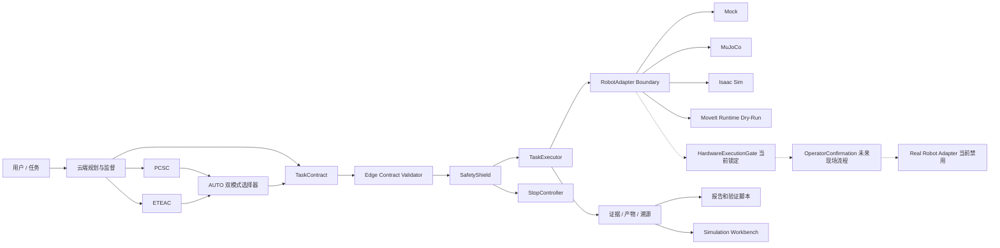

# BIG-small

BIG-small 是一个面向边缘智能场景的小型机械臂云边协同控制系统，采用云端智能规划、边缘安全执行架构。

## 1. 项目概述

本项目研究云端大模型/规划服务与边缘机器人运行时的协同控制。云端负责高层任务规划、周期监督、局部重规划和风险决策；边缘端负责契约校验、状态机执行、安全盾检查、恢复策略和最终执行拒绝权。

系统实现两类云边协同模式：`PCSC` 周期云端监督和 `ETEAC` 事件触发边缘自治。`AUTO` 双模式选择器只在两者之间做受限切换，不是第三种执行引擎。

本项目当前全部研发与实验按 **Sim2Real 模拟设备路线**开展：MuJoCo 是主批量实验设备，Isaac Sim 是对照仿真设备，ROS 2 / MoveIt 使用模拟控制器与 planning/dry-run。云边闭环、故障注入、域随机化和工作台均通过这些模拟设备验证。Mock、synthetic 和 fake provider 用于软件管线检查，不能替代物理仿真或真实模型性能证据。真实机器人接口保留为未来接入边界；本阶段不连接、读写或驱动真实设备，S3/S4 始终 LOCKED。

## 2. 当前状态

2026-10-03 已完成 RGB-D 改造首批 P1（来源审计、同步视觉/深度采集），65 项阶段合并回归通过。开发按[任务依赖](docs/superpowers/plans/2026-10-03-rgbd-evidence-research-roadmap.md)推进，实际状态、命令和证据见[过程文档](docs/research/process/README.md)及[当前权威状态](docs/current_authoritative_status.md)。本轮尚未产生新的正式研究结果。

以下是 2026-10-02 Ubuntu 本机验收快照；原分支成果及其原 verifier 状态保留在 [历史与当前状态](docs/current_authoritative_status.md)，完整证据范围见 [Ubuntu 交接报告](docs/handover/ubuntu_deployment_report.md)。

| 能力层 | 本机状态 | 已验证范围 |
| --- | --- | --- |
| 核心运行时、PCSC / ETEAC / AUTO | PASS | 软件门禁、状态机、安全和恢复 |
| Dashboard / Simulation Workbench | PASS | 24 unit tests、37 E2E，含实际 MuJoCo worker |
| MuJoCo | PASS | 模型加载、physics step、adapter、确定性 DR 与 MjSpec 参数应用 |
| ROS 2 / MoveIt | PASS | 通信/action、规划、碰撞、安全盾、模拟控制器 |
| Isaac Sim | WARN | 实际 GPU app、模型、TCP/关节/相机、step/reset/estop 通过；全参数 DR 应用未接受 |
| Isaac Lab bridge | WARN | 在实际 app 中物化配置；EventManager 参数应用未接受 |
| Sim2Real / 跨后端 | WARN | 工作台与离线轨迹通过；严格配对物理差距未接受 |
| Phase13 | BLOCKED | fake 管线通过；本机无可用真实模型服务 |
| Phase12 full | WARN | 5,580 条记录，5,040 runtime-completed、540 运行前阻塞；验收 REJECTED |
| Thesis pipeline | WARN | 历史论文可复现；新 full 统计单独导出，未形成已接受的最终论文结论 |
| 真实机器人 | BLOCKED | 本阶段禁用；NOT_STARTED / NONE，S3/S4 LOCKED |

Phase12 的 runtime-completed 包括 Mock、synthetic dry-run 和 planner dry-run，不等同于物理仿真成功。修正 repetition 分组后，F15 共 180 对，120 对满足原标量统计条件，60 对含安全停止；两端初始状态、控制方式和 DR 应用尚未满足严格物理配对条件，不能据此宣称公平轨迹 RMSE 已验收。历史 466/74 只属于既有 validation 基线。

## 3. 核心能力

- **契约与追踪**：`TaskContract`、`Telemetry`、`CloudCommand`、`FailureSummary` 等 Pydantic 模型记录任务版本、命令序号、时间戳和结构版本。
- **边缘运行时**：`TaskExecutor`、`TaskStateMachine`、Repository、AuditLog 和重启恢复组成边缘执行闭环。
- **安全盾**：技能执行前后检查速度、工作空间、碰撞、急停、过期数据和故障状态。边缘端保留最终拒绝权。
- **云端规划与监督**：云端规划、周期监督、失败摘要和局部重规划只生成高层契约或监督决策。
- **事件触发自治**：`ETEAC` 通过事件检测、本地恢复预算、局部重规划和 outbox 完成边缘自治流程。
- **技能缓存与风险调度**：Skill Cache 缓存高层技能模板；RiskEvaluator 和 AUTO 选择器只在安全边界内选择协同模式。
- **实验平台**：Phase 8 之后提供虚拟时钟、网络故障、重启恢复、消融实验、统计汇总和证据溯源。
- **仿真后端**：MuJoCo 和 Isaac Sim 用于物理仿真与跨后端对比，不构成硬件验证。
- **ROS 2 / MoveIt 集成**：ROS 2 运行时和 MoveIt 安全验证已完成；MoveIt Runtime Dry-Run 只规划，不调用 execute。
- **仿真工作台**：Phase 11 提供 S01-S15 场景浏览、配置编辑、Batch、Sweep、多 seed、模式比较、跨后端比较、实时监控、指标分析、复现和导出。
- **仿真运行时**：Phase 11.1 提供异步队列、SQLite 持久化、worker lease、cancel、timeout、retry、恢复、持久 WebSocket replay 和 MuJoCo runtime acceptance。
- **Sim2Real 工具链**：支持 per-parameter domain randomization、MuJoCo `MjSpec` 动态模型参数、Isaac Lab 对等随机化计划、Rerun 轨迹/传感器对齐 Viewer，以及自动生成 Sim/Real gap report；同一份 run manifest、seed 和参数样本用于两套仿真后端与分析产物溯源；配置取值一致不等于两个后端已经实际应用了所有参数。
- **模型控制中心**：Phase 11.2 提供 Planner profile、secret 安全、endpoint policy、Ollama 管理和 planner dry-run；本地模型 runtime 尚未接受。
- **最终评估**：Phase 12 提供 RQ1-RQ7、F01-F20、统计分析、图表、表格、论文素材和答辩包导出。Phase 12.2 clean validation 将 validation profile 接入 actual software runners，并把 synthetic smoke 数据排除出论文统计；本机 full 已运行，验收 REJECTED，当前不能形成最终论文统计结论。
- **真机安全准备**：Phase 10 提供配置门禁、HardwareExecutionGate、OperatorConfirmation 和分级验收。

## 4. 系统架构



完整架构、时序图和边界说明见 [docs/architecture.md](docs/architecture.md)。

## 5. 快速开始

### 5.0 Ubuntu 模拟设备开发

在本次已部署的主机，从项目根目录运行：

```bash
./scripts/linux/doctor.sh
./scripts/linux/start.sh
# 另一个终端执行快速软件检查
./scripts/linux/test.sh --smoke
# 先在启动终端 Ctrl-C 停止开发服务，再运行全量门禁（E2E 使用 8000/5173）
./scripts/linux/test.sh
```

默认入口：<http://127.0.0.1:5173/simulation/workbench>，API：<http://127.0.0.1:8000/docs>。启动脚本创建持久开发数据库并启动 API、内置仿真 worker、Dashboard；停止时按 Ctrl-C。默认 simulation / MuJoCo / headless / loopback，真实运动 dispatch 关闭。

`./scripts/linux/install.sh` 安装项目声明的 Python extras、锁定的前端依赖与 Chromium。Python venv 支持、Node 22.12+、NVIDIA、ROS/MoveIt、Isaac 和 TeX 为独立运行时前提，本次部署的版本、路径与实验命令见 [交接报告](docs/handover/ubuntu_deployment_report.md)。macOS 支持继续保留。

### 5.1 Apple Silicon macOS 本地开发

macOS 分支用于日常开发、MuJoCo 仿真和 Sim2Real 数据分析。首次克隆：

```bash
git clone -b codex/macos-local-dev https://github.com/ningyd98/BIG-small.git
cd BIG-small
./scripts/macos/dev.sh
```

已有仓库时：

```bash
git fetch origin
git switch codex/macos-local-dev
git pull --ff-only
./scripts/macos/dev.sh
```

`dev.sh` 是一键入口：首次运行会准备 Python 3.12+、Node 22.12+、仓库 `.venv`、MuJoCo、Rerun、分析依赖和 Dashboard；后续运行会直接启动 FastAPI 与 Vite。默认只绑定本机回环地址：

- Sim2Real Workbench：<http://127.0.0.1:5173/simulation/workbench>
- FastAPI 文档：<http://127.0.0.1:8000/docs>
- 停止服务：在启动终端按 `Ctrl-C`，脚本会同时回收前后端进程。

Mac 不连接 Linux 服务器时，可以完成：

| 能力 | Mac 单机状态 |
| --- | --- |
| Python/FastAPI 与 React Dashboard 开发 | 完整支持 |
| Mock、MuJoCo 仿真与 `MjSpec` 动态模型参数 | 完整支持 |
| 自定义 per-parameter domain randomization 与多 seed 批量实验 | 完整支持 |
| 轨迹、关节状态、控制量和传感器数据生成 | 完整支持 |
| Rerun trajectory/sensor 对齐 Viewer | 完整支持 |
| 导入已有 Real trace 并生成 Sim/Real gap report | 完整支持 |
| 生成 Isaac Lab 对等随机化配置 | 支持生成，不在 Mac 执行 |
| Isaac Sim / Isaac Lab 实际运行与 CUDA 并行训练 | 不支持，需 Linux/Windows + NVIDIA RTX |
| ROS 2 Jazzy / MoveIt 2 权威验证 | 不支持，需 Ubuntu 24.04 环境 |
| 真实机械臂在线控制 | 默认关闭，必须遵循独立硬件验收流程 |

常用维护命令：

```bash
# 预览安装计划，不修改系统
./scripts/macos/install.sh --dry-run

# 只读检查 Python、MuJoCo、Rerun、Node 和 Dashboard 环境
./scripts/macos/doctor.sh

# 不自动打开浏览器，并使用自定义端口启动
./scripts/macos/start.sh --no-open --backend-port 8010 --frontend-port 5180
```

安装要求为原生 Apple Silicon Terminal 和 Homebrew；推荐安装 Xcode Command Line Tools。脚本不会安装 Isaac Sim、ROS 2 Jazzy、MoveIt 2 或真实机械臂 SDK。详细的平台边界、配置文件和分步命令见 [docs/macos_local_development.md](docs/macos_local_development.md)。

Mac 支持代码、MuJoCo、Workbench、Rerun 和离线分析；当前 Ubuntu + RTX 4070 Ti SUPER 承担模拟设备主实验环境，并运行 Isaac、ROS 2 / MoveIt 和跨引擎对照管线。

### 5.2 通用 Python 环境

```bash
# 快速开始：安装仿真和分析依赖，仅运行软件侧验证。
python3 -m venv .venv
. .venv/bin/activate
python -m pip install -e ".[dev,sim-mujoco,sim-analysis]"
python -m pytest -q
```

常用入口使用独立运行目录：

```bash
export TASK_RUN_ROOT="$PWD/results/$(date -u +%Y%m%dT%H%M%SZ)-$(git rev-parse --short HEAD)-$$"
mkdir -p "$TASK_RUN_ROOT"
python scripts/run_fixed_pick_place.py --adapter mock
python scripts/run_phase12_experiments.py --profile smoke --output "$TASK_RUN_ROOT/phase12"
python scripts/analyze_phase12_results.py --profile smoke --output "$TASK_RUN_ROOT/phase12"
python scripts/export_phase12_thesis_assets.py --profile smoke --output "$TASK_RUN_ROOT/phase12"
python scripts/verify_phase12.py --smoke --artifact-root "$TASK_RUN_ROOT/phase12" \
  --output "$TASK_RUN_ROOT/phase12/verification"
```

MoveIt Runtime Dry-Run 需要 ROS 2 / MoveIt 环境，只规划与安全验证，不调用真实控制器：

```bash
source scripts/phase9/activate_ros2_moveit_env.sh
python scripts/verify_phase10_moveit_dry_run.py --output "$TASK_RUN_ROOT/moveit-dry-run"
```

Phase9/10/11 的各项 verifier 入口保留；独立结果目录、实际环境启用和论文隔离复现命令见 [Ubuntu 交接报告](docs/handover/ubuntu_deployment_report.md)。

更多命令见 [docs/verification.md](docs/verification.md) 和 [scripts/README.md](scripts/README.md)。

## 6. 验证配置

- **CI 可运行**：compile、ruff、mypy、pytest、文档检查、Mock/MuJoCo/Phase 10 软件门禁，不需要 Isaac、MoveIt 或真实硬件。
- **依赖环境**：ROS 2 / MoveIt、Isaac Sim 和跨后端验证需要对应主机环境和 artifacts。
- **仅限真实硬件现场**：Level 0+ 真实机械臂验收必须由现场操作员执行，默认不会由 CI 或统一入口自动运行。

## 7. 文档导航

- [docs/README.md](docs/README.md): 完整文档门户。
- [docs/architecture.md](docs/architecture.md): 当前权威系统架构。
- [docs/project_status.md](docs/project_status.md): 能力域状态、验证入口和证据。
- [docs/current_authoritative_status.md](docs/current_authoritative_status.md): 当前唯一权威状态入口。
- [docs/repository_structure.md](docs/repository_structure.md): 仓库目录职责。
- [docs/verification.md](docs/verification.md): 验证 profile 和命令说明。
- [docs/simulation_workbench.md](docs/simulation_workbench.md): Phase 11 仿真工作台。
- [docs/simulation_runtime_architecture.md](docs/simulation_runtime_architecture.md): Phase 11.1 异步仿真运行时。
- [docs/thesis_research_questions.md](docs/thesis_research_questions.md): Phase 12 研究问题。
- [docs/phase12_acceptance.md](docs/phase12_acceptance.md): Phase 12 验收定义。
- [docs/real_robot_safety.md](docs/real_robot_safety.md): 真实机械臂安全边界。
- [docs/roadmap.md](docs/roadmap.md): 后续路线图。
- [CONTRIBUTING.md](CONTRIBUTING.md): 贡献和提交规范。
- [CHANGELOG.md](CHANGELOG.md): 阶段变更记录。

## 8. 安全声明

浏览器、云端模型和用户自然语言任务不能直接驱动关节。所有动作必须经过 `TaskContract`、`EdgeContractValidator`、`SafetyShield`、`TaskExecutor` 和对应 adapter 边界。

Simulation Workbench、Simulation Runtime、Model Control Center、Phase 12 Final Evaluation、Synthetic Dry-Run 和 MoveIt Runtime Dry-Run 都不是硬件执行。Phase 11/11.1/11.2/12 固定保持 `real_controller_contacted=false`、`hardware_motion_observed=false` 和 `hardware_write_operations=[]`。真机相关开发仍冻结，只保留回归测试。

在完成 Level 0 read-only 验收前，不得开展任何运动测试。首次真实运动测试必须现场隔离、急停可达、双人监督，且人员不得进入工作空间。

## 9. 项目用途

本仓库用于云边协同机械臂控制系统的研究、仿真验证、运行证据管理和真实硬件接入前安全门禁建设。仓库当前没有新增许可证声明；使用边界以本 README、文档和配置中的安全说明为准。
