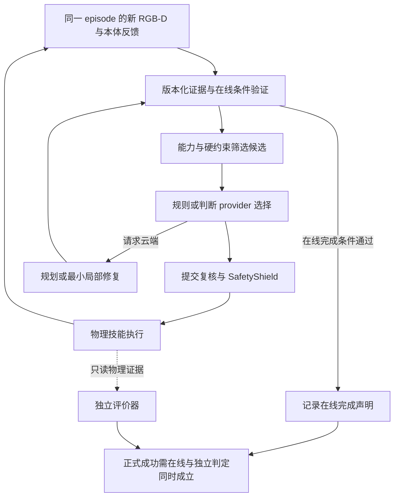

# RGB-D 云边协同代理执行计划

> **For agentic workers:** REQUIRED SUB-SKILL: Use superpowers:subagent-driven-development (recommended) or superpowers:executing-plans to implement this plan task-by-task. Steps use checkbox (`- [ ]`) syntax for tracking.

**Goal:** 按实际代码依赖完成真实 RGB-D、真实本地 VLM 和 MuJoCo 物理执行闭环，再检验不确定性与时效联合决策、视觉证据契约与最小局部修复相对公平基线的收益。

**Architecture:** 沿用现有 PCSC/ETEAC、SafetyShield、技能执行器、事件仓库、仿真作业队列及 API；形成“云端规划—边缘有限候选判断—安全执行—新观测与效果验证—有界恢复”的闭环，不建立第三套执行器。在线策略只消费视觉与本体证据，离线标签/教师/独立结果评价器单独持有真值。先完成规则与校准风险驱动的确定性选择，再比较可替换判断 provider；Jev 接入为可选对照。

**Tech Stack:** Python 3.12、MuJoCo 3.3.7+（现有依赖范围 `<4`）、NumPy、Pillow、Pydantic、FastAPI、SQLite、Ollama/兼容视觉 API、React/TypeScript；沿用项目虚拟环境与前端脚本。

**Spec:** [统一研究设计与量化目标](../specs/2026-10-03-rgbd-evidence-research-design.md)。执行者必须完整阅读该规格；本计划将其分解为 18 项实现任务。

**执行规则：** 本文是给开发代理使用的工作清单，按前置产物和验收结果推进，不按周次、日期或人工工时推进。研究设计与开题报告中的学术周期仅用于材料说明，不是代理调度条件。任务编号保持稳定以便追溯，实际执行顺序以第 2 节为准。

**状态：** 2026-10-03 用户已授权分阶段启动实施并重建过程文档。首批 P1 包含 T1 来源审计与 T2 同步 RGB-D 采集，两项已完成并通过独立审查；各项只在对应验收证据通过后勾选。下文尚未勾选的“新增”文件、接口、测试和 CLI 仍为待实现；文件已存在不表示目标行为已验收。任务完成后记录差异与证据，不将其他用户改动一并暂存或提交。

**本次修订：** 2026-10-03 按用户要求优化执行决策闭环。T1—T18 编号、G0—G5/B0—B5 和已验收状态保持稳定；主要加强 T7、T10—T13 的接口与失败路径，以及 T8/T15—T17 的证据账本。仅更新文档，不启动后续实现、模型调用或实验；当前就绪队列仍为 T6a/T3/T4。

## Global Constraints

- 每次选择前置条件已满足的核心任务；验收通过即进入后续工作。机器运行时间、磁盘和显存按实际测量安排，不预设人工工时或等待日历节点。
- MuJoCo 为主实验环境，真实本地视觉模型为必要条件；不实施真实硬件实验。Isaac 跨引擎配对和技能缓存迁移为扩展，不阻塞 MuJoCo 主结论。
- 正式研究运行凡发生的感知/推理/动作阶段，100% 使用真实 RGB-D、真实模型调用与 actuator/step 物理执行；提前 BLOCKED 或安全拒绝后的阶段标 NOT_EXECUTED，另报阶段覆盖率，仍保留成功率分母。真值泄露、伪装成功、跨集合组重复均为 0；模型/渲染不可用必须明确 BLOCKED。
- 默认固定顶视 320×240；保留 RGB uint8、光轴深度 float32 米、有效掩码、内参、camera_to_world、帧号、采集时刻、场景/episode ID、标定版本及校验和。深度可视化仅为模型辅助图像；几何使用原始深度。
- 继承旧输入边界：深度 little-endian、0 无效；相机 +X 右/+Y 下/+Z 前，变换为行优先 4×4；最大 1280×720；在线接收年龄超过 5000 ms 或超前服务器超过 1000 ms 拒绝。该入口上限不能替代动作相关有效期。
- T3 用设备实测冻结基础 VLM 的标识、权重摘要、量化、分辨率和生成参数。现有 `qwen3-vl:4b-instruct` 是候选配置，不是已通过的模型；基础 VLM 全程固定，仅训练轻量风险/恢复决策模块。
- 抓取后至少提升 50 mm 并保持 0.5 秒；放置后释放并在目标区稳定 1 秒。动作阶段禁止对象瞬移或直接写目标 TCP；初始化重置另记。
- 感知数据 smoke/validation/full 分别 100/1000/10000 个基础场景组；按组 80/10/10，验证组等分为独立校准与策略选择；每批最多尝试目标组数的 5 倍，不足报告 INCOMPLETE。
- 正例要求可见像素至少 100、目标区域有效深度至少 95%；研究负例仍保留并标注。离线数据生产不依赖 VLM；技能模板不得标为已执行动作示范。
- T8 基础先导与 T15b 方法冻结后先导各为开发池 12×10=120 个场景，两轮互斥且均不入测试；正式 N 在 T15b 从 600、1200、1800、2400 中选最小满足功效者；另有 200 个恢复故障 episode、300 个域外组×3 个训练种子，互不重叠。
- 3 类任务×4 类通信条件；RTT 0/100/300/600 ms、丢包 0/0/1/5%、RTT ±20% 均匀抖动（0 ms 无抖动）、10 Mbit/s；另列 3 秒与 10 秒中断压力场景。
- 目标速度 0/20/40 mm/s、深度噪声标准差 0/2/5 mm、无效深度 0/10/30%、遮挡面积 0/20/40%；分层均衡组合抽样，不做全部参数笛卡尔积。
- 基线selection可行性门槛为标称成功率≥90%、跨条件总体成功率≥80%、物理安全违规率≤1%（均为点估计，仅配置筛选，不替代正式非劣检验）；所有方法共用provider最大在途请求数1及保留最新待发观测的合并策略。
- 单机进程隔离加网络注入的部署名称为“模拟云边部署”。软件测试、MOCK、planner dry-run、物理完成及硬件验证分别记录；5580 条历史记录不得充当新物理评测分母。
- 优先保留 G0/G1 与 C1/C2 核心证据。基础闭环验收未完成时削减 G5/Isaac/缓存扩展；T13 尚无可恢复闭环时如实标记 C2 未完成，不以软件验收替代研究结论。
- 同一 episode 共享相机与执行 backend，动作后必须新采集；在线验证为 PASS/FAIL/UNKNOWN，真值仅供独立评价，正式成功要求在线完成与独立物理成功同时成立。
- 五类调度动作由代码生成合法候选；规则分数、候选概率、自报 confidence 与校准失败风险分别记账。Jev 非核心依赖，远程判断计入云模型总请求与网络成本。
- 恢复须验证后才解决事件；重观测/重试/无进展预算持久化，旧帧和新事件 ID 不重置预算。候选契约、边缘接受和实际执行分别记录，dry-run 不能产生真实 ACK 或切换 active contract。

## Review Focus

1. RGB/depth/实例图跨 render pass 推进、标定版本错配或像素缩放错误：应拒绝错误几何，Task 2/3 的同步与坐标测试覆盖。
2. 标签、教师真值、文件名或缓存意外进入在线模型/控制：应保持输入隔离，Task 3/5/7 的诱饵真值和只读评价测试覆盖。
3. 同场景不同 seed、扰动/修复轨迹或指令改写进入不同集合：应按来源组与内容检测泄露，Task 6/8/14 的分组审计覆盖。
4. 动作返回成功但目标已移动、最终验收 UNKNOWN、恢复空转：成功/失败均重新决策，预算耗尽明确终止；Task 7/11/13 的反馈与重启预算测试覆盖。
5. 迟到/取消响应、候选变化、ACK 丢失与原子动作并发：提交复核且候选/接受/执行不混记；Task 10/12/13 覆盖竞态，Task 8/15/16 同时覆盖失败分母与重复记账。

---

## 1. 优化对象、指标与贡献边界

所有数值均为待实验验证的预注册目标；除“百分点”外均为相对变化。基线值尚未实测，不补造成功率或提升结果。30%、3 个百分点等是本项目设定的工程收益与可接受代价，理由见规格第 3 节。

| 对照 | 公平实现与选择规则 | 对应任务/目标 |
|---|---|---|
| B0 周期云端监督 PCSC | 0.5/1/2/5 秒仅在策略选择集筛选；先过成功与风险门槛，再选请求最少、平局时延最低者；保留扫描曲线 | T8/T11；G2/G2a |
| B1 固定阈值 ETEAC | 相同视觉、技能、安全和时钟；只在策略选择集调阈值，测试冻结 | T11；G2 辅助对照 |
| B2 现有规则 AUTO | 冻结原人工风险权重和规则，接入相同运行中事件入口；单次初始化选择仅留作诊断 | T11；G2 辅助对照 |
| B3 时间有效期+确定性检查 | 与新方法共用 SafetyShield、版本和基础几何，仅去校准不确定性及动作相关有效期 | T10；G3 |
| B4 失败后完整重规划 | 同 VLM、技能、安全、观测与预注册故障，比较完整重规划与最小依赖修复 | T13；G4 |
| B5 均匀域随机化数据 | 与定向采样相同有效组数、优化步数、模型及训练 seed；另设普通失败采样 | T14；G5 |

B0—B5 是本工程可执行机制对照，不冒称完整复现 Network Offloading、CloudEdgeVLA、KnowNo、SafeGate、VoxPoser、MimicGen 或 RESample，也不直接比较其公开数值。

| 目标 | 固定验收规则 | 主要证据 |
|---|---|---|
| G0 | 已发生的RGB-D/VLM/动作阶段真实路径100%；泄露、伪装成功、跨集合组重复为0；不可用BLOCKED，未执行NOT_EXECUTED | T1—8/T15 来源审计，阶段覆盖另报 |
| G1 | 清晰目标三维表面误差 P90≤10 mm；标称静态任务成功率点估计≥90% | 定位点到独立标注平顶刚性块顶部几何中心的欧氏距离；仅正确识别且有效深度样本，另报覆盖率/拒绝率；独立标称测试层 |
| G2 / C1 | 对 B0 每分配任务云请求均值减少≥30%；成功率差单侧 95% 下界>−3 个百分点；违规率差单侧 95% 上界≤+1 个百分点 | 相同配对正式任务，超时/重试/失败请求全计 |
| G2a | 对 B0 实际应用层字节均值减少≥25%；失败惩罚耗时 P95 减少≥15% | 与 G2 同集合，两个次级目标分别报告 |
| G3 / C2 | 对 B3 误放行减少≥50%且绝对值≤2%；有效且安全机会错误拒绝≤5% | 预定义固定机会，按 episode 聚类；UNKNOWN 独立层 |
| G4 / C2 | 200 故障 episode 恢复成功≥80%；对 B4 失败惩罚恢复耗时中位数减少≥30%；已完成不可重复动作重复提交为 0 | 故障注入至独立评价成功，失败赋 Rcap=60 秒 |
| G5 扩展 | 同为 2000 训练组时域外成功率提高≥5 个百分点；500/1000/2000 组学习曲线 | 300 个域外组、3 训练种子，固定基础 VLM |

先过 G0/G1 才验收正式方法；C1 需要 G2，C2 需要 G3 与 G4。G2a/G5 单列，不能以其他指标替代。名义减少量按点估计判定，可靠改善还要求对应 95% 区间排除 0；基线为 0 时相对比例为 N/A，报告绝对值，不能判相对目标通过。成功或风险不合格的基线不得用于声称节省。

### 1.1 本轮闭环优化落点

Jev 思路的来源与边界见[研究设计 §4.4—4.5](../specs/2026-10-03-rgbd-evidence-research-design.md)。本项目借鉴有限候选判断与代码编排，以下各项均为待实施设计；不把 provider 的候选概率当动作成功率，不承诺高频实时性能。

| 已核实的缺口 | 负责任务 | 必须得到的行为 |
|---|---|---|
| RGB-D worker 止于规划，一次性 capture 会重置场景 | T7 | 共享 backend/episode、动作后新帧、明确资源所有权 |
| 部分条件仅验 TCP 高度或恒真 | T7 | 条件注册表与 PASS/FAIL/UNKNOWN；无数据/未注册均不得放行 |
| AUTO confidence 固定，成功步骤后缺统一再判断 | T9/T11/T12 | 分离概率语义；成功/失败/最终验证均进入同一事件入口 |
| 最终验收失败直接 FAILED，批准重试即标处理 | T7/T13 | 失败分类路由、验证后解决、持久化预算与无进展终止 |
| 重规划 active 更新与 ACK/启动边界不清 | T13 | 候选暂存、实际边缘接受、显式启动确认；重启协调与 dry-run 隔离 |

新增诊断指标为误完成率、UNKNOWN/拒答/回退率、端到端决策延迟、故障响应延迟和无进展终止率，定义遵循规格 §5.4，不增加未经论证的性能承诺。正式统计必须同时保留在线判断与独立评价，不用后者驱动在线修复。

## 2. 实际执行顺序、状态和文件责任

### 2.1 当前入口与完成规则

T1、T2 已验收，当前就绪项为 **T6a、T3、T4**，均尚未开始。启动时先读取 `docs/current_authoritative_status.md` 与工作区差异，核验已有 RGB-D 原型及相关回归，建立证据清单；不能因文件已存在就将任务勾选完成，也不覆盖已有用户改动。后续依据下面的前置条件选择可执行项。

状态只使用 `TODO / READY / IN_PROGRESS / BLOCKED / DONE`；当前 T1/T2 为 `DONE`，T6a/T3/T4 为 `READY`，其余任务为 `TODO` 且尚未验收，表中顺序不是完成声明。每个子项结束时在对应任务下记录：状态、实际改动、验证命令及结果、产物路径、阻塞原因和下一个可执行项。依赖产物经验证后才将任务标为 `READY`；代码与该项要求的真实运行证据全部通过才能标 `DONE`。报告 `BLOCKED` 时继续处理无关的就绪分支，不用假模型或软件状态替代真实结果。

T6、T15、T16、T17 分成可独立验收的子项；只有全部必需子项完成才能关闭父任务。T14、Isaac 和缓存是可选扩展，不在核心完成路径中。单个子项内部仍按第 3 节的文件、接口和复选步骤实施。

### 2.2 工作队列与完成门槛

| 执行单元 | 前置条件 | 实际工作及出口 |
|---|---|---|
| T1 现状与来源契约 | 无 | 记录历史边界、已有改动与真实能力；明确来源和失败口径 |
| T2 同步观测 | T1 | 验证 RGB/depth/mask 同步、米制深度、标定、会话释放 |
| T6a 静态数据最小闭环 | T2 | 先创建共享 `SceneSpec`；完成采样/标注/落盘/划分/导出，100 与 1000 组验收；不等待 VLM 或物理教师 |
| T3 本地视觉模型 | T2 | 真实双图请求、严格解析、像素映射、延迟/显存实测，冻结模型快照；可与 T4/T6a 并行 |
| T4 物理技能 | T2 | IK、关节/夹爪驱动、真实接触抓放；先自由空间，再接触；可与 T3/T6a 并行 |
| T5 教师与独立评价 | T4、T6a | 消费共享场景类型，完成 20 episode 正反例与真实轨迹记录 |
| T7 视觉执行闭环 | T3、T5、T6a | 同 backend 新帧、三值条件验证、统一事件与有界验证路由；20 场景冒烟及取消/租约验证 |
| T8 基础先导与初次冻结 | T6a、T7 | 先接实际请求/字节账本，再运行 120 场景；锁定 Tcap、候选池、统计/样本规则与实测预算 |
| T6b 全量数据及轨迹整合 | T6a、T5、T8 | 预算允许后生成 10000 组，接入教师记录并复核分组；不作为 T8 的前置条件 |
| T9 风险模型与校准 | T6a、T8 | train/calibration/selection 隔离、风险与误差界校准；可与 T6b 并行 |
| T10 证据契约 | T9 | 新门控及 B3、决策身份/有效期；固定机会回放，返回与提交两次复核 |
| T11 公平运行中基线 | T8、T10 | 消费 T7 事件；成功/失败/验证均再判断，B0 独立周期，公平基线筛选 |
| T12 有限候选联合决策 | T9、T11 | 规则/成本 provider、拒答与非法输出处理、完整成本；T13 前禁用恢复候选 |
| T13 有界恢复与局部修复 | T10、T12 | 最终验证失败路由、恢复状态/预算、候选/ACK/启动协调及 B4；无动作重放 |
| T15a 运行器与记录契约 | T8、T10 | 先固定 `EpisodeAssignment/EpisodeRecord`，实现分配、回放、断点、功效计算及门槛测试；完整方法接入等待 T13 |
| T16a 统计与验收工具 | T8、T15a | 用手算/合成反例及开发记录验证分母、区间和目标判定；正式结果产生前完成 |
| T17a 数据及能力界面 | T6a、T7 | 默认视觉入口、能力分级、数据预览、取消与进度；可与方法开发并行 |
| T15b 方法冻结与功效先导 | T13、T15a、T16a | 冻结方法/参数；另 120 场景只估功效，选 N、复核资源、生成最终协议 hash |
| T15c 正式实验与核心消融 | T15b | 通过来源和基础能力门槛后运行相同 N 场景、固定机会回放及 200 故障；保留全部失败 |
| T16b 正式统计 | T15c、T16a | 从完整原始记录输出 PASS/FAIL/INSUFFICIENT_EVIDENCE；不据结果修改方法或 N |
| T17b 研究结果界面 | T17a、T16a；真实结果验收等 T16b | 实现目标/区间/分母展示并校验与实际结果一致 |
| T18 复现与交付 | T16b；界面交付等 T17b | 从原始记录重建结论、独立审查、软件回归及交付；复现材料随各任务收集 |
| T14 与受限扩展（可选） | T6b、T9、T13；核心资源已保障 | 单独冻结扩展配置再训练/评测，未开展标 NOT_RUN；不改已冻结主方法 |

默认先推进能最早获得真实闭环的 T1→T2→T3/T4/T6a→T5→T7→T8，再推进 T9→T10→T11→T12→T13。T15a/T16a 与 T17a 在前置条件满足后穿插，不能拖到正式实验结束才实现。T15b→T15c→T16b 是严格串行的研究冻结与执行链；T18 的数据重建不等待界面完成，最终界面验收才等待 T17b。

T7 先交付不依赖 T9/T12/T13 的基础事件与规则验证路由；缺恢复能力时记录不可用并安全终止，不能假定未来接口已存在。T11 复用这些事件，T12 交付确定性 provider 契约，T13 接入恢复后再做完整集成。可选 Jev/其他判断模型的影子与闭环比较在 T12/T13 后、核心资源保障下另立实验配置，不阻塞 T15b，不替换已冻结主方法。

### 2.3 并行、共享文件与阻塞处理

- 接口先于并行：T6a 是 `datasets/rgbd/models.py` 中 `SceneSpec` 的创建者；T5 消费并扩展轨迹类型。T2 独占相机/观测接口直到稳定，T3 负责模型消息，T4 负责控制器，T6a 负责离线数据；共享 `backend.py` 的修改按接口合并，不让两个代理同时改同一段。
- T10/T11/T12/T13 涉及执行器、模式事务与重规划提交，按上述依赖集成。T15a 完成记录接口后 T16a 才启动。T17a 的后端/UI分工以冻结 API 为界；生成的 OpenAPI/TypeScript 类型只由一个任务更新。
- 真模型不可用：阻塞 T3 的真实验证及依赖它的 T7/T8，继续 T4、T6a、T5；模型探测保留实际失败。渲染/物理不可用：继续相关纯软件契约与错误路径检查，但相应真实验收保持 BLOCKED。
- GPU/渲染器资源默认串行使用；代码编辑、CPU 测试可在互不改写的文件范围内并行。训练、全量生成和长实验按实测显存、磁盘及任务队列安排，不能因可并行写代码就并发抢占同一 GPU。
- 基础先导不通过则修复闭环并延期扩展；无可行基线不得声称节省。局部恢复未完成则 C2 保持未完成，可继续独立的 C1 开发与工具测试；任何缩减正式协议的研究必须另立版本，不冒充完整主实验。
- 用户已授权分阶段实施；先核验 T1/T2 的已有证据，再从当前 READY 队列进入，不重写已经验收的实现。过程文档与实际验收同步更新，文档完成不算产品任务完成。

### 2.4 文件责任

以下以 `src/`、`tests/`、`scripts/`、`configs/`、`docs/`、`dashboard/`、`assets/` 开头的路径相对仓库根；任务内其余 Python 包路径（例如 `vision/`、`research/`、`simulation_runtime/`）统一补前缀 `src/cloud_edge_robot_arm/`。花括号表示同目录所列文件分别创建/修改，不是实际文件名。新增模块需同时新增缺失的 `__init__.py`，不改变其他包布局。

| 文件范围 | 单一责任与复用边界 |
|---|---|
| `src/cloud_edge_robot_arm/vision/` | 观测、双图消息、模型快照、几何定位、在线闭环、离线读取；扩展现有原型 |
| `src/cloud_edge_robot_arm/simulation/mujoco/` | 同步渲染、IK/运动、RuntimeSkillRobot 实现、只读结果评价 |
| `src/cloud_edge_robot_arm/datasets/rgbd/`（新增） | 场景、标签、原子写入、分组、教师、导出与三类采样器；原始大文件位于仓库根 `datasets/` |
| `src/cloud_edge_robot_arm/research/`（新增） | 协议/来源、网络和时钟、盲测分配、统计、验收、资源预算及复现 |
| `src/cloud_edge_robot_arm/vision/risk/`、`edge/evidence/`（新增） | T7 先建在线条件/证据快照；T9 校准，T10 证据契约，均不替代 SafetyShield |
| `src/cloud_edge_robot_arm/auto_mode/` | T7 定义基础事件、T11 策略上下文、T12 候选/provider；复用模式事务 |
| `src/cloud_edge_robot_arm/edge/recovery/`、事件仓库 | T7 定义有界验证策略，T13 持久化恢复生命周期/预算及完成判定 |
| `src/cloud_edge_robot_arm/cloud/replanning/` | 视觉依赖、证据检查与候选/ACK/启动协调；ReplanApplyService 保持单写入口 |
| `configs/research/`、`scripts/*rgbd*.py`（新增为主） | 白名单配置和 CLI；`artifacts/research/` 存实际运行证据 |
| `cloud/api/`、`simulation_runtime/`、`dashboard/src/simulation/` | 扩展现有队列、证据、状态、数据预览和研究看板 |

## 3. 实施任务

每项任务先写所列最小回归并观察新增断言失败，再实现并使同一命令通过；现有测试已通过时无需人为制造失败。命令中出现的新脚本/测试只在该任务实现后可执行，不能将计划中的命令视为当前功能。物理、真模型和长作业另保存原始产物，单元测试 PASS 不能替代相应阶段验收。

### Task 1：历史证据冻结与研究记录契约

**Files:** 修改 `docs/current_authoritative_status.md`、`scripts/verify_phase11_1_simulation_runtime.py`；新增 `src/cloud_edge_robot_arm/research/models.py`、`research/provenance.py`、`tests/test_research_provenance.py`、`docs/research/evidence_inventory.md`。

**Interfaces:** 在 `research/models.py` 定义 `EvidenceKind=SOFTWARE|MOCK|PLANNING|PHYSICS|HARDWARE`、`StageEvidence(stage, status: REAL|NOT_EXECUTED|BLOCKED|MOCK, source_hashes, reason)`、`RunProvenance(run_id, source_tree_hash, scene_group_id, split_role, model_snapshot_hash, observation_hashes, physics_steps, evidence_kind, blocked_reason, stages)`；`audit_provenance(records: Sequence[RunProvenance]) -> ProvenanceAudit`，返回各已发生阶段真实性、阶段覆盖率、泄露计数、跨集合重复组、阻塞原因。同一正式场景跨方法配对是允许的重复，不是跨集合泄露。保留 `ExperimentDraft.input_mode=RGBD|LEGACY_PIPELINE`。

**依赖/验收：** 无前置；交付可审计现状，保留 PHASE12_REJECTED、权威论文运行数 0 与旧 5580 条记录的边界。

- [x] 写 `test_mock_or_plan_is_not_physical_success`（`evidence_kind!=PHYSICS` 不能进入物理成功分子）、`test_missing_model_is_blocked`（阻塞理由非空）、`test_historical_runs_are_not_new_denominator`（旧记录计数为 0）、`test_pre_action_block_keeps_denominator_without_fake_steps`（未执行阶段NOT_EXECUTED、steps=0、仍计失败，已发生阶段需REAL）。
- [x] 运行 `.venv/bin/python -m pytest -q tests/test_research_provenance.py tests/test_phase11_1_simulation_runtime.py`，保存新增失败和既有回归基线。
- [x] 实现来源审计和现状清单；仅为真正的历史软件 fixture 显式设置 LEGACY_PIPELINE，修复旧 verifier，而不放宽新默认 RGB-D。
- [x] 重跑同一命令并记录通过项/环境阻塞；核对只整理本任务文件，记录独立交付摘要。

**实际验收：** T1 已完成。新增审计单测 15 项、与旧运行时合并 35 项主机回归通过；ruff/mypy 通过。独立审查的三项来源反例已修复并复审关闭。详见[阶段过程记录](../../research/process/execution_log.md)。

### Task 2：同步 RGB-D、标定及连续相机会话

**Files:** 修改 `src/cloud_edge_robot_arm/vision/{observations,capture}.py`、`simulation/{models,config}.py`、`simulation/mujoco/{camera,backend}.py`；扩展 `tests/test_rgbd_observations.py`；新增 `tests/test_rgbd_capture_session.py`。

**Interfaces:** 保留 `RGBDObservation.world_point(pixel: tuple[int,int]) -> Pose`；增加 observation_id（映射既有 frame_id）、episode_id、scene_id、calibration_version、有效掩码与校验和。`MuJoCoCaptureSession(config: SimulatorConfig)` 提供上下文管理、`capture() -> RGBDObservation`、`capture_with_instances() -> CapturedFrame`；`CapturedFrame` 在 capture.py 定义 observation、instance_ids、physics_state_hash。实例图仅可送离线标注，不是在线模型字段。

**依赖/验收：** T1；真实渲染的 RGB/depth/mask 同状态，标定可反投影，renderer 只初始化一次并关闭。

- [x] 写 `test_render_passes_share_frozen_state`（三 pass sim_time/hash 相等）、`test_plane_back_projection_within_5mm`（误差≤0.005 m）、`test_capture_session_reuses_renderer`（构造计数=1）、`test_invalid_depth_and_calibration_rejected`（NaN/零深度/奇异变换不能给 Pose）。
- [x] 运行 `MUJOCO_GL=egl .venv/bin/python -m pytest -q tests/test_rgbd_observations.py tests/test_rgbd_capture_session.py`，确认新增行为缺失。
- [x] 实现冻结状态采集、米制深度、尺寸/载荷/轴约定校验和历史/在线 freshness 分离；每次真实 capture 生成新帧号，裁剪旧图保留原观测身份。
- [x] 重跑上述命令及 `tests/test_phase9_mujoco_load.py tests/test_phase9_mujoco_physics_step.py`；存一组 RGB/depth/mask、标定、深度平面测量与资源释放证据。

**实际验收：** T2 已完成。真实 EGL 同步采集与资源释放通过；100 个独立桌面点最大高度反投影误差 2.728 mm。P1 合并回归 88 项通过，定向 Ruff/mypy 与独立审查通过。新增复核脚本 `scripts/verify_rgbd_capture.py`；`simulation/config.py` 已满足尺寸约束，本任务未重复修改。原始产物与范围见[阶段报告](../../../artifacts/research/process/20261003-phase1/phase1-report.json)。

### Task 3：真实本地 VLM、严格输出与模型冻结

**Files:** 修改 `src/cloud_edge_robot_arm/vision/planner.py`、`model_control/service.py`、`cloud/planning/pipeline.py`；新增 `vision/{messages,model_resolver}.py`、`configs/research/model_candidate.yaml`、`scripts/probe_rgbd_model.py`；扩展 `tests/test_rgbd_planning.py`。

**Interfaces:** messages.py 定义 `VisualDecision(target_pixel, destination_pixel, skills, reported_confidence, reason)`；`build_visual_messages(instruction: str, observation: RGBDObservation) -> list[dict[str, object]]`。model_resolver.py 定义不可变 `ModelConfigSnapshot(provider, model, endpoint, weight_digest, quantization, image_size, generation_parameters, timeout_s)`；`resolve_visual_planner(snapshot: ModelConfigSnapshot) -> RGBDPlannerAdapter`。reported_confidence 不直接解释为成功概率。

**依赖/验收：** T2；实际双图调用与设备实测通过后冻结模型。候选不可用则 BLOCKED，不能用文本/Mock 代替。

- [ ] 写 `test_wire_payload_contains_two_images_no_truth`（HTTP 收到不同 RGB/深度可视化图像，诱饵目标真值不出现在提示/文件名）、`test_scaled_pixels_map_to_original_depth`（缩放映射后 Pose 正确）、`test_invalid_pixel_or_skill_blocks_dispatch`（越界/非法技能无可执行合同）、`test_active_profile_snapshot_is_stable`（运行中快照不被配置切换修改）。
- [ ] 运行 `.venv/bin/python -m pytest -q tests/test_rgbd_planning.py`，确认新增断言失败。
- [ ] 实现白名单技能意图、像素/深度/标定检查、可见表面到顶抓偏移，不把表面点当物体中心；拆分消息构造和活跃配置解析，保留既有 endpoint/secret 安全边界。
- [ ] 重跑测试；实现并运行待提供命令 `.venv/bin/python scripts/probe_rgbd_model.py --config configs/research/model_candidate.yaml --output artifacts/research/model-probe`，保存真实请求摘要/响应、冷/热启动、p50/p95、显存及版本。非流式 TTFT 标 NOT_MEASURED；输出 `model-frozen.json`，只在验证成功后锁定。

### Task 4：IK、执行器驱动与物理高层技能

**Files:** 新增 `src/cloud_edge_robot_arm/simulation/mujoco/{motion_controller,skill_robot}.py`、`tests/test_rgbd_physical_skills.py`；修改 `simulation/mujoco/backend.py`、`assets/robots/franka_panda/scene.xml`、必要的 `edge/safety/context_builder.py`。

**Interfaces:** motion_controller.py 定义 `MotionTarget(position: Pose, orientation_wxyz: tuple[float,float,float,float])`、`MotionResult(status, position_error_m, orientation_error_deg, physics_steps)`；`MuJoCoMotionController(backend: MuJoCoPhysicsBackend).move_tcp(target: MotionTarget, timeout_s: float) -> MotionResult`。`MuJoCoSkillRobot` 完整实现现有 `RuntimeSkillRobot`；沿用其 resolved_target/tcp_velocity/acceleration/timeout_ms 参数，目标只来自视觉或明确标记的离线教师。复用 `apply_joint_targets(targets: JointCommand) -> None`、`apply_gripper_command(command: GripperCommand) -> None`、`step(steps: int=1) -> SimulationStepResult`。

**依赖/验收：** T2；首版刚性方块顶抓，有界 IK/限位/速度/超时，动作由 actuator+step 产生。

- [ ] 写 `test_tcp_motion_requires_physics_steps`（steps>0、固定 fixture 位置误差≤5 mm、朝向≤5°）、`test_grasp_without_contact_fails`、`test_unreachable_target_times_out`、`test_execution_never_writes_object_pose`（初始化后对象 qpos/TCP 直接赋值被 spy 拒绝）。
- [ ] 运行 `MUJOCO_GL=egl .venv/bin/python -m pytest -q tests/test_rgbd_physical_skills.py`，记录新增失败与现有机器人资产限制。
- [ ] 实现有界 Jacobian IK、关节目标和夹爪驱动；先验收自由空间，再验收接触抓取。必要资产修正另记 model/asset hash；不得改成软件位置更新。
- [ ] 重跑同一命令及 `tests/test_phase9_joint_control.py tests/test_phase9_gripper_contact.py`；归档正例、无接触、不可达、停止轨迹及实际步数。

### Task 5：独立物理结果评价与教师示范

**Files:** 新增 `src/cloud_edge_robot_arm/simulation/mujoco/episode_evaluator.py`、`datasets/rgbd/teacher.py`、`scripts/generate_rgbd_trajectories.py`、`configs/rgbd/trajectory_smoke.yaml`、`tests/test_rgbd_trajectory_dataset.py`；扩展 T6a 已创建的 `datasets/rgbd/models.py`。

**Interfaces:** episode_evaluator.py 定义 `CompletionCriteria(object_id, target_region_id, lift_m=0.05, hold_s=0.5, placed_stable_s=1.0)`、`EpisodeOutcome(success, status, safety_violation, failure_reason, measured_lift_m, hold_s, placed_stable_s, elapsed_s)`；`evaluate_episode(backend: MuJoCoPhysicsBackend, criteria: CompletionCriteria) -> EpisodeOutcome` 只读。复用 T6a 在 datasets/rgbd/models.py 定义的 `SceneSpec(group_id, scene_parameters, asset_family_hash, seed)`，只扩展 `TrajectoryFrame(observation, action, next_observation, sim_time_s, skill_boundary)`；teacher.py 定义 `EpisodeRecorder.append(frame: TrajectoryFrame) -> None`、`run_teacher_episode(scene: SceneSpec, robot: MuJoCoSkillRobot, recorder: EpisodeRecorder) -> EpisodeOutcome`。

**依赖/验收：** T4/T6a；20 episode 教师集成冒烟含固定正反例；评价器记录实物状态与接触，控制器不能读取其真值。

- [ ] 写 `test_script_completion_is_not_task_success`、`test_lift_and_place_require_stability`（49 mm/0.49 s/放置0.99 s不能通过）、`test_teacher_frames_follow_executed_actions`（sim_time 单调，action/next_observation 对齐）、`test_online_robot_cannot_read_evaluator_truth`。
- [ ] 运行 `MUJOCO_GL=egl .venv/bin/python -m pytest -q tests/test_rgbd_trajectory_dataset.py`，观察新增失败。
- [ ] 实现接触、稳定保持与放置结果判定；正常夹持接触不算违规，非许可碰撞/自碰撞/工作空间及硬限位违规单独记录。离线教师标 `GROUND_TRUTH_TEACHER`；只有真实执行且独立通过的轨迹标 `execution_verified=true`，失败和模板分别保留。
- [ ] 重跑测试；运行待提供命令 `MUJOCO_GL=egl .venv/bin/python scripts/generate_rgbd_trajectories.py --config configs/rgbd/trajectory_smoke.yaml --output datasets/rgbd-teacher-smoke`，检查20个 episode及预期反例，不能要求反例物理成功或按脚本结束计成功。

### Task 6：无模型数据工厂、分组与原子恢复

**Files:** T6a 创建 `src/cloud_edge_robot_arm/datasets/rgbd/models.py`；新增该目录的 `scene_sampler.py`、`labels.py`、`writer.py`、`quality.py`、`splitter.py`、`generator.py`、`exporters.py`；新增 `vision/offline_reader.py`、`scripts/{generate_rgbd_dataset,validate_rgbd_dataset,export_rgbd_training,replay_rgbd_sample}.py`、`configs/rgbd/{dataset_smoke,dataset_validation,dataset_full}.yaml`、`tests/test_rgbd_dataset_{labels,integrity,splits,generation,export}.py`。共享 models.py 先由 T6a 交付，再由 T5 增加轨迹类型，禁止重复定义 SceneSpec。

**Interfaces:** models.py 增加 `DatasetConfig`（组数/seed/范围/预算）、`SampleRecord`（组/episode/帧/路径/来源/hash/标签/状态）、`DatasetManifest`、`QualityReport`、`SplitManifest`。`sample_scene(config: DatasetConfig, seed: int) -> SceneSpec`；采集会话增加 `apply_scene(scene: SceneSpec) -> None`，离线能力适配器提供 `capture_ground_truth() -> Mapping[str,object]`，仅标注/教师/评价可访问；`label_frame(frame: CapturedFrame, truth: Mapping[str, object]) -> Mapping[str, object]` 仅离线调用。`DatasetWriter(root: Path, config: DatasetConfig).write_episode(records: Sequence[SampleRecord]) -> None`；`assign_splits(records: Sequence[SampleRecord], seed: int) -> SplitManifest`；`validate_dataset(root: Path) -> QualityReport`；`generate_dataset(config: DatasetConfig, output: Path, cancel: Callable[[],bool]) -> DatasetManifest`；`export_grounding_sft(root: Path, split: Literal['train','calibration','selection'], output: Path) -> int`；`load_offline_observation(record: SampleRecord) -> RGBDObservation`。

**依赖/验收：** T6a 仅依赖 T2，先定义上述共享 `SceneSpec` 并完成 100/1000 组；T6b 依赖 T6a/T5/T8，负责教师整合与预算通过后的 10000 组。T8 只依赖 T6a，不等待 T6b。默认每 GPU 一个渲染进程；VLM 离线仍可生产。

- [ ] 写 `test_group_split_80_5_5_10`（100 组 train/calibration/selection/test=80/5/5/10）、`test_same_scene_different_seed_is_duplicate`、`test_episode_augmentations_keep_split`、`test_atomic_publish_survives_disk_failure`（半成品不进索引/恢复无重复）、`test_negative_conditions_are_retained`（低于100像素或95%深度的研究负例保留且非正例）。
- [ ] 写 `test_generator_without_model`、`test_sampling_stops_at_five_times_budget`（100组至多500次尝试，不足 INCOMPLETE）、`test_test_split_export_is_denied`、`test_offline_reader_preserves_timestamp`；运行 `.venv/bin/python -m pytest -q tests/test_rgbd_dataset_labels.py tests/test_rgbd_dataset_integrity.py tests/test_rgbd_dataset_splits.py tests/test_rgbd_dataset_generation.py tests/test_rgbd_dataset_export.py`。
- [ ] 实现真实场景/实例标签、float32 无损与禁 pickle/object dtype、schema `rgbd.dataset.v1`、episode 原子发布、checksum、断点、磁盘/取消状态；以基础参数/资产族 hash 加近重复图像检查划分，不按 seed 代替去重。SFT user 只含指令/图像路径，标签在 assistant；导出不代表本计划要微调基础 VLM。
- [ ] **T6a 验收：** 重跑测试，依次运行待提供的 generate/validate/export/replay CLI，先 100 组再 1000 组；记录每组字节、生成秒数、显存峰值，交付共享模型、离线读取器和校验通过的 manifest。此项通过即可放行 T5/T7/T8。
- [ ] **T6b 验收：** T5 轨迹可用且 T8 实测预算通过后再运行 10000 组、整合教师记录并复核划分/来源；100 组仅深度为 30.72 MB、10000 帧为 3.072 GB，不将其当总磁盘需求。资源不足时保留已验收小批数据与真实 INCOMPLETE 原因。

### Task 7：同一 episode 视觉闭环、三值验证与默认作业

**Files:** 新增 `src/cloud_edge_robot_arm/vision/{execution,evaluation}.py`、`edge/evidence/conditions.py`、`edge/recovery/verification_router.py`、`auto_mode/runtime_events.py`、`scripts/{run_rgbd_smoke,evaluate_rgbd_model}.py`、`tests/test_rgbd_{closed_loop,online_verification}.py`；修改 `vision/capture.py`、`edge/runtime/{condition_evaluator,task_executor}.py`、`edge/completion_evaluator.py`、`simulation_runtime/{worker,service,dispatcher}.py`、`simulation_workbench/models.py`、`cloud/api/{vision,model_control}.py`；扩展 `tests/test_rgbd_runtime.py`。

**Interfaces:** 保留 `MuJoCoCaptureSession(config)`，新增可选参数 `backend: MuJoCoPhysicsBackend | None = None`；借用已初始化 backend 时不得 initialize/reset/shutdown，由 episode owner 统一释放，默认自建路径仍由 session 管理。conditions.py 定义 `ConditionSpec(name, target_id, tolerances, sensor_requirements)`、`OnlineEvidenceSnapshot(observation: RGBDObservation, robot_state: RobotState, visual_facts, plan_version, command_seq, context_hash)`、`ConditionVerdict(status: PASS|FAIL|UNKNOWN, condition_name, observation_id, measured_values, reasons)`；`evaluate_conditions(conditions: Sequence[ConditionSpec], evidence: OnlineEvidenceSnapshot) -> list[ConditionVerdict]`。visual_facts 仅来自 RGB-D 估计，不接收实例真值或评价器结果；缺条件实现、时间戳、深度或目标身份返回 UNKNOWN。

**事件与路由归属：** runtime_events.py 在本任务创建 `DecisionAction=CONTINUE|REOBSERVE|LOCAL_RECOVER|REQUEST_CLOUD|STOP`、`DecisionEvent(event_id, kind: SKILL_BOUNDARY|EVIDENCE_INVALIDATED|ANOMALY|CLOUD_RETURN|SUPERVISION_TICK|RESULT_VERIFIED|VERIFICATION_FAILED, occurred_at, observation_id, atomic_action_active, verification_status)`。verification_router.py 定义配置 `VerificationBudget(max_reobservations, max_retries, max_no_progress, deadline_s)`，整数额度非负、deadline_s>0；运行状态 `VerificationBudgetState(remaining_reobservations, remaining_retries, consecutive_no_progress, deadline_at, limits: VerificationBudget)`；`route_verification(verdicts: Sequence[ConditionVerdict], budget: VerificationBudgetState, capabilities: set[DecisionAction]) -> DecisionAction`。UNKNOWN 不继续物理步骤，FAIL 进入事件路径；缺恢复能力或预算时明确失败/停止。T7 不等待 T12/T13，仅复用已有已验证能力，T13 再完善生命周期和持久化。

**运行接口：** evaluation.py 定义 `ExecutionPolicy(instruction: str, scope, timeout_s, model_snapshot_hash, verification_budget: VerificationBudget)`、`EvaluationReport(assigned, succeeded, blocked, localization_errors_m, recognition_coverage, invalid_depth_rejection_rate, latency_summary)`；execution.py 提供 `run_visual_episode(planner: RGBDPlannerAdapter, robot: MuJoCoSkillRobot, capture: MuJoCoCaptureSession, policy: ExecutionPolicy) -> EpisodeOutcome`。扩展 T5 EpisodeOutcome 保留 `evaluation_scope`、`online_reported_complete: bool | None`、`physical_success`、`verification_records`；VISION_CLOSED_LOOP 的 success 要求两项完成判定共同成立，GROUND_TRUTH_TEACHER 的在线字段为 None，教师示范只按物理判定标注、不能进入正式在线成功分母。独立物理评价仅记录，不能参与在线路由。`evaluate_model(dataset: Path, split: Literal['selection','test'], planner: RGBDPlannerAdapter, output: Path) -> EvaluationReport` 使用离线读取器。`execution_scope=CAPTURE_ONLY|VISUAL_PLANNING|VISION_CLOSED_LOOP`，默认 VISUAL_PLANNING；input_mode 默认 RGBD，DATASET_GENERATION 为独立 job_type。

**依赖/验收：** T3/T5/T6a；先共享 session 与在线条件，再接验证路由和作业。20 个独立开发场景覆盖正常完成及预先指定的扰动/失败，不以全部成功作为失败路径测试标准，不以冒烟替代正式 G1。开发预算显式写入运行配置；T8/T13 再按协议冻结，禁止无限重观测。

- [ ] 写 `test_action_and_recapture_share_backend_episode`（动作后 frame_id 更新、episode 不变、无 reset）、`test_borrowed_backend_is_not_shutdown_by_capture`（正常/异常退出均由 owner 恰好释放一次）、`test_moved_target_requires_new_frame`（旧裁剪不算新帧）。
- [ ] 写 `test_visibility_is_not_tcp_height`、`test_unknown_condition_or_missing_timestamp_cannot_pass`、`test_release_does_not_prove_placement`、`test_skill_completed_marker_needs_effect_evidence`、`test_oracle_outcome_cannot_change_online_routing`；运行 `.venv/bin/python -m pytest -q tests/test_rgbd_closed_loop.py tests/test_rgbd_online_verification.py` 观察新增失败。
- [ ] 实现借用 session、条件注册表与 T7 事件；研究路径移除高度代理/恒真判据，必要的历史 fixture 显式归 LEGACY_PIPELINE。步骤成功、失败和最终验收都产生事件，在线完成仅由统一条件验证入口产生；修复完成评价中缺时间戳仍通过的路径。
- [ ] 写 `test_final_unknown_reobserves_without_completing`、`test_verification_fail_routes_before_terminal_failure`、`test_missing_recovery_capability_is_not_selected`、`test_reobserve_budget_exhaustion_terminates`（给定额度2，第三次不得再采集）、`test_online_false_done_is_not_episode_success`；实现基础路由及三层记录：技能返回、在线验证、独立物理结果。
- [ ] 写 `test_cancelled_or_timed_out_response_cannot_dispatch`、`test_capture_works_without_model`、`test_planning_result_is_not_task_success`、`test_online_request_ignores_decoy_truth`、`test_localization_error_uses_independent_reference`（同物体偏离中心20 mm的合法像素误差≥20 mm）；运行 `.venv/bin/python -m pytest -q tests/test_rgbd_runtime.py tests/test_rgbd_closed_loop.py tests/test_rgbd_online_verification.py`。
- [ ] 实现有界模型调用、独立租约心跳、取消结果丢弃和终态一致；ws/HTTP 共用活跃模型配置。记录每次前后观测、动作、条件判定、预算与事件 ID，以及覆盖率/定位误差/全分母成功；历史帧不可送在线 dispatch，G1 真值参考只用于离线评分。
- [ ] 重跑本任务测试及 `tests/test_rgbd_capture_session.py`；运行待提供命令 `MUJOCO_GL=egl .venv/bin/python scripts/run_rgbd_smoke.py --scope closed-loop --episodes 20 --output artifacts/research/visual-smoke`。核验同 episode 反馈与失败终止、真实模型/步进/接触，模型缺失为 BLOCKED_BY_ENV；不以规则回退伪装真实视觉闭环。

### Task 8：网络时钟与成本账本、基础先导及协议初次冻结

**Files:** 新增 `src/cloud_edge_robot_arm/research/{protocol,network,clock,pilot,budget,cost_ledger}.py`、`configs/research/{protocol,pilot_foundation}.yaml`、`scripts/{run_rgbd_pilot,freeze_rgbd_protocol}.py`、`tests/test_research_{protocol,network,pilot,cost_ledger}.py`；在视觉 provider 的实际请求边界接入账本，供后续 T12 直接复用。

**Interfaces:** protocol.py 定义 `ProtocolSpec`（任务/通信/扰动层、G0—G5、分析规则、候选组及机会/故障清单、N候选、Tcap/Rcap）、`FrozenProtocol(spec, stage: Literal['INITIAL','FINAL'], content_hash)`；`freeze_protocol(spec: ProtocolSpec, output: Path, stage: Literal['INITIAL','FINAL']) -> FrozenProtocol`。network.py 定义 `NetworkSchedule(schedule_id, rtt_ms, jitter_fraction, loss_rate, bandwidth_mbit_s, outages, seed)` 与在线实测 `NetworkCostSnapshot(observed_rtt_s, observed_loss_rate, observed_bandwidth_bytes_s, sampled_at)`；故障日程仅注入器/评价器可读，策略只读取实测摘要。clock.py 定义 `ExperimentClock.wall_elapsed_s() -> float`、`sim_elapsed_s() -> float` 与映射记录。pilot.py 定义 `PilotReport`（配对ID、成功耗时、成本、覆盖、来源）；`derive_tcap(successful_b0_durations_s: Sequence[float]) -> int`；budget.py 定义 `estimate_budget(report: PilotReport, candidate_ns: Sequence[int]) -> Mapping[str, float]`。

**依赖/验收：** T6a/T7；基础先导复用 T7 接入的既有 PCSC 周期执行路径，不依赖后续 T11 的统一适配，也不等待 T6b 全量数据。此时新方法未完成，只测可用基线和基础能力，不能估计新方法相对B0的不一致率或宣布锁定N。

**前置接口归属：** cost_ledger.py 在本任务定义 `RequestCost(request_id, sent_at, finished_at, is_cloud_model, model_role, deployment, provider_location, provider_version, status, serialized_sent_bytes, serialized_received_bytes)`，model_role 为 PLANNER/SUPERVISOR/REPLANNER/JUDGE，逻辑 deployment 为 EDGE/CLOUD，实际 provider_location 为 LOCAL_HOST/REMOTE_SERVICE；`CostSnapshot(model_requests, cloud_model_requests, requests_by_role, telemetry_messages, application_bytes, queue_s, inference_s, network_s, commit_check_s, switch_s)`；`CostLedger.record_request(cost: RequestCost) -> None`、`snapshot() -> CostSnapshot`。is_cloud_model 必须与逻辑 CLOUD 一致；模拟云进程调用本机 VLM 仍算云请求，远程判断也算云请求。边缘本地判断只计本地请求/耗时；未知费用为 null。protocol.py 定义 `OpportunitySeed(opportunity_id, group_id, observation_hash, action_spec, oracle_label)`，锁定候选/快照/标签，T10不得改选。

- [ ] 写 `test_protocol_has_twelve_balanced_cells`（3×4，正式最少50/层）、`test_request_response_delays_sum_to_rtt`（上下行合计100/300/600 ms）、`test_zero_rtt_has_no_jitter`、`test_wall_time_advances_during_cloud_wait`（物理/网络映射可追溯，不冻结目标运动以消除延迟）、`test_tcap_rounds_and_clamps`（P99=63→130秒，20→120，400→600）。
- [ ] 写 `test_pilot_pools_are_disjoint_from_candidates`（两轮各120、正式候选2400、恢复200、域外300与训练/校准/选择均无组交集）、`test_initial_protocol_cannot_start_formal_runs`、`test_no_b0_success_blocks_tcap_freeze`；运行 `.venv/bin/python -m pytest -q tests/test_research_protocol.py tests/test_research_network.py tests/test_research_pilot.py`。
- [ ] 在 `tests/test_research_cost_ledger.py` 写 `test_all_sent_retries_timeouts_count`（成功1+超时1+重试1=3请求）、`test_application_bytes_are_actual_payload_lengths`、`test_unsent_cancel_is_not_model_request`、`test_telemetry_is_separate_from_model_calls`、`test_remote_judge_counts_in_cloud_total`（云规划1+远程判断2=3，EDGE本地判断不增云计数）、`test_local_host_cloud_vlm_still_counts_as_cloud`、`test_decision_latency_includes_queue_network_and_commit`；先运行 `.venv/bin/python -m pytest -q tests/test_research_cost_ledger.py` 观察缺失，再接入实际边界并重跑。
- [ ] 实现双向网络注入、实际序列化边界及统一可解释的墙钟/仿真推进；保存原始/扰动后观测，模型仅见后者。候选池每层200组，固定层内顺序；固定机会标签在运行各方法前生成，区分有效/无效/UNKNOWN。恢复故障限定可恢复任务，200清单在任何比较前锁定。
- [ ] 实现/运行待提供命令 `MUJOCO_GL=egl .venv/bin/python scripts/run_rgbd_pilot.py --stage foundation --config configs/research/pilot_foundation.yaml --output artifacts/research/pilot-foundation`，12层各10场景。以可用B0成功耗时 P99×2、向上取整10秒并限[120,600]确定Tcap；Rcap=60。保存G0/G1初检、各候选N机器时/磁盘估计，费用与本地资源可用性。
- [ ] 运行待提供命令 `.venv/bin/python scripts/freeze_rgbd_protocol.py --stage initial --config configs/research/protocol.yaml --pilot artifacts/research/pilot-foundation --output artifacts/research/protocol-initial`；冻结场景、任务/安全定义、门槛、分析与样本选择规则，N 留待 T15b。记录 T7 开发预算，冻结 T13 恢复预算候选/选择规则；补入误完成、拒答/回退、延迟与无进展的统计定义。基础先导失败则削减扩展并补闭环，不修改G门槛。

### Task 9：可观测风险特征、轻量模型与独立校准

**Files:** 新增 `src/cloud_edge_robot_arm/vision/risk/{models,features,fit,calibration}.py`、`scripts/calibrate_rgbd_risk.py`、`configs/research/risk.yaml`、`tests/test_rgbd_risk_calibration.py`。

**Interfaces:** models.py 定义 `FeatureValue(value: float, source: Literal['IMAGE','DEPTH','CALIBRATION','PROPRIOCEPTION','ESTIMATOR'])`、`RiskFeatures(values: Mapping[str, FeatureValue], observation_id)`、`RiskEstimate(failure_probability, failure_probability_by_action: Mapping[str,float | None], geometric_error_bound_m, motion_bound_m_s, status)`、`RiskModelArtifact(model_hash, model_path, calibration_path, fit_group_ids, calibration_group_ids, feature_schema)`；features.py 的 `extract_risk_features(observation: RGBDObservation, previous: RGBDObservation | None, calibration_residuals: Sequence[float]) -> RiskFeatures`；fit.py 的 `fit_risk_model(train: Sequence[SampleRecord], seed: int) -> RiskModelArtifact`；calibration.py 的 `calibrate_risk(model: RiskModelArtifact, calibration: Sequence[SampleRecord]) -> RiskModelArtifact`、`estimate_risk(model: RiskModelArtifact, features: RiskFeatures) -> RiskEstimate`。动作条件失败/恢复估计同样只从训练反馈拟合并独立校准；某动作尚无估计记None，不能虚构成功率。

**依赖/验收：** T6a/T8；无需等待 T6b 才能完成模块和初步校准；扩大训练量时消费经校验的 T6b 产物。训练只用train、校准只用calibration，策略权重/阈值只用selection。输出概率可靠性/覆盖率与误差界覆盖曲线，不先许诺未经验证的校准误差数值。

- [ ] 写 `test_true_error_and_fault_label_are_not_online_features`（注入target_xyz/true_localization_error/fault_label即拒绝，改变诱饵GT不改变特征）、`test_reported_confidence_is_not_probability`、`test_calibration_groups_are_disjoint`、`test_invalid_depth_or_drift_returns_unknown`（无可靠深度/标定匹配时status=UNKNOWN）。
- [ ] 写 `test_calibrated_bound_tracks_held_out_residuals`（固定合成数据与手算分位数一致，过窄预测界被扩大）、`test_motion_bound_uses_timestamped_new_frames`（旧裁剪不产生运动新样本）；运行 `.venv/bin/python -m pytest -q tests/test_rgbd_risk_calibration.py`。
- [ ] 写 `test_candidate_probability_is_not_failure_probability`（候选分布0.9不写成failure_probability=0.1）、`test_missing_action_outcomes_remain_uncalibrated`；输出按动作/条件的校准覆盖，缺执行反馈时保留 None，不用感知标签冒充恢复成功标签。
- [ ] 实现首版轻量逻辑风险估计与独立保序/分位数校准（方法与超参写risk.yaml，selection选择后冻结）；输入包含可观测像素一致性、局部深度离散/无效率、标定残差、视觉运动/年龄。几何真误差仅作为离线拟合/校准标签，不能直接进在线函数参数。
- [ ] 重跑测试并运行待提供命令 `.venv/bin/python scripts/calibrate_rgbd_risk.py --dataset datasets/rgbd-validation --config configs/research/risk.yaml --output artifacts/research/risk-calibration`；保存模型hash、组列表、可靠性和覆盖图、标定漂移/无效深度失败案例。若需新增统计依赖，先记录版本和用途，不引入基础VLM训练。

### Task 10：动作相关视觉证据契约与 B3

**Files:** 新增 `src/cloud_edge_robot_arm/edge/evidence/{models,validator,opportunities}.py`、`tests/test_visual_evidence_contract.py`；修改 `contracts/models.py`、`edge/contract_validator.py`、`edge/runtime/task_executor.py`、`cloud/replanning/apply_service.py`。

**Interfaces:** models.py 定义 `VisualEvidence(observation_id, calibration_version, captured_at, geometric_error_bound_m, motion_bound_m_s, identity_status, sensor_status)`、`ActionEvidenceContract(evidence, expected_duration_s, allowed_error_m, sensor_requirements, preconditions: Sequence[ConditionSpec], postconditions: Sequence[ConditionSpec], plan_version, command_seq, context_hash)`、`EvidenceVerdict(status: Literal['VALID','INVALID','UNKNOWN'], reasons, bound_at_completion_m)`；复用 T7 ConditionSpec。`validate_evidence(contract: ActionEvidenceContract, now: datetime, current_context_hash: str, calibration_version: str) -> EvidenceVerdict`。opportunities.py 定义 `Opportunity(opportunity_id, group_id, observation: RGBDObservation, action_contract, oracle_label)`、`GateReplayRecord(opportunity_id, method_id, verdict: EvidenceVerdict)`；oracle_label只交离线评价器。`validate_b3(contract: ActionEvidenceContract, now: datetime, current_context_hash: str, calibration_version: str) -> EvidenceVerdict` 仅去校准不确定性及动作相关有效期。

**提交身份：** models.py 同时定义 `DecisionEnvelope(decision_id, task_id, episode_id, observation_id, plan_version, command_seq, mode_version, context_hash, candidate_set_hash, action: DecisionAction, policy_version, provider_version, created_at, valid_until)`、`CommitContext(task_id, episode_id, observation_id, plan_version, command_seq, mode_version, context_hash, candidate_set_hash, cancelled)`；validator.py 的 `validate_decision_commit(decision: DecisionEnvelope, current: CommitContext, now: datetime) -> EvidenceVerdict`。DecisionAction 复用 T7；T10 用固定集合 hash 测试接口，T12 再提供候选生成器，不倒置依赖。研究提交必须同时通过身份检查、ActionEvidenceContract 和 SafetyShield；终止标志优先，普通动作不因置信度高而豁免。

**依赖/验收：** T9；使用 T8 冻结的 `OpportunitySeed` 构造上述 `Opportunity`，保持 ID、候选动作、快照和 oracle_label 不变。云返回和动作提交前均复核，SafetyShield继续独立执行。准则为 `error_bound + motion_bound*(age + expected_duration) <= allowed_error`。

- [ ] 写 `test_completion_time_bound_is_action_specific`（0.002+0.02×(0.1+0.2)=0.008m，允许0.01时VALID；duration=0.4时INVALID）、`test_missing_motion_identity_or_depth_is_unknown`、`test_calibration_mismatch_is_unknown`、`test_cloud_return_and_commit_both_revalidate`（中途移动/版本变更必拒绝旧结果）。
- [ ] 写 `test_stale_decision_identity_blocks_commit`（任一episode/观测/计划/序号/模式版本不匹配均无dispatch）、`test_candidate_change_invalidates_decision`、`test_cancelled_or_expired_decision_cannot_commit`、`test_missing_condition_evidence_is_unknown`；与上述测试使用同一命令。
- [ ] 写 `test_b3_keeps_safety_version_and_geometry_checks`（B3也拒绝越界/版本冲突）、`test_opportunity_denominators_do_not_depend_on_policy_actions`（两方法固定ID集合相同）、`test_unknown_is_not_false_rejection_denominator`；运行 `.venv/bin/python -m pytest -q tests/test_visual_evidence_contract.py`。
- [ ] 实现证据附属契约、版本/上下文检查、UNKNOWN→REOBSERVE或STOP；不得仅因预估风险小而跳过确定性门。B3保留验证集冻结的普通TTL与确定性状态检查，禁止故意移除其安全机制。
- [ ] 重跑测试及 `tests/test_phase3_safety_shield.py tests/test_phase6_2_replan_resume.py`；G3以同一候选动作+RGB-D快照记录分别送新门控和B3作固定机会回放，输出误放行/错误拒绝及UNKNOWN层，按episode聚类。真实轨迹分叉后的额外机会单列；G3回放不得冒称物理任务成功，G2/G4继续采用真实物理闭环。

### Task 11：运行中事件入口、公平 B0/B1/B2 与模式事务

**Files:** 扩展 T7 创建的 `src/cloud_edge_robot_arm/auto_mode/runtime_events.py`，新增 `auto_mode/baseline_policies.py`、`tests/test_runtime_auto_baselines.py`；修改 `auto_mode/{models,selector,transition_service}.py`、`edge/runtime/task_executor.py`、`experiments/runtime_harness.py`；新增 `configs/research/baselines.yaml`。

**Interfaces:** 复用 T7 的 DecisionEvent/DecisionAction；runtime_events.py 新增 `DecisionContext(task_id, episode_id, mode, mode_version, plan_version, command_seq, event, online_evidence: OnlineEvidenceSnapshot, evidence_verdict, condition_verdicts, risk_features: RiskFeatures, risk_estimate: RiskEstimate, network_cost: NetworkCostSnapshot, capabilities: set[DecisionAction], verification_budget: VerificationBudgetState)`。context 构造器消费 T7/T9/T10 及 T8 网络实测摘要，禁止 oracle 标签、未来故障日程和真实目标坐标。`RuntimeDecisionPolicy.decide(context: DecisionContext) -> DecisionAction`；baseline_policies.py 提供 `PeriodicPolicy(period_s)`、`ThresholdPolicy(threshold)`、`FrozenRuleAutoPolicy(rule_snapshot)`。B0 独立周期触发 SUPERVISION_TICK，其他方法共用业务事件但不被迫同频调用云端。复用 `ModeTransitionService.prepare(request: AutoModeTransitionRequest) -> AutoModeTransitionRecord`、`commit(transition_id: str)`、`abort(transition_id: str, *, reason: str)`，不新增切换状态机。

**依赖/验收：** T8/T10；T7 已定义的业务事件与独立周期 tick 支持真正运行中选择；所有方法同视觉/技能/安全边界/时钟。任务初始化、成功/失败技能边界、结果验证、证据失效、异常和云返回都必须覆盖。

- [ ] 写 `test_every_policy_receives_same_runtime_events`（六类业务事件均可处理，非只初始化）、`test_successful_step_with_moved_target_redecides`（技能返回成功仍触发后续证据失效）、`test_final_verification_failure_reenters_policy`、`test_b0_ticks_independently_of_skill_completion`（长技能期间仍按0.5/1/2/5秒产生tick）、`test_non_safety_switch_waits_for_atomic_boundary`、`test_hard_stop_bypasses_dwell_time`、`test_duplicate_transition_is_idempotent`、`test_transition_commit_rechecks_mode_version`。
- [ ] 写 `test_b0_selected_from_feasible_periods`（候选恰为0.5/1/2/5，先剔除不合格，再requests、latency排序）、`test_no_feasible_baseline_disables_savings_claim`、`test_b2_rule_snapshot_unchanged`；运行 `.venv/bin/python -m pytest -q tests/test_runtime_auto_baselines.py tests/test_phase8_1_mode_transition_commit.py tests/test_phase9_auto_safe_transition.py`。
- [ ] 实现基线适配、周期调度、原子边界检查、防抖/最小驻留（值仅在selection集选择并写snapshot），共用状态版本。provider最大在途模型请求数固定1，所有方法相同地只保留最新待发观测，另计合并/未发送监督事件。冻结B2原风险权重/规则，单次初始化版只输出诊断曲线，不能作为唯一B2。
- [ ] 重跑测试；仅用selection集扫描B0与B1阈值，公开集合、每类样本数和全部候选曲线。T8 固定的筛选门槛为标称成功率≥90%、总体成功率≥80%、物理违规率≤1%，均为点估计，仅选配置，不替代正式G2非劣；合格者请求最少、平局时延最低，无合格者返回NO_FEASIBLE_BASELINE。

### Task 12：有限候选判断、实际成本与不确定性/时效联合决策

**Files:** 复用 T8 的 `src/cloud_edge_robot_arm/research/cost_ledger.py` 并扩展其测试；新增 `auto_mode/{joint_policy,candidates,judgment}.py`、`tests/test_joint_visual_policy.py`、`tests/test_decision_judgment.py`、`configs/research/joint_policy.yaml`；修改 `auto_mode/selector.py` 的分数语义与兼容映射；将账本接入 `experiments/metrics_collector.py`，不再另建计数器。

**Interfaces:** RequestCost/CostSnapshot/CostLedger 严格复用 T8 定义。joint_policy.py 定义 `ActionCostEstimate(action, failure_probability, failure_loss, inference_cost, network_cost, switch_cost)`；`estimate_action_costs(context: DecisionContext, measured_costs: CostSnapshot, weights: Mapping[str,float]) -> list[ActionCostEstimate]` 组合 T9 校准风险、观测年龄和 T8 实测成本；`score_actions(context: DecisionContext, estimates: Sequence[ActionCostEstimate]) -> Mapping[DecisionAction,float]`。主动 STOP 包含任务失败代价，硬停止不参加成本竞争；缺估计的物理候选不可用，UNKNOWN 的重观测/停止由确定性路由兜底。

**候选与 provider：** candidates.py 定义 `ActionCandidate(candidate_id, action: DecisionAction, executable, unavailable_reasons, evidence_contract: ActionEvidenceContract | None)`、`CandidateSet(candidates: Sequence[ActionCandidate], content_hash)`；`build_candidates(context: DecisionContext) -> CandidateSet` 按 T10 证据/能力过滤可选项，保留被排除原因和停止路径。judgment.py 定义 `JudgmentResult(selected_candidate_id: str | None, rule_scores, candidate_probabilities, reported_confidence, status: SELECTED|ABSTAIN|ERROR, provider_version, latency_ms)`、`DecisionTrace(envelope: DecisionEnvelope, candidates: CandidateSet, judgment: JudgmentResult, estimates: Sequence[ActionCostEstimate], disposition, reason_codes, verification_event_ids)`；`DecisionJudge.choose(context: DecisionContext, candidates: CandidateSet, estimates: Sequence[ActionCostEstimate]) -> JudgmentResult`。规则输出的概率/confidence 为 None，旧固定0.9/0.7不得冒称校准概率。

**核心实现：** `CostDecisionJudge` 用 score_actions 选择可行最低成本项；`JointEvidencePolicy(risk_model: RiskModelArtifact, weights: Mapping[str,float], cost_ledger: CostLedger, judge: DecisionJudge | None = None)` 实现 T11 协议，默认 CostDecisionJudge。实际 decide 依次构建候选、估计成本、选择、校验输出、持久化 DecisionTrace；执行编排器随后调用 T10 提交复核，decide 本身不执行动作，不能只在测试外部注入成本。拒答/超时/集合外选项转有预算的新观测或停止，fallback 原因与原 provider 失败分别记账。

**依赖/验收：** T8/T9/T11；本节账本类型沿用 T8 定义，先验证现有账本回归，再增加合并请求与策略集成测试。先用确定性门删不可行动作，再从有限候选中选最低预测期望成本。只声称启发式/有限候选优化，不声称全局最优。

- [ ] 写 `test_unsafe_low_cost_action_cannot_win`、`test_risk_age_network_cost_change_decision`（固定fixture中增龄触发REOBSERVE、高失败风险触发REQUEST_CLOUD）、`test_reobserve_requires_new_capture`（旧图裁剪不清龄）、`test_equal_scores_have_deterministic_tie_break`。
- [ ] 写 `test_unavailable_recovery_is_masked`、`test_out_of_set_choice_never_dispatches`、`test_abstain_or_timeout_routes_with_budget`、`test_independent_answers_with_conflicting_actions_are_rejected`、`test_rule_scores_have_no_fabricated_probabilities`、`test_selected_decision_records_candidate_and_observation_hash`；运行 `.venv/bin/python -m pytest -q tests/test_decision_judgment.py tests/test_joint_visual_policy.py` 后实现候选与 provider 契约。
- [ ] 写 `test_all_sent_retries_timeouts_count`（成功1+超时1+重试1=3请求）、`test_application_bytes_are_actual_payload_lengths`（双图/回复/重试/心跳全部len(bytes)累计，token不能替代）、`test_unsent_cancel_is_not_model_request`（只记录实际发出）、`test_merged_events_are_not_requests`（最大在途1，只保留最新待发帧，合并事件不增请求）、`test_telemetry_is_separate_from_model_calls`；运行 `.venv/bin/python -m pytest -q tests/test_joint_visual_policy.py tests/test_research_cost_ledger.py`。
- [ ] 实现联合决策、成本归一化和固定tie-break；权重仅selection选择并冻结。REQUEST_CLOUD调现有PCSC/ETEAC通道，LOCAL_RECOVER连接T13，T13未完成时该动作显式不可用；STOP仍由现有停止控制器执行。
- [ ] 重跑测试；保存相同场景的B0/B1/B2/新方法决策时间线与实际请求/字节账本，验证无重复记账和实际运行中切换，不提前声称G2通过。

**可选 provider 对照（不计 T12 核心完成门槛）：** T13 后且核心资源有保障时，才新增 `auto_mode/judge_providers.py` 和 `tests/test_optional_judge_provider.py`，接入已获访问能力的 Jev 或本地轻量模型。先验证影子模式无 dispatch，再冻结模型/问题/候选生成器/阈值/预算，在独立开发协议做配对物理闭环；实际不可用记 BLOCKED，无尝试记 NOT_RUN。测试必须覆盖影子无副作用、版本记录、超时拒答、远程判断计费和无静默回退。独立原子问题可以合批；有依赖的问题分阶段或做联合约束验证。不得把模型自报置信度、离线准确率、规则回退结果或 API 推理时间充当闭环性能。

### Task 13：验证驱动的有界恢复、契约提交与最小局部修复/B4

**Files:** 新增 `src/cloud_edge_robot_arm/cloud/replanning/{visual_dependencies,visual_repair}.py`、`edge/recovery/lifecycle.py`、`tests/test_visual_local_repair.py`、`tests/test_verified_recovery_lifecycle.py`、`tests/test_replan_activation.py`；修改现有 `cloud/replanning/{context,merge,validators,apply_service}.py`、`contracts/models.py`、`edge/runtime/{recovery,task_executor}.py`、`edge/event_mode/controller.py`、`edge/completion_evaluator.py`、T7 `verification_router.py`、`repositories/event_autonomy/{protocol,memory,sqlite}.py`；新增 `configs/research/recovery_faults.yaml`，含故障定义及预算参数。

**Interfaces:** visual_dependencies.py 定义 `StepDependency(step_id, depends_on, evidence_ids, physical_effect_id, completed)`、`RepairWindow(first_affected_step_id, replace_step_ids, preserved_step_ids, expected_plan_version, expected_command_seq)`；`find_repair_window(steps: Sequence[StepDependency], invalid_evidence_ids: set[str]) -> RepairWindow`。visual_repair.py 的 `build_visual_repair(request: LocalReplanningRequest, window: RepairWindow, observation: RGBDObservation) -> LocalReplanningResponse`；B4同接口但请求完整剩余任务重规划。统一复用 `ReplanApplyService.apply(*, request, response, active_record=None, failure_summary=None, checkpoint=None, dispatch=True) -> ReplanApplyResult`，其类型沿用现有定义。

**恢复生命周期：** lifecycle.py 定义 `RecoveryRecord(recovery_id, event_id, task_id, attempt_id, state, budget_state: VerificationBudgetState, progress_signature, last_verified_at, resolution_observation_id, reason)`；state 为 DETECTED/RECOVERY_AUTHORIZED/RETRY_EXECUTED/VERIFIED_RESOLVED/EXHAUSTED/UNRECOVERABLE。`advance_recovery(recovery_id: str, expected_state: str, next_state: str, verification: Sequence[ConditionVerdict]) -> RecoveryRecord` 通过 repository CAS 保存。任务级预算池复用 RetryBudgetService，新增重观测/无进展/绝对截止时刻字段；换事件 ID 或进程重启不补充预算。进展签名仅由已验证条件、可观测残差改善或UNKNOWN转有效的证据生成；仅新帧号/时间、confidence 或日志编号不算进展。

**候选契约与激活：** contracts/models.py 扩展 ReplanApplyRecord，分别保存 candidate/accepted/executing 版本、repair_id、payload_hash、activation_token、实际 ACK 和启动事件；状态为 PREPARED/EDGE_ACCEPTED/ACTIVATED/EXECUTION_STARTED/REJECTED/EXPIRED。ReplanDispatchGateway 增加 `stage(contract: TaskContract, repair_id: str) -> CommandAck`、`resume(repair_id: str, activation_token: str) -> CommandAck`；stage 只暂存，resume ACK 也不等于已运动。启动由实际边缘事件 `ReplanExecutionReceipt(repair_id, task_id, plan_version, command_seq, event_id, started_at)` 证明；`ReplanApplyService.confirm_execution_started(receipt: ReplanExecutionReceipt) -> ReplanApplyResult` 幂等记录执行版本。未知/旧版本回执拒绝。

**事务顺序：** apply 在现有单写入口校验并持久化候选，通过 stage 获得真实接受 ACK 后 CAS 激活，再显式 resume；每个阶段检查 T10 证据与取消状态。ACK 拒绝/超时不替换 active；激活后 resume 超时保持 ACTIVATED/等待协调，不倒退成旧版本或重放物理动作。重启先读取持久状态与边缘 checkpoint 协调，版本不一致时等待/停止；不跨云边宣称单数据库事务原子性。dispatch=False 只作候选验证，不产生真实 ACK、READY_TO_RESUME 或 active 变更。迁移旧记录时只保留可证明阶段，不把旧 dry-run 接受记录当执行证据。

**依赖/验收：** T10/T12；依次验收恢复生命周期、候选提交协调、依赖修复与完整故障闭环。T7 的最终验证 UNKNOWN/FAIL 接回此路径，每次恢复重新验证。仅替换受失效证据影响且尚未完成的依赖后缀；已完成效果用新帧确认，效果丢失只能新增具有新身份和前置条件的补偿动作，不能重放完成的不可重复步骤。B4 也遵循相同预算、提交与完成保护，仅重规划范围不同。

- [ ] 写 `test_repair_changes_only_dependent_unfinished_suffix`（无依赖的未完成步骤和完成前缀保持不变）、`test_completed_release_never_resubmitted`（重复计数=0）、`test_stale_or_duplicate_patch_cannot_apply`、`test_completed_effect_requires_fresh_observation`、`test_b4_and_local_repair_share_failure_and_model_inputs`。
- [ ] 写 `test_authorizing_retry_does_not_resolve_event`、`test_failed_retry_remains_unresolved`、`test_verified_recovery_resolves_only_its_event`、`test_completion_checks_unresolved_not_all_historical_events`、`test_restart_preserves_reobserve_retry_and_stall_budget`、`test_new_event_id_does_not_reset_task_budget`、`test_no_progress_exhaustion_terminates`（max_no_progress=3，第三次即终止，同候选/旧图不清零）；运行 `.venv/bin/python -m pytest -q tests/test_verified_recovery_lifecycle.py` 后实现内存/SQLite 一致的 CAS 状态及事件查询。
- [ ] 写 `test_rejected_or_missing_ack_keeps_active_contract`、`test_edge_stage_never_executes`、`test_dry_run_never_activates_or_fabricates_ack`、`test_resume_ack_is_not_execution_started`、`test_restart_reconciles_activation_without_replay`、`test_late_duplicate_receipt_is_idempotent`；运行 `.venv/bin/python -m pytest -q tests/test_replan_activation.py tests/test_phase6_2_replan_resume.py` 后实现候选/stage/激活/resume/回执及旧记录迁移。
- [ ] 写 `test_repair_cannot_bypass_safety_or_unknown_evidence`、`test_unrecoverable_fault_stops_without_success`；运行 `.venv/bin/python -m pytest -q tests/test_visual_local_repair.py tests/test_phase6_recovery_replanning.py tests/test_phase6_2_replan_resume.py`。
- [ ] 实现依赖遍历、最早受影响步骤、新观测确认、幂等补丁及版本约束；云端返回后和apply前复查证据，保持现有提交单写入口。故障类型与可恢复判据在200集合冻结前固定，不按方法表现删场景。
- [ ] 将开发故障反馈按既有来源组分配至 train/calibration/selection；T9 的动作条件估计只用 train 拟合、calibration 校准，未覆盖的恢复候选保持不可用。在 T8 冻结候选/规则范围内用 selection 选择恢复次数、无进展阈值和重观测预算，保留全部候选结果。能力及估计验收后显式启用 T12 的 LOCAL_RECOVER 并复测；最终验证失败、重启、预算耗尽与未知证据均有明确终态，正式200故障不用于此环节。
- [ ] 重跑本任务三组测试及 T7/T11/T12 相关回归；在开发故障池做 B4/局部修复配对物理运行，记录故障时刻、首次有效恢复决定、每次尝试/新帧/验证、独立恢复结果及 Rcap=60秒失败惩罚。无进展/超时/模型错误保留。T13 无法闭环则 C2 未完成，正式200故障评测留T15。

### Task 14：训练补足、三种采样与 G5 扩展（可选分支）

**Files:** 新增 `src/cloud_edge_robot_arm/datasets/rgbd/{targeted_sampler,learning_curves}.py`、`scripts/train_rgbd_decision_module.py`、`configs/research/data_sampling.yaml`、`tests/test_targeted_rgbd_sampling.py`；扩展T6的generator/writer及T9的fit。

**Interfaces:** targeted_sampler.py 定义 `SamplingFeedback(group_id, risk_error, recovery_failure, training_split)`；`select_training_groups(pool: Sequence[SampleRecord], feedback: Sequence[SamplingFeedback], strategy: Literal['UNIFORM','FAILURE','TARGETED'], budget: int, seed: int) -> list[str]`。learning_curves.py 定义 `TrainingBudget(group_count, optimizer_steps, seed, base_vlm_hash)`、`TrainingRun(model_hash, group_ids, optimizer_steps, seed)`；`train_decision_module(records: Sequence[SampleRecord], budget: TrainingBudget) -> TrainingRun`，复用轻量风险/恢复模型，基础VLM不更新。

**依赖/验收：** T6b/T9/T13，且核心运行资源已保障；所有输入只来自训练池与训练反馈；三策略有效组数/步数完全一致，不能用测试表现选薄弱点。延后开展时单独冻结扩展协议、数据与模型，不重新打开主方法参数。

- [ ] 写 `test_sampler_rejects_test_and_pilot_feedback`、`test_three_strategies_receive_equal_unique_group_budget`（budget=500/1000/2000恰等组数）、`test_same_group_frames_do_not_inflate_budget`、`test_base_vlm_digest_is_unchanged`、`test_ood_requires_unseen_asset_or_parameter_combination`（仅新seed拒绝OOD标签）。
- [ ] 运行 `.venv/bin/python -m pytest -q tests/test_targeted_rgbd_sampling.py`；使用可观察风险/恢复反馈给训练组排序，失败采样按失败标签，均匀采样不看反馈，三者均保留来源hash。
- [ ] 实现/冻结3个训练种子 `[11,29,47]`；各规模/策略使用相同优化步数，步数值在 selection 验证后写配置并于该扩展首次域外评测前固定；扩展单独保存协议与模型 hash，不修改主研究已冻结快照，不能看域外结果改配置。生成500/1000/2000组学习曲线；未达到有效2000组不能声称G5比较成立。
- [ ] 重跑测试；资源允许时运行待提供命令 `.venv/bin/python scripts/train_rgbd_decision_module.py --config configs/research/data_sampling.yaml --output artifacts/research/learning-curves`，在冻结300域外组上评估，seed作为层次重复。报告训练时间/有效组数/优化步数/域外成功区间；不足预算时标NOT_RUN并保留核心实验资源。

### Task 15：方法冻结、功效先导、盲测与消融运行器

**Files:** 新增 `src/cloud_edge_robot_arm/research/{assignments,runner,ablations,power}.py`、`scripts/{run_rgbd_research,run_rgbd_gate_replay}.py`、`configs/research/{pilot_power,formal,ablations}.yaml`、`tests/test_research_{assignments,runner,power}.py`；扩展T8 protocol/pilot及现有仿真队列。

**Interfaces:** assignments.py 定义 `EpisodeAssignment(assignment_id, group_id, stratum_id, method_id, physics_seed, network_schedule_id, order_index)`、`EpisodeRecord(assignment, outcome, provenance, costs, duration_penalized_s, infrastructure_incident_id, decision_trace_refs, verification_records, recovery_trace_refs, provider_versions)`；`build_assignments(protocol: FrozenProtocol, methods: Sequence[str]) -> list[EpisodeAssignment]`。轨迹引用为带 schema_version/content_hash 的产物引用，T15a 可验证记录结构，T13 后才接真实决策/恢复日志，不反向依赖未实现类型。runner.py 的 `run_assignment(assignment: EpisodeAssignment, protocol: FrozenProtocol) -> EpisodeRecord`；`run_gate_replay(opportunities: Sequence[Opportunity], method_id: str) -> list[GateReplayRecord]` 保留原机会顺序/id，在线门控只收到快照与动作，不能收到oracle_label。power.py 定义 `PowerDecision(selected_n: int | None, power_by_n, reason)`；`choose_formal_n(paired_success: Sequence[tuple[bool,bool]], paired_safety: Sequence[tuple[bool,bool]], alpha: float=0.05, target_power: float=0.8) -> PowerDecision`。

**依赖/验收：** T15a 在 T8/T10 后交付记录契约、分配/回放/功效工具及其软件验证，可与 T11—T13 并行；T15b 等 T13/T15a/T16a 完成，再冻结方法并运行功效先导；T15c 仅在 T15b 最终协议通过后开始正式实验。T14 仅供独立扩展。所有实现与参数先冻结，再运行互斥的功效先导，禁止据本轮先导调参。

**子项边界：** 下列前四步属于 T15a；第五步属于 T15b；第六步属于 T15c。T15a 可用显式软件 fixture 验证分配/统计接口，但不能输出物理成功证据；完整方法的实际集成和开发冒烟必须在 T15b 冻结前通过。

- [ ] 写 `test_paired_assignments_share_scene_seed_schedule`、`test_all_methods_have_balanced_n`（N每层50/100/150/200）、`test_blocked_timeout_stop_keep_assigned_denominator`、`test_only_documented_infrastructure_damage_allows_paired_rerun`（原记录不删除，任务失败不可retry-until-pass）、`test_gate_replay_preserves_identical_candidate_snapshot`。
- [ ] 写 `test_power_selects_smallest_allowed_n`（已知功效表首个≥0.8者被选）、`test_power_above_2400_is_insufficient`（selected_n=None）、`test_final_freeze_rejects_changed_threshold_or_pool`、`test_formal_runner_requires_final_protocol_hash`；运行 `.venv/bin/python -m pytest -q tests/test_research_assignments.py tests/test_research_runner.py tests/test_research_power.py`。
- [ ] 实现配对分配/随机但固定的方法顺序、运行状态与故障证据、盲测入口；锁定无不确定性/无时效性/无局部修复三个消融，仅改变目标组件，其余设置不变。正式主比较B0/B1/B2/新方法共用N个场景；G3用这些场景冻结机会回放，G4/B4另用200故障集；3/10秒中断作为单列压力结果。
- [ ] 实现功效估计：成功与安全使用配对不一致率、单侧总体α=0.05、功效0.8，功效计算纳入 T8 锁定主假设族的多重校正；可采用同族Bonferroni界作保守设计，正式使用Holm。只从600/1200/1800/2400取满足两项所需功效的最小N并保持12层平衡；超过2400记录证据不足，不能按正式p值再追加。重跑本任务两组测试命令通过后，将 T15a 标记为完成并交付记录契约给 T16a。
- [ ] 先核验 T7/T10—T13 的同 episode、UNKNOWN、候选约束、预算与 ACK/启动回归，冻结 provider/策略/候选生成器/校准器/恢复预算版本；可选 Jev 对照不进入本次主方法选择。运行待提供命令 `MUJOCO_GL=egl .venv/bin/python scripts/run_rgbd_pilot.py --stage power --config configs/research/pilot_power.yaml --output artifacts/research/pilot-power`，另120开发场景仅估不一致率。用T8 freeze CLI `--stage final` 记录N和最终hash；T8 目标/分析规则不变。行为修复使该轮先导作废，记录偏离并另用未使用开发场景，不静默复用调参。
- [ ] 重跑测试并核验G0来源要求与G1开发初检；运行待提供命令 `MUJOCO_GL=egl .venv/bin/python scripts/run_rgbd_research.py --config configs/research/formal.yaml --protocol artifacts/research/protocol-final --output artifacts/research/formal` 和 `scripts/run_rgbd_gate_replay.py`。最终方法验收须由T16在冻结的独立标称测试层确认G1通过；完成最终N的主比较与同N核心消融，保留全分配清单及失败证据。计算/时间预算不足时报告未完成，不缩样后宣称达标。

### Task 16：预注册统计、目标判定与负结果

**Files:** 新增 `src/cloud_edge_robot_arm/research/{statistics,metrics,acceptance}.py`、`scripts/analyze_rgbd_research.py`、`tests/test_research_statistics.py`、`tests/test_research_acceptance.py`；研究产物写 `artifacts/research/analysis/`，不覆盖Phase12历史结果。

**Interfaces:** statistics.py 定义 `EffectEstimate(point, lower95, upper95, p_value, adjusted_p_value, denominator, method)`；`paired_binary_effect(pairs: Sequence[tuple[bool,bool]]) -> EffectEstimate`、`stratified_paired_bootstrap(records: Sequence[EpisodeRecord], metric: str, iterations: int=10000, seed: int=20261003) -> EffectEstimate`、`zero_event_upper_bound(n: int, alpha: float=0.05) -> float`。metrics.py 的 `compute_research_metrics(records: Sequence[EpisodeRecord], opportunities: Sequence[Opportunity], gate_records: Sequence[GateReplayRecord]) -> Mapping[str, object]`；acceptance.py 定义 `GoalVerdict(goal_id, status: PASS|FAIL|INSUFFICIENT_EVIDENCE|NOT_RUN, estimate, reasons)`；`evaluate_goals(metrics: Mapping[str,object], protocol: FrozenProtocol) -> list[GoalVerdict]`。

**依赖/验收：** T16a 依赖 T8 的统计规则与 T15a 的 `EpisodeRecord` 契约，完成下列前四步及同一测试命令通过，作为 T15b 的前置门槛；T16b 依赖 T15c 实测记录，执行最后一步正式分析。二项按episode，连续指标以基础场景为簇分层配对bootstrap≥10000次；G5训练种子作为层次重复，不能把帧或同场景多seed扩充独立样本数。

- [ ] 写 `test_noninferiority_is_not_failure_to_find_significance`（成功差下界−0.031不通过；−0.029才可能通过，风险上界0.011不通过）、`test_zero_events_have_nonzero_upper_bound`（0/n仍有精确或Wilson单侧上界）、`test_baseline_zero_returns_na_relative_gain`、`test_bootstrap_resamples_groups_not_frames`、`test_holm_adjustment_is_applied`。
- [ ] 写 `test_penalized_duration_includes_failures`（失败/超时/执行前BLOCKED赋Tcap；恢复失败赋60）、`test_false_rejection_excludes_unknown`、`test_point_target_without_interval_excluding_zero_is_not_reliable_gain`、`test_g3_replay_never_counts_as_task_success`、`test_false_completion_rate_uses_online_done_denominator`（2次在线完成、1次物理失败=1/2；无在线完成为N/A）、`test_remote_judge_is_in_total_cloud_cost`、`test_stall_and_fallback_keep_assignment_denominator`；运行 `.venv/bin/python -m pytest -q tests/test_research_statistics.py tests/test_research_acceptance.py`。
- [ ] 实现匹配二项比例得分区间/检验，使用固定四格计数算例校验配对结构与边界；连续量对同场景差/相对变化做分层配对bootstrap，报告95%区间；零事件补精确或Wilson单侧界。T8 协议冻结主假设族：G2请求改善、成功非劣、安全非劣、G3误放行改善、G4恢复耗时改善，统一Holm校正；报告原始95%区间及校正检验结果，不把未校正结果冒称族错误率受控。
- [ ] 实现G0—G5登记表：G0审计已发生阶段并另报覆盖，G1独立标称层，G2全部分配episode且云请求含远程JUDGE，G3固定机会聚类，G4完整200分母，G5独立300×3。补报在线完成与独立物理判定分歧、误完成率、UNKNOWN/拒答/回退率、端到端决策/故障响应延迟、无进展终止率；按 T8 定义记录分母，零分母为N/A。成功/安全通过后才声明成本收益，G2a/G5独立。重跑同一命令通过后完成 T16a，方可进入 T15b。
- [ ] 重跑测试；运行待提供命令 `.venv/bin/python scripts/analyze_rgbd_research.py --runs artifacts/research/formal --protocol artifacts/research/protocol-final --output artifacts/research/analysis`，输出机器可读metrics/goal_verdicts、CSV和图表。分别列PASS/FAIL/INSUFFICIENT_EVIDENCE/NOT_RUN；核对N不足或区间跨界不会写“非劣成立”，负结果与失败边界照常进入论文。

### Task 17：工作台默认视觉、数据入口与研究看板

**Files:** 新增 `src/cloud_edge_robot_arm/cloud/api/{rgbd_datasets,research_results}.py`、`dashboard/src/simulation/pages/{RGBDDatasetPage,ResearchEvidencePage}.tsx`、`tests/test_rgbd_dataset_api.py`、`tests/test_research_results_api.py`、`dashboard/src/simulation/pages/ResearchEvidencePage.test.tsx`；修改现有 `cloud/api/app.py`、`simulation_runtime/{models,worker}.py`、`dashboard/src/simulation/pages/{SimulationWorkbenchPage,LiveRunPage}.tsx`、`dashboard/src/simulation/stores/experimentDraftStore.ts`；重生成 `dashboard/src/api/generated/{openapi.json,schema.d.ts}`。

**Interfaces:** 复用 `/api/v1/vision/observations`；新增 `POST /api/v1/rgbd-datasets/jobs`、`GET /api/v1/rgbd-datasets/jobs/{job_id}`、`POST /api/v1/rgbd-datasets/jobs/{job_id}/cancel`、`GET /api/v1/rgbd-datasets/{dataset_id}/samples/{sample_id}`、`GET /api/v1/research/runs/{run_id}/evidence`。请求只含配置allowlist ID、组数、seed、分辨率；响应复用T1/T6/T16产物模型，不接受任意路径、脚本或shell。

**依赖/验收：** T17a 依赖 T6a/T7，交付数据作业/API、默认视觉能力和真实采集/模型缺失 E2E；T17b 依赖 T17a/T16a，实现研究 API 和结果页，实际分母/指标一致性验收等待 T16b。可按CAPTURE_ONLY/VISUAL_PLANNING/VISION_CLOSED_LOOP能力展示，模型缺失仍能采集/生产，正式结果只读取已验证记录。

**子项边界：** 下列每步按文件责任分开执行与勾验：数据 API、数据预览和默认视觉属于 T17a；研究 API、目标区间和正式结果属于 T17b。共享 API 生成由单一任务负责；先验收 T17a 后继续研究页，不因尚无正式结果推迟可用的采集入口。

- [ ] 写 `test_dataset_api_denies_path_traversal_and_cross_dataset_access`、`test_read_only_user_cannot_start_job`、`test_dataset_progress_comes_from_published_index`、`test_results_keep_blocked_denominator_and_protocol_hash`；前端 `shows separate planning and physical evidence`、`shows NOT_EXECUTED stages without success badge`、`renders goal point estimate and confidence interval`。
- [ ] 运行 `.venv/bin/python -m pytest -q tests/test_rgbd_dataset_api.py tests/test_research_results_api.py` 及 `npm --prefix dashboard test -- src/simulation/pages/ResearchEvidencePage.test.tsx`，确认新增断言失败。
- [ ] 实现默认RGBD/显式legacy选择、双图与像素叠加、深度范围、分组统计/拒绝原因、取消与真实进度；研究页展示B0扫描、分角色/部署的调用成本、G3机会分母、G4重复提交、阶段真实性与G判定。决策时间线联结前帧→候选/拒绝原因→选择→提交→执行→后帧→在线验证→恢复结果；模型概率、规则分数、校准风险分列，在线完成与独立物理结果并列。补测试 `shows unknown without success badge`、`distinguishes candidate accepted and execution started`、`shows rule score without probability label`；导出附协议hash/全分母，不只展示成功子集。
- [ ] **T17a 验收：** 运行 `.venv/bin/python -m pytest -q tests/test_rgbd_dataset_api.py tests/test_rgbd_runtime.py`；用项目 Python 环境运行 `npm --prefix dashboard run api:generate` 后执行前端 `typecheck`、`lint`、`test`、`build`。用真实 MuJoCo 采集和模型不可用两种路径做 E2E，保存实际截图/输出，不用静态 mock 截图当功能证据。
- [ ] **T17b 验收：** T16b 产物齐备后运行 `.venv/bin/python -m pytest -q tests/test_research_results_api.py` 和 `npm --prefix dashboard test -- src/simulation/pages/ResearchEvidencePage.test.tsx`；核对实际结果页的分母、区间、协议 hash 和失败记录与原始分析输出一致。仅在前端/schema有新改动时重跑相关前端检查。

### Task 18：复现、受限扩展、论文与演示交付

**Files:** 新增 `src/cloud_edge_robot_arm/research/reproducibility.py`、`scripts/reproduce_rgbd_research.py`、`tests/test_research_reproducibility.py`、`docs/research/{reproduction,results_and_limits}.md`；补充 `docs/{rgbd_setup,rgbd_dataset_format,rgbd_validation,current_authoritative_status}.md`、README入口及本计划状态。资源允许的Isaac兼容修改限 `simulation/isaac/backend.py`、`scripts/phase9/isaac_standalone_app.py` 和现有 `tests/test_rgbd_isaac_transport.py`；运行包存 `artifacts/research/release/`。

**Interfaces:** reproducibility.py 定义 `ReproductionManifest(source_tree_hash, dependency_versions, asset_hashes, model_snapshot_hash, protocol_hash, dataset_hashes, seeds, command_arguments, artifact_hashes)`；`verify_reproduction_bundle(root: Path) -> Mapping[str, object]`；`rebuild_analysis(root: Path, output: Path) -> None` 调T16同一分析入口。记录实际机器/驱动/渲染后端、量化、墙钟/仿真映射及单GPU资源调度。

**依赖/验收：** 版本、命令、来源和产物清单随 T1 起的各任务持续积累；T16b 完成即可进行数据包与分析重建，不等待 UI；完整界面交付需 T17b。最终从原始记录重建所有主表图，核心贡献逐条对G值，发布包包括失败和限制。当前任务仅规划交付，不授权外部发布。

- [ ] 写 `test_bundle_hash_mismatch_blocks_reproduction`、`test_recomputed_metrics_match_saved_results`（同原始记录和固定统计seed得到同点估计/区间）、`test_bundle_keeps_failed_and_blocked_assignments`、`test_unexecuted_extension_is_not_accepted`；运行 `.venv/bin/python -m pytest -q tests/test_research_reproducibility.py`。
- [ ] 实现并运行待提供命令 `.venv/bin/python scripts/reproduce_rgbd_research.py --bundle artifacts/research/release --output artifacts/research/reproduced`；抽取事先固定seed的小批物理重跑，区分数值重建与跨环境物理复现，记录浮点/渲染差异，不承诺不同GPU逐位一致。
- [ ] 若核心证据与预算已满足，再验证Isaac真实RGB bytes/米制深度/ROS optical标定和同步；不可用标BLOCKED。跨引擎配对需真正运行同场景，传输测试不能充当物理通过；缓存迁移需在线积累后迁移到未见场景并与无缓存比较，预置计数不得充当经验。扩展独立登记范围/样本/成本，未实施标NOT_RUN，不影响已成立的C1/C2。
- [ ] 完成静态与软件回归：`.venv/bin/python -m ruff check src tests scripts`、`.venv/bin/python -m mypy src`、`MUJOCO_GL=egl .venv/bin/python -m pytest -q -m 'not isaac and not isaac_runtime and not real_robot_runtime and not ros2 and not benchmark'`；运行T17前端各检查。硬件/重型/Isaac排除项逐项列出，不写“所有测试通过”。
- [ ] 完成一次独立最终代码/证据审查，重点核对真值隔离、物理真实性、统计分母、版本竞态和测试泄露；修复实质问题后只重跑相关回归。整理论文/开题后续材料、目标对照、方法局限、演示与数据包，所有“已提升”陈述指向实际记录，未达标给负结果与区间。

## 4. 运行入口与冻结产物（均待对应任务实现）

不复制一次性长命令作为手工流程；CLI均支持 `--help`，输出实际参数、版本、成功/失败/BLOCKED/INCOMPLETE状态以及产物目录。退出码固定为0成功、2配置/数据无效、3环境阻塞、4运行或质量未通过、130用户取消；状态细节同时写JSON。

| 阶段 | 入口/配置 | 必须保留的证据 |
|---|---|---|
| T3 模型 | `scripts/probe_rgbd_model.py` / `configs/research/model_candidate.yaml` | 真实双图请求摘要、模型/设备实测、`model-frozen.json` |
| T6a/T5/T6b 数据/教师 | `generate_rgbd_dataset.py` / `generate_rgbd_trajectories.py` / validator/export/replay | manifests、split、深度/标定、拒绝/失败轨迹、资源用量 |
| T8 基础先导 | `run_rgbd_pilot.py --stage foundation`、`freeze_rgbd_protocol.py --stage initial` | 120开发组、Tcap、2400/200/300池hash、分析/样本规则及预算 |
| T9—T13 方法 | `calibrate_rgbd_risk.py` 与基线/策略配置 | train/calibration/selection隔离、校准曲线、方法配置快照 |
| T15b 功效与终锁 | `run_rgbd_pilot.py --stage power`、`freeze_rgbd_protocol.py --stage final` | 新120开发组、N与功效、多重校正规则、所有方法/协议hash |
| T15c 正式 | `run_rgbd_research.py`、`run_rgbd_gate_replay.py` | 全分配清单、真实轨迹、固定机会回放、失败/阻塞/成对重跑原因 |
| T16b/T18 分析/复现 | `analyze_rgbd_research.py`、`reproduce_rgbd_research.py` | 点估计/区间/目标判定、数据血缘、可重建图表与限制 |

两个冻结层次严格分工：T8 固定研究门槛、场景池、方法候选/操作门槛及样本/统计规则；T15b 先冻结完整方法及所有参数，再仅用独立先导按规则计算N并生成最终hash。正式测试与剩余候选均不用于调参；改变研究问题或阈值须另立协议并标探索性结果，不能追溯修改本次正式结论。

资源预算采用实测每episode时间与每组字节，分别列基础先导120、方法先导120×方法数、正式N×主方法数、同N×3消融、G3机会回放、200×2恢复、可选300×3seed×3采样×3规模的机器时；不能把同场景配对或重复训练当免费运行。记录渲染器复用、磁盘峰值、恢复重跑预留和串行GPU计划。若 T8 估算无法承担上限，优先减少扩展，不能降低核心指标或删失败；T15b 功效要求超过预算则给证据不足/未完成结论。

## 5. 旧需求继承与规格覆盖自检

| 来源要求 | 新计划落点 | 冲突处理 |
|---|---|---|
| 旧直接输入T1—2：相机、标定、真实双图、几何 | T2/T3/T7 | 保留输入边界；新增独立定位参考点与模型冻结 |
| 旧直接输入T3：默认工作台、模型控制、证据 | T1/T7/T17 | 规划/物理/未执行分阶段，不伪装成功 |
| 旧直接输入T4：Isaac与文档 | T18 | 兼容要求继承，跨引擎实验为可选扩展 |
| 旧MuJoCo数据T1—4：原型回归、session、配置、取消 | T1—3/T7 | 独立心跳、迟到结果拒绝及显式legacy保留 |
| 旧MuJoCo数据T5—7：标签、落盘、split、生成/导出 | T6/T8/T14 | 80/10/10中的验证10%再分5%校准+5%选择；测试不可训练导出 |
| 旧MuJoCo数据T8—10：物理控制、教师与闭环 | T4/T5/T7 | 放置稳定由旧0.5秒统一为新规格1秒；先真实物理后研究 |
| 旧MuJoCo数据T11—12：API/UI、回归、发布准备 | T17/T18 | 开放能力分级，保留未通过/阻塞状态 |
| 新规格§1/§4.1：G0/G1与物理真实性 | T1—8/T15/T16 | 历史5580条不进分母；100%真实性不要求NOT_EXECUTED阶段造证据 |
| 新规格§2/§4.2：B0/B1/B2、校准、运行中联合选择 | T9/T11/T12 | 公平基线、同安全边界与真实成本；在线估计量不能用GT标签 |
| 新规格§4.3：证据契约、B3/B4、最小修复 | T10/T13 | 固定动作快照回放测G3；G2/G4保留真实物理闭环 |
| 闭环修订§4.4—4.5：有限候选、三值验证、有界恢复与提交生命周期 | T7/T9—T13 | T7先定义事件/验证，T11复用；规则先行、Jev可选；真实ACK/启动与dry-run隔离 |
| 闭环修订§5.4：判断成本与误完成/拒答/无进展诊断 | T8/T15—T17 | 不改变G0—G5；远程判断计入云总成本，影子回放不替代物理闭环 |
| 新规格§5.1—5.2：隔离、任务/通信层与故障 | T6/T8/T14/T15 | 两轮先导与正式/恢复/OOD组互斥，参数分层抽样 |
| 新规格§5.3—5.4：功效、统计、失败口径 | T8/T15/T16 | T8 定规则，T15b 方法先冻结再定 N；Holm、≥10000 bootstrap、零事件上界 |
| 新规格§6—7：验收、缩减、材料与复现 | 依赖队列/T18/交付清单 | 核心未达标给负结果，不将扩展或软件验收替代主贡献 |

**计划自检（文档检查，不代表实现完成）：** 已逐节映射规格，所有T1—T18均有依赖、文件、输入/输出、具名断言、命令和验收；后续任务沿用已定义类型，底层MuJoCo、RuntimeSkillRobot、ModeTransitionService和ReplanApplyService保留现有入口。五项Review Focus各有拥有该代码的任务测试。全部新增入口均标待实现，B/G 编号、样本和失败口径服从统一规格，执行顺序服从本计划的依赖队列；实现时不得以旧计划冲突数值覆盖本计划。

## 6. 最终交付清单

- [ ] G0/G1真实来源与基础能力报告；明确已执行、NOT_EXECUTED、BLOCKED及全部预分配分母。
- [ ] 100/1000/10000感知组分阶段产物、20教师冒烟、双层验证拆分与来源/近重复审计。
- [ ] T8 基础先导、T15b 独立功效先导、初次/最终协议hash、N/Tcap/Rcap及机器时/磁盘预算。
- [ ] B0—B5实现配置、B0完整周期扫描、校准与策略选择记录、固定VLM摘要及公平性审计。
- [ ] C1的G2、C2的G3/G4，以及G2a/G5独立判定；全部消融、失败、零事件区间和证据不足记录。
- [ ] 真实请求/应用字节/物理轨迹/机会回放/恢复补丁及不重复动作证据；看板与原始记录一致。
- [ ] 同 episode 前后帧、三值条件、候选/选择/提交/验证关联记录；恢复状态/预算、候选/接受/启动版本与重启协调证据。
- [ ] 规则分数/模型概率/校准风险分离、远程判断完整成本和误完成/拒答/无进展诊断；可选 provider 未运行时为 NOT_RUN，不阻塞核心交付。
- [ ] 完整软件/前端检查与真实环境验证清单，独立审查记录、图表重建与复现包。
- [ ] 论文及后续开题材料保持课题题目与专利基础，陈述适用范围和负结果，明确“模拟云边部署”；Isaac/缓存未开展时如实标注。
