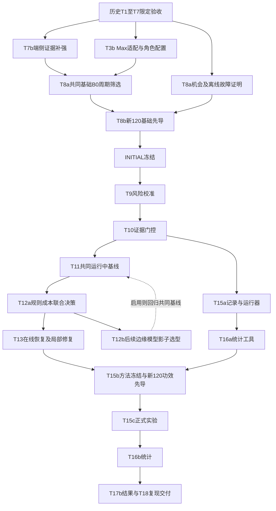

# 云、边、端协同整体研发执行计划

> **For agentic workers:** REQUIRED SUB-SKILL: Use superpowers:subagent-driven-development or superpowers:executing-plans to implement this plan task-by-task. Steps use checkbox (`- [ ]`) syntax for tracking.

**Goal:** 先补齐可验收的Max规划、端侧视觉/物理反馈与基础B0，再验证边缘受约束决策和局部修复的实际收益，逐步报告并最终复现全分母研究结论。

**Architecture:** 云端Qwen3.8-Max生成规划、监督与重规划；边缘汇总证据、筛选能力并通过可替换provider判断；端侧OpenCV＋RGB-D几何、现有技能控制器与SafetyShield负责感知和执行。近期边缘采用规则/成本路径，模型选型后置；不新增第三套执行器。

**Tech Stack:** 现有Python/NumPy/Pillow/Pydantic/FastAPI/SQLite、MuJoCo `<4`、React/TypeScript；计划增加OpenCV headless研究依赖及Max视觉API适配。版本与模型配置以真实探测后快照为准，不据计划安装或切换。

**Spec:** [当前设计 ced.research.v2](../specs/2026-10-04-cloud-edge-device-research-design.md)。数值和统计继承[原量化设计](../specs/2026-10-03-rgbd-evidence-research-design.md)；未变化任务的实现细节可复用[原执行计划](2026-10-03-rgbd-evidence-research-roadmap.md)，执行顺序及新增接口以本文为准。

## Global Constraints

- 用户已授权继续全部后续研发、按步报告；边缘侧模型后续再调整。最初计划修订为文档交付，后续实施状态以阶段总结为准。软件交付不能自动关闭真实模型、物理或正式研究验收。
- 文件路径中的 `vision/`、`edge/`、`auto_mode/`、`cloud/`、`research/` 等模块均相对 `src/cloud_edge_robot_arm/`；`scripts/`、`tests/`、`configs/`、`docs/` 和 `pyproject.toml` 相对仓库根。
- T1/T2/T3/T4/T5/T6a/T7的历史限定DONE及T17a的DONE保留；旧模型/资产/源码冻结只代表原验收时点，不能作为新路径的验收。
- 全部实际阶段真实RGB-D、真实服务及actuator/step；真值只供离线教师/独立评价，不能送在线provider。失败/BLOCKED/未执行阶段保留全分母。
- 同backend/episode新帧；固定顶视320×240、optical-z float32米、标定/时刻/hash；缺信息输出UNKNOWN。抬升≥50mm、保持≥0.5秒，释放后区域稳定≥1秒。
- 云返回与提交前复核身份、时效、候选集合和版本；原子技能内普通决策延期，硬停止独立。LOCAL_RECOVER在T13完整能力验收前不可选。
- 每实际provider在途上限1、最新待发帧有界合并，所有方法同规则；B0独立周期0.5/1/2/5秒。模型不进入实时伺服环。
- 基线selection静态≥90%、总体≥80%、安全违规≤1%。未合格不得宣称云请求节省；T8不是因文件存在或单个成功而DONE。
- G0—G5/B0—B5保留；基础/功效先导各120互斥，正式2400候选，N∈{600,1200,1800,2400}，恢复200、域外300×3seed，全部按来源组隔离。
- INITIAL/FINAL分层，Tcap=P99成功耗时×2向上10秒取整并夹[120,600]，Rcap=60；α=.05、power=.8、Holm、配对分层bootstrap≥10000次，零事件单侧界。
- 云请求/本地请求/规则/遥测和角色/实际位置分列；未知计费与纯推理时长为null。模型调整只能在selection/FINAL前或另立探索协议，正式测试中不改。
- GPU与渲染按实测串行；真实硬件NOT_STARTED、S3/S4 LOCKED。Isaac/G5/腕部相机/缓存为可选扩展，近期优先核心闭环。
- 每个通过的独立步骤先写局部报告，再汇入阶段总结；软件、真实采集、模型、物理证据分别登记。不统一暂存已有改动或自动推送。

## Review Focus

1. 目标缺失/相似干扰物：动作前语义与身份不一致必须拒绝，T7b覆盖 `test_missing_requested_target_cannot_start_motion`。
2. 部分遮挡与完整物体越界：UNKNOWN不补成功，T7b覆盖 `test_occluded_extent_cannot_prove_placement` 和 `test_partial_pixels_inside_region_do_not_prove_whole_object_inside`。
3. 云/边版本错绑或晚到回复：不能提交，T3b/T10/T12覆盖角色hash、取消、旧frame、candidate_set和mode_version。
4. 规则冒称模型、边缘provider临时替换：分列来源与成本，T12覆盖影子无dispatch、拒答及无静默回退。
5. T8伪造机会/可恢复性与样本泄露：原始快照/故障轨迹独立重算，T8a/T8b覆盖无故障轨迹拒绝、label重算、旧组排除与冻结拒绝。

---

## 1 当前状态与优先级

截至2026-10-04，历史基础任务T1/T2/T3/T4/T5/T6a/T7与新工作台T17a为限定DONE；T8仍为IN_PROGRESS。旧先导全120例5成功、静态4/40，独立复核一致，但只测过2秒候选且未过质量门。后续角色、端侧、门控、共同基线、规则判断、恢复、统计和复现已形成软件模块，不能用软件通过或历史DONE关闭实际新路径验收。

| 优先级 | 当前行动 | 状态与出口 |
|---|---|---|
| P0 | T7b端侧身份/遮挡/抬升/完整放置证据 | 软件独审PASS；真实几何/运动界和连续效果证明缺失，native提交UNKNOWN |
| P0 | T3b云Max角色适配/探测 | 软件独审PASS；当前无可用key/profile，新Max实测NOT_RUN |
| P1 | T8a开发池、固定机会/故障证明与B0周期筛选 | 池/原始证据生产校验软件PASS；开发故障教师仅1组，完整机会/200故障及四周期筛选NOT_RUN |
| P1 | T8b新120基础先导与INITIAL冻结 | staged/完整资源修复与INITIAL来源审计软件独审PASS；独立计费及实际基础先导/INITIAL未成立 |
| P2 | T9→T10→T11→T12a→T13 | 多项软件独审PASS；恢复消费者、运行组合和Max局部修复继续集成，真实风险/恢复/方法准入未成立 |
| 后续 | T12b边缘模型筛选或调整 | TODO；不锁型号，不阻塞近期补强；启用前独立验收 |
| P3 | T15a/T16a/T17补充→T15b→T15c→T16b→T18 | 记录/统计/只读界面/复现软件及浏览器检查PASS；真实方法执行/物理来源验证、功效/FINAL/正式实验NOT_RUN |

T3b与T7b可分文件实现，合并前按源码依赖重探模型并复验；真实模型/GPU/渲染串行。开发时间不按十二周等待。边缘型号后置不等于删除判断层：接口、规则、能力和提交边界先完成。

## 2 执行顺序与依赖

图中T12b回到T11是受控的版本变更回归，不是必须循环：未选择新模型时采用已验收规则provider继续；选择新模型时记录新版本，只重验受影响的共同能力/selection，再进入FINAL。改变INITIAL的云模型、场景、门槛或端侧绑定时另生成INITIAL代次，旧协议只读保留。

T8a的离线可恢复性证明由T5教师/独立评价提供，不等待T13在线恢复，也不算G4成功。B0基础周期筛选复用现有周期路径，不等待T11统一适配。INITIAL之前生产的正式机会/恢复快照不得用于视觉开发或阈值选择。

实际OpenCV路径的基础几何/运动证据必须先在T7b独立成立，再进行B0周期筛选和INITIAL。当前native动作契约的界为None；若只等INITIAL后的T9风险校准提供这些界，就会形成无法启动基础先导的循环依赖。T7b基础证书与T9后续风险拟合分开验证，二者都不能通过模型自报、模拟夹具或读取在线独立真值获得VALID。

## 3 任务与可验收交付

### T3b 云端Max接入与角色配置

**Files:** 扩展 `vision/{planner,model_resolver,frozen_model}.py`、`vision/evaluation.py` 的策略绑定；新增 `vision/role_models.py`、`configs/research/ced_roles.yaml`、`scripts/probe_rgbd_roles.py`、`tests/test_rgbd_role_models.py`。复用 `cloud/planning` 与 `model_control` 的既有请求、profile/secret和endpoint边界，不复制凭据或另造模型控制服务。

**Interfaces:** 保留 `RGBDPlannerAdapter.plan(InitialPlanningRequest) -> PlannerDraft` 与 `supervise(RGBDObservation, SupervisionContext) -> SupervisionDecision`。新增 `RoleProviderSnapshot(role, provider_id, provider_location, model_id: str | None, revision: str | None, weight_digest: str | None, quantization: str | None, request_config_hash, source_hashes)`；`RoleModelBundle(cloud_snapshot: RoleProviderSnapshot, edge_provider_id: str, edge_provider_hash: str, device_pipeline_hash: str)` 提供 `digest() -> str`。策略分别绑定角色/设备hash，旧 `model_snapshot_hash` 仅用于显式legacy兼容；新路径不复用旧单模型hash表示全部角色。

- [ ] 写测试 `test_cloud_plan_uses_real_two_image_transport`、`test_cloud_and_edge_versions_cannot_be_swapped`、`test_cloud_alias_does_not_invent_weight_digest`、`test_cancelled_cloud_reply_cannot_dispatch`，断言双图/角色/字节、未知字段null、拒绝后0动作。
- [ ] 运行 `.venv/bin/python -m pytest -q tests/test_rgbd_role_models.py`，确认新增行为先失败。
- [ ] 实现角色配置和Max适配；云端可用日期快照优先固定，服务不可用记录BLOCKED，不自动换回旧模型。边缘当前记录规则路径，型号不固定。
- [ ] 重跑角色及现有planner/request-control回归；真实S01及新开发目标缺失/干扰物探测保存载荷、响应、解析/拒绝和定位证据，模型未通过保持未验收。
- [ ] 写角色探测局部报告及源码/配置快照；Max探测通过不等于物理任务或G1通过。

### T7b 端侧视觉证据与闭环补强

**Files:** 新增 `vision/tracking.py`；从 `vision/execution.py` 中有针对性地拆出/替换RGBDTargetTracker实现，扩展 `edge/evidence/conditions.py`、`vision/task_semantics.py`；新增 `tests/test_opencv_target_evidence.py`、`tests/test_visual_effect_evidence.py`，在 `pyproject.toml` 增加OpenCV headless研究依赖。保留现有控制器、SkillExecutor、SafetyShield和独立评价器。

**Interfaces:** 新 `OpenCVTargetTracker(observation: RGBDObservation, grounding: dict[str, Any])` 的 `facts(observation: RGBDObservation, robot_state: RobotState | None = None) -> dict[str, Any]` 对接现有条件入口；RobotState类型复用 `contracts/models.py`，在线值来自当前机器人适配器的 `robot.get_state()`，不是从类型定义获得硬件遥测。事实记录source、身份、帧/时刻/标定、几何估计、完整性与原因，进入 `OnlineEvidenceSnapshot.visual_facts`，继续由 `evaluate_conditions(...) -> list[ConditionVerdict]` 产生PASS/FAIL/UNKNOWN；ConditionVerdict保留status、condition_name、observation_id、measured_values、reasons。

用户已选择“增加可见姿态标记，保留现有顶视相机与控制器”。新增独立标记检测模块与开发资产版本，以已登记的非对称可见图案辨别姿态；旧v2基础资产和默认抓取profile保留。先检验新资产物理参数等价，再保存真实RGB-D原始帧和离线误差核对。标记识别/单帧姿态只记OBSERVED；连续角速度、几何误差界、稳定性与完整放置仍需独立证据。实际320×240首帧严格检测失败已保留；允许在同一物理相机上用新的640×480、必要时960×720观测配置验证可见性，分别登记intrinsics/标定与成本，不把旧帧放大当新采集，不自动切换默认配置。

现已完成v1及保留原红色边缘的v2范围内软件/原始帧独审。一次显式排除的70毫米开发搬运经完整raw重建评分成功，但初始以外全部九个动作边界标签UNKNOWN；顶面标签在现有手/臂下不可持续观测。这一负结果不能通过教师成功补视觉PASS。下一项先实施独立DEVELOPMENT_ONLY标记/颜色关联诊断，分开白/黑标签、白底、实际色边与几何参考，禁止任意填洞、改写完整目标身份或声明校准界。运行时接入、已验收身份登记、完整外轮廓/深度与运动连续证书仍须单独审查；需要观测的动作本身也须当前独立VALID提交，不能以获取证据的目的豁免门控。

- [ ] 写身份/遮挡/错颜色/深度损坏反例及Review Focus两项放置反例；断言目标缺失0动作、遮挡UNKNOWN、旧裁剪未获新证据。
- [ ] 写真实新帧抬升保持与完整物体释放/稳定行为测试；覆盖物理抬升成立但视觉不足时保持UNKNOWN，不能读取独立结果来补PASS。
- [ ] 用 `MUJOCO_GL=egl .venv/bin/python -m pytest -q tests/test_opencv_target_evidence.py tests/test_visual_effect_evidence.py` 确认新增行为先失败。
- [ ] 实现OpenCV时序跟踪和保守RGB-D几何，重用唯一在线条件/动作入口；观测动作仅在已验证能力与预算内开放。
- [ ] 重跑T7条件/闭环/语义及安全回归，重探受源码影响的模型；使用新开发smoke组独立重算物理与在线分歧，失败全部保留。
- [ ] 输出端侧算法/标定hash、误差/覆盖/UNKNOWN、各效果条件与物理分歧报告；不放宽50mm/0.5秒/1秒或安全门槛。
- [ ] 完成标记检测、新资产物理等价和原始采集独审，再实施可观测连续性与基础几何/运动证书；缺界时native提交保持UNKNOWN，不借后续T9或INITIAL开关放行。

### T8a 场景证据准备与基础B0筛选

**Files:** 扩展 `research/{protocol,pilot,freeze_evidence}.py`、`scripts/run_rgbd_pilot.py`；新增 `research/protocol_evidence.py`、`scripts/prepare_rgbd_protocol_evidence.py`、`configs/research/{ced_selection,ced_foundation,recovery_faults}.yaml`、`tests/test_protocol_evidence_generation.py`。复用T6数据来源与T5教师，不访问在线T13。

**Interfaces:** `prepare_protocol_evidence(pools: dict, output: Path) -> dict` 输出固定机会/故障与载荷hash清单；`verify_protocol_evidence(directory: Path) -> dict` 从原始资料重算身份、标签、注入与可恢复性。`run_rgbd_pilot.py --stage selection` 为计划新增入口，保存120个selection组×4周期的完整配对结果；每周期12层各10组。

- [ ] 写反例 `test_opportunity_label_is_recomputed_from_raw_evidence`、`test_success_without_fault_cannot_prove_recoverability`、`test_development_cannot_read_formal_opportunity_labels`、`test_all_previous_used_groups_are_excluded`。
- [ ] 运行对应测试确认先失败，再实现离线生产/校验与完整来源排除；旧资产不兼容时另版本生成现行资产train/calibration/selection开发数据。
- [ ] 预先锁定故障定义、eligibility与有界生成规则；实际注入后由独立教师证明200组可恢复，保留失败、排除和尝试记录。不足200保持INCOMPLETE。
- [ ] T3b/T7b通过后，在隔离selection组真实扫描0.5/1/2/5秒；选择静态≥90%、整体≥80%、安全≤1%的候选中云请求最少者，平局墙钟延迟较低者。
- [ ] 保留四周期扫描曲线与全部失败。全部候选不合格则NO_FEASIBLE_BASELINE，继续基础补强；预算不足记INCOMPLETE，不能冒称已筛选。
- [ ] 输出固定机会、故障及selection报告；正式快照/标签不作为端侧开发输入，离线可恢复性不冒称在线G4。

### T8b 新基础先导、预算与INITIAL冻结

**Files:** 复用T8已有账本/网络/时钟/pilot/audit/budget及freeze CLI；扩展角色快照与独立证据绑定，更新 `tests/test_research_{pilot,protocol}.py`。

**Interfaces:** 在冻结的selection胜出周期上运行 `run_rgbd_pilot.py --stage foundation`；`initial_spec_from_evidence(Path) -> ProtocolSpec` 核验全部120原始轨迹、账本、角色hash、互斥池、机会/故障证据；`freeze_protocol(..., stage='INITIAL', evidence_directory=...)` 才能发布INITIAL。

- [ ] 写 `test_new_roles_require_new_foundation_evidence`、`test_initial_freeze_rejects_missing_fault_or_opportunity_proof`，确认先失败。
- [ ] 实现新路径严格证据校验，按角色与真实序列化边界结算成本，拒绝仅靠摘要或YAML放行。
- [ ] 在另120个未用开发组跑完整先导；独立重算全部物理/帧/成本/来源，旧v1/v2不改名或覆盖。
- [ ] 从合格B0成功P99派生Tcap，计入初始化、完整成功路径、源档、功效/正式/消融/恢复/回放及重跑预留刷新预算；不把旧失败均值当成功路径承诺。
- [ ] 运行INITIAL冻结CLI，保存退出码、hash及拒绝原因。全部条件通过才T8 DONE；N留空、FINAL仍不能伪造。

### T6b 与 T9 现行数据、风险与校准

**Files/Interfaces:** 复用T6数据工厂与原T9的 `vision/risk/{models,features,fit,calibration}.py`、`scripts/calibrate_rgbd_risk.py` 规划；输入 `RiskFeatures` 仅含在线可观测特征，输出 `RiskEstimate` 与校准覆盖/误差界。具体字段与原T9接口保持一致，实现时不得仅凭名称增加预测概率。

- [ ] T8预算通过后决定是否运行10000组；未运行保持TODO。训练/校准/selection/test及所有衍生帧按组隔离，教师成功标签必须真实轨迹验证。
- [ ] 按原T9测试循环实现特征与轻量模型，增加 `test_oracle_features_never_enter_edge_judgment`；只用train拟合、calibration校准、selection选择参数。
- [ ] 报告覆盖、校准、拒答与域外边界；规则分数/模型自报/校准失败概率分列。该任务不要求先更换边缘模型，也不训练通用VLA。

### T10 证据契约及B3

**Files/Interfaces:** 复用原T10的视觉证据契约计划，接收T9的可观测误差/运动界、T8的固定机会；在云返回与提交前统一复核版本和动作相关有效期。

- [ ] 写角色版本冲突、旧帧/标定、运动界未知和候选集合变化的拒绝测试；先失败后实现。
- [ ] 在同一T8固定快照/候选上运行新门控与B3，保留VALID/INVALID/UNKNOWN及全分母；B3仍保留基础OpenCV和SafetyShield。
- [ ] 输出开发门控结果和时效边界；回放不算真实任务成功，正式G3留T15c。

### T11 共同运行中基线与模式提交

**Files/Interfaces:** 原T11事件适配与 `auto_mode/{selector,transition_service,repository}.py`、`experiments/runtime_harness.py`；复用现有PCSC ticker、DecisionEvent及SkillExecutor。模式CAS软件已独审通过，实际RGB-D owner的模式、active contract和checkpoint统一登记仍待接入，不能将Mock harness视作该实际来源。

- [ ] 测试成功/失败/最终验证均再判断、独立周期、原子边界、checkpoint和 `expected_mode_version` 比较更新；重启/乱序不得重复执行。
- [ ] 实现模式提交单写者、prepared提交/abort及幂等恢复；合同重规划CAS继续复用既有repository机制。
- [ ] 在共同冻结云模型/端侧/边缘provider上selection复验B0/B1/B2，保留全候选，不选弱基线；基线质量失败回到共同基础补强。

### T12a 边缘规则/成本联合决策

**Files:** 按原T12新增 `auto_mode/{joint_policy,candidates,judgment}.py`、`tests/{test_decision_judgment,test_joint_visual_policy}.py`，扩展其models与现有事件入口；`judge_providers.py` 留T12b模型扩展。

**Interfaces:** 沿用原T11的 `DecisionContext` 和原T12的 `ActionCandidate`、`CandidateSet`、`ActionCostEstimate`、`JudgmentResult`。可替换provider实现 `DecisionJudge.choose(context: DecisionContext, candidates: CandidateSet, estimates: Sequence[ActionCostEstimate]) -> JudgmentResult`；`CostDecisionJudge` 作为近期实现，`JointEvidencePolicy` 消费同一接口。上下文与结果绑定完整版本/候选hash，规则输出不产生模型请求；结果只经提交复核进入现有路由。

- [ ] 写合法候选、STOP必有、未验收恢复禁用、模型/规则来源、非法组合/拒答/超时与提交时再次过期测试。
- [ ] 实现确定性规则及基于校准风险/实测成本的受限选择；能力、预算、安全条件先筛选，不声称全局最优。
- [ ] 验证事件到提交/拒绝的完整延迟与角色成本；未知分量明确null，规则回退不冒称模型结果。

### T12b 后续边缘模型选型与调整

**Files/Interfaces:** 新增 `auto_mode/judge_providers.py`、`tests/test_edge_judge_shadow.py` 并扩展角色配置。模型沿用T12a同一DecisionJudge接口，不另设动作协议或执行器。

- [ ] 核心闭环和资源就绪后再比较候选型号；当前不锁Qwen3.5-4B，不下载或训练新权重作为近期任务。
- [ ] 先用独立开发观测影子回放，断言无dispatch、真实视觉输入、候选合法/拒答及实际本地成本；拒答与ERROR分列。
- [ ] 合格候选再在独立selection做相同能力/候选/控制器下的配对闭环；型号、量化、参数与版本全部记录，不能用自报置信度当物理成功概率。
- [ ] 启用前冻结provider，复验受影响T10/T11/T12与基线；若无合格模型保留验证过的规则provider并如实记录。FINAL后调整另立探索协议。

### T13 验证后恢复、局部修复与B4

**Files/Interfaces:** 继承原T13的 `cloud/replanning/{visual_dependencies,visual_repair}.py`、`edge/recovery/lifecycle.py`；接现有ReplanApplyService和EventAutonomyRepository合同CAS。T8a已提供故障定义/证明，T13负责在线能力，不反向阻塞T8。

- [ ] 测试DETECTED→AUTHORIZED→EXECUTED→VERIFIED_RESOLVED、有界/重启预算、ACK与启动区分、completed步骤不重放，以及已授权但验证失败仍未解决。
- [ ] 实现最小受影响未完成后缀修复和完整重规划B4，共同SafetyShield/候选版本/预算；REPLAN在能力验收前继续停止。
- [ ] 开发故障组做真实配对闭环并独立重算，能力通过后才启用LOCAL_RECOVER。正式200组不能调参；恢复未闭环时C2未完成。

### T15a、T16a 与 T17 后续界面

**Files/Interfaces:** 继承原记录契约、运行器、功效/统计工具任务；T17a已DONE，补充角色来源/费用、端侧证据、升级原因、候选→接受→启动→效果→独立结果的时间线。

- [ ] T8/T10就绪后实现记录/恢复/分配与失败分母反例；statistics验证非劣、零事件上界、Holm与配对分层bootstrap。
- [ ] FINAL入口仍需真实方法和功效证据，实现前明确拒绝；软件合成数据只用于算法校验。
- [ ] 前端核验规则/模型/UNKNOWN和采集/规划/执行/物理结果分级；T17b真实结果验收等T16b，不把已有工作台DONE扩展成研究看板DONE。

### T15b 方法冻结与独立功效先导

- [ ] 先冻结主方法、B0/B1/B2/B3/B4、角色/provider、端侧算法、全部阈值和预算；选择边缘模型与否均需固定，正式测试不再调整。
- [ ] 另120个互斥开发组只估配对不一致率，按预定α/功效/校正规则从600/1200/1800/2400取N；此批不调参。
- [ ] 独立核验INITIAL链接、方法hash、样本规则与新资源预算，证据充分才发布FINAL；需要N>2400或预算不足保持证据不足/未完成。

### T15c、T16b、T17b 正式运行与统计

- [ ] FINAL与G0/G1条件通过后，在同一N组执行主方法＋B0/B1/B2及三项消融；G3固定机会与200组G4/B4分别运行，全分母保留。
- [ ] 从原始记录判定PASS/FAIL/INSUFFICIENT_EVIDENCE；G2成功/安全门均通过才声明成本收益，G2a独立报告，C2需要G3与G4。
- [ ] 展示实际分母、区间、角色成本、误完成/UNKNOWN/无进展及负结果；A0/A1/A2为独立架构探索，不替代正式B机制对照。

### T18 复现与交付；T14等可选扩展

- [ ] 收集源码/模型/协议/数据hash、环境和命令，从原始资料重建统计与报告，进行独立审查和必要软件/小批物理复验。
- [ ] 每步已有局部报告合入阶段总结，最终形成方法、失败边界、成本、复现和演示包；未完成指标如实登记。
- [ ] 核心资源足够后才做G5、Isaac/腕部相机/缓存；未做记NOT_RUN，不缩减核心阈值或删失败。

## 4 报告与计划维护

局部报告最少包含：任务范围和状态、源代码/资产/模型/provider/协议hash、命令和退出码、原始目录、全分配与失败、四层证据、开放问题及下一前置。软件通过不关研究门，研究未达标不删软件完成记录。

阶段汇总入口为[2026-10-04阶段总结](../../research/process/continuation_20261004.md)；当前执行状态同步 `phase_progress.md`、`validation_matrix.md`、`handover.md` 与权威状态。每次模型/视觉/恢复/冻结变更保存独立版本，不覆盖T7、T8 v1/v2及探索性对比。

当前资源冻结修复、恢复消费者、Max局部修复、INITIAL来源审计已取得限定软件独审；继续标记关联、风险完整原始来源/有限选择重放、实际owner登记和方法/准入接口集成。远端声明账本金额不是独立实测计费，公开费率规划上界仍为未采纳的新规则设计；不静默替换预算门。Max凭据、端侧校准与连续效果证据、完整机会/200故障、合格四周期B0和实际基础先导仍是研究前置；边缘模型优化后置。本文未勾选项包含真实验收要求，不能仅凭子项软件通过整项勾选；逐项已完成的软件与实际来源见阶段总结及局部报告。
