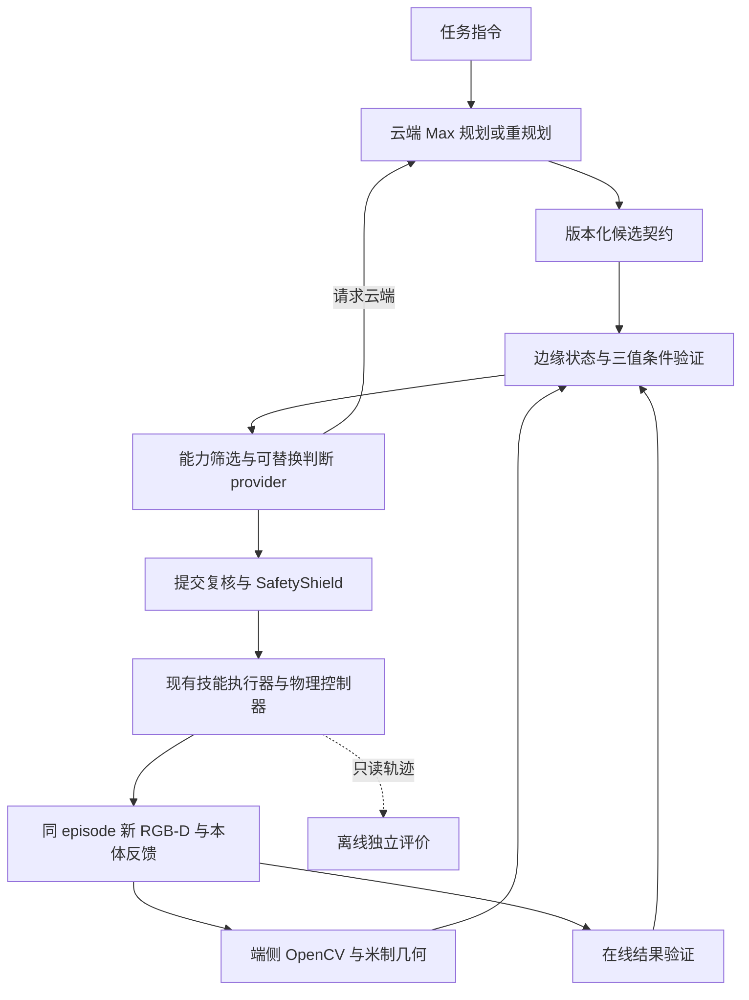

# 云、边、端协同研究设计与计划修订

版本：`ced.research.v2`，2026-10-04。状态：**研发设计，尚未形成 INITIAL/FINAL 实验协议**。

依据用户“更新整体计划”及“边缘侧的模型后续再调整”，将后续研发调整为云端 Qwen3.8-Max 规划、边缘可替换判断层、端侧 OpenCV＋RGB-D 几何＋控制器的协同路线。边缘模型型号暂不固定，不把 Qwen3.5-4B 接入或优化设为近期前置任务。先完成端侧证据与基础闭环，再验证受约束协同和恢复收益。

本设计继承[原研究设计](2026-10-03-rgbd-evidence-research-design.md)的 G0—G5、B0—B5、数据隔离和统计规则；本文件定义当前架构、补强顺序及新模型配置边界，冲突处以本文件为准。对应[当前整体执行计划](../plans/2026-10-04-cloud-edge-device-research-roadmap.md)。开题材料的十二周只是材料安排，开发按依赖与验收推进。

## 1 当前事实与本轮范围

T1/T2/T3/T4/T5/T6a/T7 的历史限定 DONE 保留；T17a 数据/视觉工作台已 DONE。T8 第二批先导120例5成功、静态4/40，物理/帧/成本独立复核一致；当前2秒周期候选未达质量门，初次冻结拒绝。固定机会快照与200恢复证据尚未完成。详见[第二批报告](../../../artifacts/research/process/20261004-t8-foundation/foundation-v2-assessment.md)。

18例在线抬升保持未验证，而离线物理证据达到50mm/0.5秒，只能作为遮挡与证据设计的诊断线索，不能改判成功或把真值输入在线策略。既有 Max 探索闭环正常成功1/12，也不能替代新的基础能力验收。

设计修订时 `RGBDTargetTracker` 使用 NumPy/PIL，规划和监督共享单模型快照；最初交付只更新文档。用户随后授权全部后续研发，角色/OpenCV/门控等软件已在[阶段总结](../../research/process/continuation_20261004.md)分步登记。本设计定义验收要求，后续软件或开发采集不能据此宣称已完成三层真实部署或正式研究。

## 2 三层职责与数据流

| 层级 | 当前计划 | 输出与边界 |
|---|---|---|
| 云端 | Qwen3.8-Max；任务语义、初始白名单技能意图、周期监督、复杂异常及重规划 | 结构化规划或监督决定；不能直接产生关节控制、绕过条件验证或宣布物理完成 |
| 边缘 | 统一状态、能力筛选、规则/成本判断、版本与提交协调；判断 provider 可替换 | CONTINUE / REOBSERVE / LOCAL_RECOVER / REQUEST_CLOUD / STOP；未验收的恢复能力不开放 |
| 端侧 | OpenCV 身份与时序跟踪、RGB-D 几何及效果证据；现有控制器、技能执行器、SafetyShield | 新观测、三值条件、实际动作和停止；未知证据不能改成 PASS |

边缘先采用确定性规则/成本 provider；模型后续通过独立角色测试与影子回放后再选择。Qwen3.5-4B 保留为参考候选，暂不写入强制模型快照。规则分数不标为模型置信度，规则选择不记作模型请求。

控制器循环与模型等待分开；模型工作异步、有界，MuJoCo owner 线程负责采集和物理推进。普通模型返回只在原子技能安全边界应用，硬停止独立执行。复用 PCSC/ETEAC 与现有技能执行器，不新增第三套动作引擎。

## 3 近期优先补齐的端侧证据

1. **动作前语义身份。** 将有限任务语义与可观测目标身份绑定；目标缺失、错颜色、相似干扰物和身份歧义必须在第一条物理动作前拒绝或重观测。尾部语义扣分不能替代动作前检查。
2. **时序与遮挡。** OpenCV 连通域/轮廓、颜色与时序关联只提供 RGB-D 估计；漂移、合并、遮挡、深度不足输出 UNKNOWN 并记录原因。旧帧裁剪不算新观测，不能用帧号变化假称观测内容改善。
3. **抬升与保持。** 用新帧、米制深度、身份和本体反馈构造在线证据；TCP升高、动作返回或模型自报均不足以证明物体抬升。遮挡时取得新的有效证据，能力未覆盖时停止。
4. **完整物体放置。** 判定覆盖完整物体的保守空间范围、释放与1秒稳定性；部分可见像素落入绿色区域不能证明整个物体已在区域内。缺失范围或误差界时 UNKNOWN。
5. **观测动作。** 重采集与改变视角分别记账。只有经过控制器/SafetyShield验收的观测动作才能开放；实际动作仍走原技能入口和预算，不重放已完成抓放步骤。

继续使用 `edge/evidence/conditions.py` 的唯一 `evaluate_conditions` 入口；端侧输出证据事实，不能另设恒真完成判据。首阶段保持当前批准资产和刚性竖直方块任务范围；腕部相机与任意物体操作为独立扩展。

## 4 跨层契约与模型配置

所有候选与返回绑定 task/episode、observation_id、采集时刻、calibration_version、plan_version、command_seq、mode_version、context_hash、candidate_set_hash、provider版本与valid_until。云返回和提交前均复核身份、证据与版本；取消、超时、乱序、过期或候选集合变更后不得提交。

边缘判断输入只含可观测证据、本体状态和代码生成的合法候选；至少保留STOP路径。模型拒答、集合外动作、矛盾选择和超时分列；有预算及已验收能力时重观测，否则停止。provider建议不绕过确定性安全条件和已校准风险边界。

模型快照从单模型升级为角色快照：云端配置、边缘provider、端侧算法/标定及版本分别绑定到运行。云端 API 固定model ID、可用快照版本、endpoint区域、提示、生成参数、图片转换及响应证据；无法取得的权重摘要或服务版本明确为null，不伪造权重冻结。边缘规则记录源码/策略hash；后续本地模型另记录权重、量化、视觉能力和推理参数。

Qwen3.8-Max 的图像/结构化接口依据[阿里云官方文档](https://www.alibabacloud.com/help/zh/model-studio/vision-model)；接口支持不等于本项目规划可靠性。近期先验证320×240双图、严格解析、坐标协议和缺失目标拒绝。保留当前受限抓放技能与几何落地，不假定Max已支持任意复杂机器人任务。

每个实际provider在途模型请求上限1，最新待发观测有界合并；不同provider可独立排队，云端等待不能阻塞本地硬停止。所有方法使用相同在途与合并规则。PCSC保持独立0.5/1/2/5秒周期候选，不改成仅在技能边界触发。

## 5 解除初次冻结的依赖闭环

当前T8冻结需要固定机会快照、200个故障的离线可恢复性证据，以及合格基础B0；在线T13和统一基线T11又依赖T8。调整为三个明确阶段：

| 阶段 | 生产者与出口 | 不依赖的后续能力 |
|---|---|---|
| T8a 前置证据准备 | 复用T5离线教师/独立评价生成固定机会、故障日程与200个可恢复性证明；固定候选及预算选择规则 | 不依赖T9校准、T10新门控或T13在线恢复，不计算G3/G4方法收益 |
| T8a 基础B0筛选 | 现有周期路径在独立selection开发组扫描0.5/1/2/5秒；保留全部结果，按既定质量与成本规则选择 | 不等待T11统一运行中基线适配 |
| T8b 基础先导与初冻 | 新架构/配置的另120个未用开发组，完整原始证据、预算、Tcap与INITIAL协议 | 不等待完整新方法；N不在此选择 |

固定机会生产器在运行比较方法前锁定相同候选动作、RGB-D快照和独立标签，VALID/INVALID/UNKNOWN分列。标签需能由原始传感缺陷、独立几何和时刻规则重算，不能仅信摘要布尔值。离线真值与标签不送在线provider。

200个恢复组的证明必须包含实际故障注入、起止时刻、教师恢复动作与独立成功/安全证据；普通无故障成功轨迹不证明可恢复。eligibility规则及有界生成尝试在方法比较前固定，失败/排除/未完成来源全部保留，不按某方法表现删除组。无法获得完整证据时保持INCOMPLETE，不能降低G4的200分母。

selection扫描、基础先导、方法先导和正式池分别隔离。旧v1/v2只能用于开发诊断和资源参考；改动模型、视觉证据或控制后在新目录与未用组重验，不覆盖旧报告。现存旧资产数据按其来源保留，新资产训练/校准/选择数据另版本生成。

## 6 方法与架构对照

B0—B5仍代表机制：PCSC周期监督、固定阈值ETEAC、规则AUTO、确定性基础门控、完整重规划、均匀采样。主方法与这些基线共用同一冻结的云模型、边缘provider、端侧视觉、控制器、候选、预算和安全边界；触发规则、证据门控和修复范围是比较变量。

架构探索单独编号，不取代B0：

| 对照 | 用途与边界 |
|---|---|
| A0 云＋端 | Max承担高层规划/判断，端侧使用同一CV/几何/控制；检验是否需要独立边缘判断层 |
| A1 固定三层 | Max＋冻结边缘provider＋同一端侧；固定触发与选择规则 |
| A2 自适应三层 | 与A1完全同模型/provider/端侧，只改变风险与时效触发、局部处理/升级策略 |

A0与三层的角色差异属于架构探索；C1的机制归因以冻结主架构上的公平B0/B1/B2为准。B3仅去校准不确定性及动作相关有效期，不删基础OpenCV身份、版本或SafetyShield。B4只改重规划范围，不删预算/完成保护。边缘模型更换另设探索配置或在FINAL前重新selection冻结，不能在正式测试中途调整。

边缘模型后续先做无dispatch影子判断，再在独立selection组验证拒答、候选合法性、风险、资源与延迟；单纯规划成功率不能替代局部判断角色验收。模型未合格时保留已验证规则provider并标明来源，不伪装模型成功。

## 7 保留的量化目标

| 目标 | 保留的验收要求 |
|---|---|
| G0 | 已发生感知/模型/动作阶段100%真实；泄露、伪装成功、跨组重复0；不可用BLOCKED，未发生NOT_EXECUTED |
| G1 | 正确识别且有效深度目标定位P90≤10mm，另报覆盖；独立静态抓放成功≥90% |
| G2 / C1 | 对B0云请求均值减少≥30%；成功率差单侧95%下界>−3百分点；安全违规率差单侧95%上界≤+1百分点 |
| G2a | 应用字节减少≥25%；失败惩罚任务耗时P95减少≥15%，分别判定 |
| G3 / C2 | 对B3误放行减少≥50%、绝对≤2%；有效安全机会错误拒绝≤5%，UNKNOWN独立 |
| G4 / C2 | 200故障恢复成功≥80%；失败惩罚恢复耗时中位数减少≥30%；完成的不可重复动作重提交0 |
| G5 可选 | 2000训练组域外成功提高≥5百分点；500/1000/2000曲线，300域外组×3训练seed |

基线selection的静态≥90%、整体≥80%、安全违规≤1%不变。没有合格B0时报告NO_FEASIBLE_BASELINE，不能用低成功率宣称请求节省。正式G0/G1通过后才验收C1/C2；软件通过和开发smoke不替代正式结果。

G1定位误差对独立标注的物体顶部几何中心计算三维欧氏距离，不能以选中像素处的真值反投影自比较。相对改进的基线值为0时记N/A并另报绝对值；名义改进阈值按点估计判定，可靠改善还要求对应95%区间排除0，不把点估计达标写成置信下界达到同一阈值。

## 8 数据、冻结、统计与成本

- 感知数据100/1000/10000组；按组80/5/5/10划分train/calibration/selection/test，全部派生帧同组。测试不得训练/选阈值。
- 基础先导120、方法冻结后功效先导另120，均12层各10且互斥；正式候选2400、恢复200、域外300与全部开发/训练组隔离。正式N从600/1200/1800/2400选取，层内固定前N/12；剩余候选不得调参。
- 三任务层×RTT0/100/300/600ms，丢包0/0/1/5%，RTT±20%（0档无抖动），10Mbit/s；另列3/10秒中断。目标速度0/20/40mm/s，深度噪声0/2/5mm、无效0/10/30%、遮挡0/20/40%，层内均衡组合。
- 保持同backend/episode与可解释墙钟—仿真映射；等待时物理继续推进。固定顶视320×240、RGB uint8、optical-z float32米、有效掩码、内外参、帧/采集时刻/标定/hash。深度辅助图不代替米制深度。
- 抓取提升≥50mm并保持≥0.5秒；释放后目标区稳定≥1秒。动作通过actuator/step，不写目标位姿。在线完成与独立物理成功合取，离线评价不反馈在线策略。
- INITIAL锁定场景、机会、故障、门槛、统计与预算选择规则；FINAL先冻结完整方法与provider，再用独立120仅估功效锁定N与最终hash。Tcap按合格B0成功P99×2、向上10秒取整并夹[120,600]；Rcap=60秒，失败分别赋Tcap/Rcap。
- 一侧总体α=0.05、目标功效0.8、Holm校正；场景聚类/条件分层配对bootstrap≥10000次、95%区间；零事件用单侧精确或Wilson上界。所需N>2400或区间不足为INSUFFICIENT_EVIDENCE，不追加至显著。
- 全部预分配episode计分母，失败/超时/模型错误/安全停止/BLOCKED保留；基础设施损坏才允许有记录的成对重跑，原记录不删。
- 云请求含规划/监督/重规划/远程判断及所有实际重试、超时、失败；边缘模型请求单列，规则和遥测另计。逻辑CLOUD/EDGE与实际LOCAL_HOST/REMOTE_SERVICE分列；字节按实际序列化收发，未知费用/纯推理耗时为null。
- 报告触发至提交复核的端到端延迟、故障首个有效响应及未响应数、UNKNOWN/拒答/回退/误完成/无进展分母。边缘与端侧同时报告资源耗时，不用云请求下降掩盖本地代价。

## 9 资源、实现与报告规则

单GPU渲染和本地模型按实测串行安排，云模型请求异步有界。近期不启动10000组、正式N或扩展训练，先根据新闭环实测时间、磁盘、云请求与API计费刷新预算；旧批大量早期失败的均值不能保证成功闭环运行成本。

MuJoCo为主；单机模拟角色部署标“模拟云边端部署”，实际远程Max调用及本机端侧/边缘位置分列，不宣称已部署真实边缘设备。真实硬件仍NOT_STARTED，S3/S4 LOCKED。Isaac、腕部相机、缓存与G5为资源允许的独立扩展。

每完成可独立验收的一步，写入原始产物目录的局部报告，并汇总到[阶段总结](../../research/process/continuation_20261004.md)：改动、源码/模型/协议版本、命令/退出码、分配与全分母、SOFTWARE/REAL_CAPTURE/REAL_VLM/PHYSICS层级、未满足项和下一依赖。DONE只对全部要求通过的范围成立。
