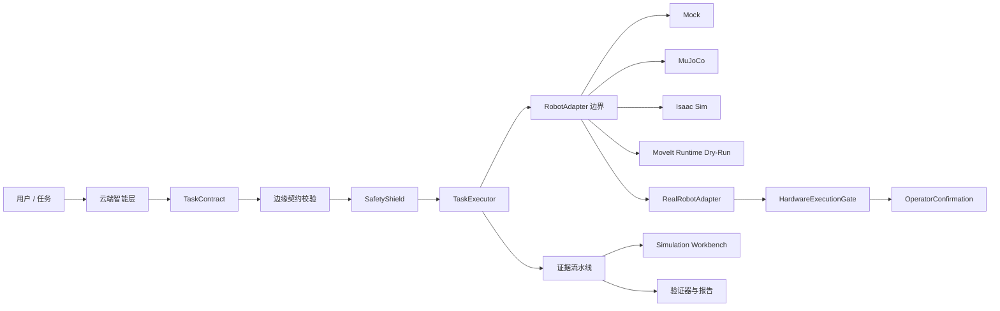
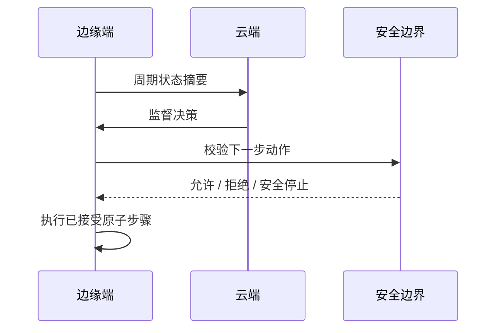
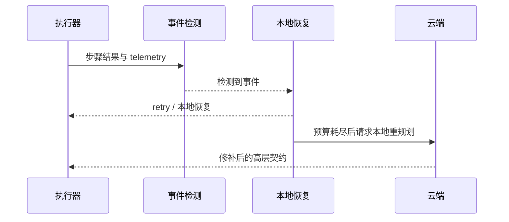
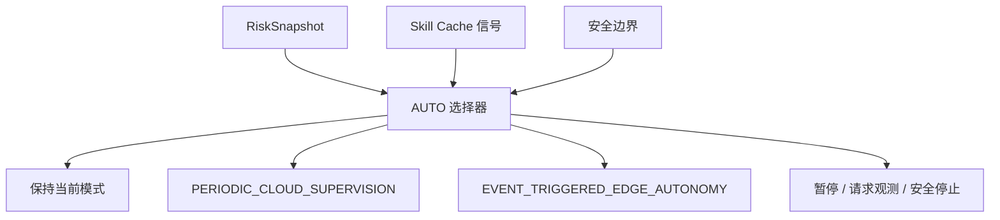
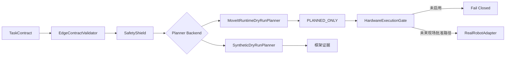
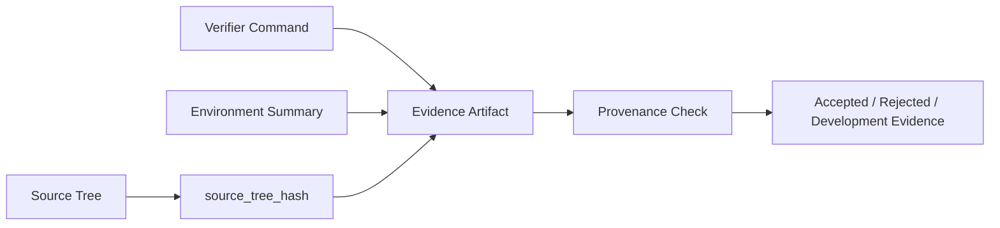

# BIG-small 架构

BIG-small 采用“云端智能规划、边缘安全执行”的架构。云端只生成高层任务契约、监督决策和重规划建议；边缘端负责契约校验、安全盾、状态机执行、恢复策略，并保留最终执行拒绝权。

## 1. 总体分层

- **契约层**：`TaskContract`、telemetry、`CloudCommand`、`FailureSummary`，以及 schema/provenance 字段。
- **云端智能层**：planning、supervision、本地重规划和风险感知调度。
- **边缘运行时层**：`EdgeContractValidator`、`TaskExecutor`、`SkillRegistry`、repository 和 audit log。
- **安全层**：`SafetyShield`、`StopController`、telemetry/scene provider 和 safety rule。
- **协同模式层**：`PCSC`、`ETEAC` 和 `AUTO 双模式选择器`。
- **实验与证据层**：Phase 8+ experiment、artifact、statistics、source tree hash 和 verifier。
- **仿真与机器人集成层**：Mock、MuJoCo、Isaac Sim、ROS 2 / MoveIt。
- **真实机械臂安全边界**：`RealRobotConfig`、`HardwareExecutionGate`、`OperatorConfirmation` 和 acceptance level。
- **仿真工作台层**：`dashboard/src/simulation/` 提供 Phase 11 Simulation Workbench，不直接控制硬件。
- **仿真运行时层**：`simulation_runtime` 提供 Phase 11.1 异步队列、SQLite 持久化、worker lease 和恢复。

## 2. 系统总览



浏览器、云模型或用户指令都不能直接命令关节。所有动作路径都必须经过边缘运行时和安全边界。

## 3. PCSC 序列



`PCSC` 表示周期云端监督。它不会绕过边缘 executor。

## 4. ETEAC 序列



`ETEAC` 让本地恢复保持确定性，只在需要高层重规划时升级到云端。

## 5. AUTO 边界



AUTO 不是第三种执行引擎。它在 dwell time、cooldown、switch limit 和安全约束下，在 PCSC 与 ETEAC 之间做选择。

## 6. Phase 10 Dry-Run 与硬件边界



Phase 10.2A 状态为 `PHASE10_MOVEIT_DRY_RUN_ACCEPTED`：已有 MoveIt runtime planning evidence，`sent_to_hardware=false`，`hardware_motion_observed=false`，没有联系真实 controller，也没有调用 execute。

## 7. 证据溯源流



Phase 10 evidence 记录 `generated_from_commit`、`source_tree_hash`、`worktree_clean`、`diff_hash`、verifier version、command、config hash、environment hash 和 timestamp。

## 8. 机器人集成

- MuJoCo 是适合 CI 的物理仿真后端。
- Isaac Sim 6.0 runtime validation 基于独立进程，并写入 Phase 9.2 evidence。
- ROS 2 / MoveIt safety validation 是 runtime evidence，不是源码守卫。
- MoveIt Runtime Dry-Run 只规划，不执行。
- Phase 11 冻结 Real Robot 开发，只保留回归测试。
- Real Robot Read-Only 的 fake/framework 已完成，真实设备连接和 Real Robot Motion 仍未开始。

## 9. Simulation Workbench

`dashboard/src/simulation/` 是 Phase 11 仿真工作台。前端可以调用 FastAPI/WebSocket API 读取 capability、场景、运行状态、metrics、comparison 和 evidence，但不能直接连接 ROS 2 trajectory topic、MoveIt execute、MuJoCo runtime、Isaac runtime 或真实 controller。

```mermaid
flowchart LR
  React[React Workbench] --> API[/api/v1/simulation]
  API --> Registry[scenario_registry]
  API --> Config[ExperimentConfig]
  API --> Allowlist[Fixed Runner Allowlist]
  Allowlist --> Mock[MOCK_SCENARIO]
  Allowlist --> Mujoco[MUJOCO_SCENARIO]
  Allowlist --> Batch[PHASE8_BATCH / PHASE8_SWEEP]
  Allowlist --> Cross[CROSS_BACKEND_PAIRED]
  API --> Artifacts[artifacts/phase11]
```

Phase 11.1 在 API 和 runner allowlist 之间加入持久运行时：

```mermaid
flowchart LR
  API[/api/v1/simulation] --> Runtime[SimulationRuntimeService]
  Runtime --> Repo[SQLite Job Repository]
  Repo --> Dispatcher[SimulationJobDispatcher]
  Dispatcher --> Worker[SimulationWorker]
  Worker --> Runner[Allowlisted Runner]
  Worker --> Events[Persisted Events / Metrics]
  Events --> Stream[WebSocket Replay]
```

`POST /runs` 返回 `QUEUED`；worker 后台推进状态。MuJoCo READY 不等于 MuJoCo runtime accepted，正式验收需运行 Phase 11.1 M11-01 至 M11-10。

## 10. 验证入口

- 核心检查：`scripts/verify_project.py --profile ci`
- Phase 9 core：`scripts/verify_phase9.py`
- Phase 9.1 ROS 2 / MoveIt：`scripts/verify_phase9_1.py --skip-history`
- Phase 9.2 Isaac/cross-backend：`scripts/verify_phase9_2.py --output artifacts/phase9_2/final`
- Phase 10 config/gate：`scripts/verify_phase10_0.py`
- Phase 10 Synthetic Dry-Run：`scripts/verify_phase10_1.py`
- Phase 10 MoveIt Runtime Dry-Run：`scripts/verify_phase10_moveit_dry_run.py`
- Phase 10.2A aggregate：`scripts/verify_phase10_2a.py`
- Phase 11 Simulation Workbench：`scripts/verify_phase11_simulation_workbench.py`
- Phase 11.1 Simulation Runtime：`scripts/verify_phase11_1_simulation_runtime.py --ci|--mujoco|--full`
