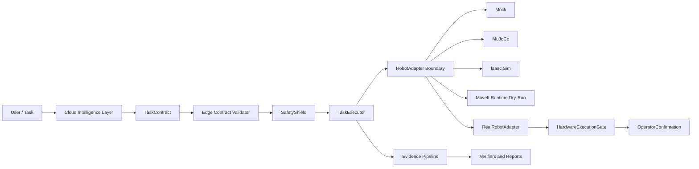
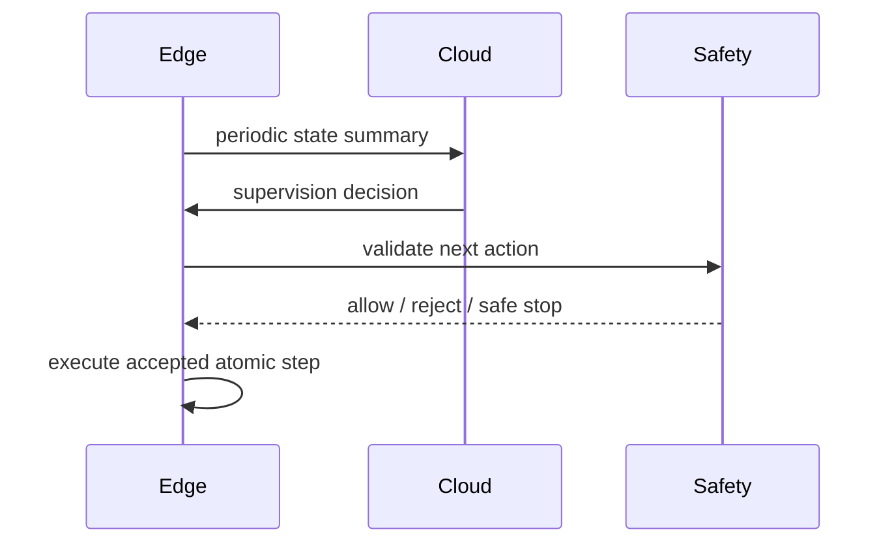
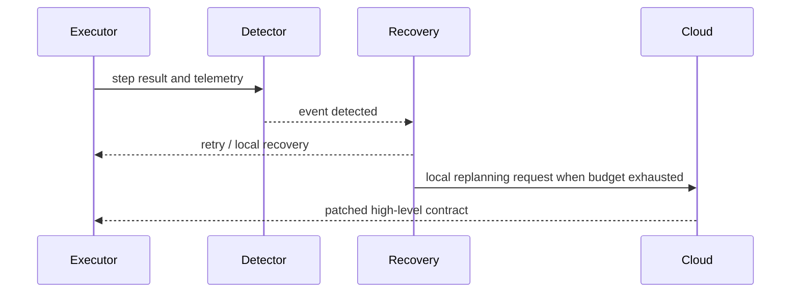
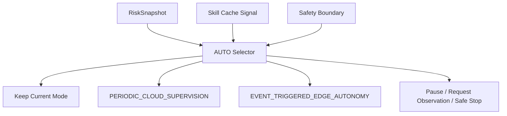
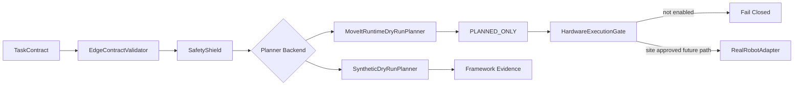
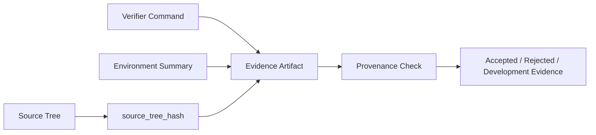

# BIG-small Architecture

BIG-small 采用云端智能规划、边缘安全执行架构。云端只产生高层任务契约、监督决策和重规划建议；边缘端负责契约校验、安全盾、状态机执行、恢复策略和最终执行拒绝权。

## 1. 总体分层

- **Contract Layer**: `TaskContract`、Telemetry、CloudCommand、FailureSummary 和 schema/provenance 字段。
- **Cloud Intelligence Layer**: planning、supervision、local replanning、risk-aware scheduling。
- **Edge Runtime Layer**: `EdgeContractValidator`、`TaskExecutor`、SkillRegistry、Repository、AuditLog。
- **Safety Layer**: `SafetyShield`、StopController、telemetry/scene providers、safety rules。
- **Coordination Mode Layer**: `PCSC`、`ETEAC` 和 `AUTO 双模式选择器`。
- **Experiment and Evidence Layer**: Phase 8+ experiments、artifacts、statistics、source tree hash 和 verifier。
- **Simulation and Robotics Integration Layer**: Mock、MuJoCo、Isaac Sim、ROS 2 / MoveIt。
- **Real Robot Safety Boundary**: RealRobotConfig、HardwareExecutionGate、OperatorConfirmation、acceptance levels。
- **Future Dashboard Layer**: reserved `dashboard/` for Phase 10.2B console only.

## 2. System Overview

No browser, cloud model, or user instruction can directly command joints. All action paths pass through the edge runtime and safety boundary.

## 3. PCSC Sequence

`PCSC` is periodic supervision. It does not bypass the edge executor.

## 4. ETEAC Sequence

`ETEAC` keeps local recovery deterministic and only escalates high-level replanning.

## 5. AUTO Boundary

AUTO is not a third execution engine. It selects between PCSC and ETEAC under dwell time, cooldown, switch limit, and safety constraints.

## 6. Phase 10 Dry-Run and Hardware Boundary

Phase 10.2A status is `PHASE10_MOVEIT_DRY_RUN_ACCEPTED`: MoveIt runtime planning evidence exists, `sent_to_hardware=false`, `hardware_motion_observed=false`, no real controller is contacted, and no execute call is made.

## 7. Evidence Provenance Flow

Phase 10 evidence records `generated_from_commit`, `source_tree_hash`, `worktree_clean`, `diff_hash`, verifier version, command, config hash, environment hash, and timestamp.

## 8. Robotics Integration

- MuJoCo is the CI-friendly physical simulation backend.
- Isaac Sim 6.0 runtime validation is independent-process based and writes Phase 9.2 evidence.
- ROS 2 / MoveIt safety validation is runtime evidence, not a source guard.
- MoveIt Runtime Dry-Run plans but does not execute.
- Real Robot Read-Only and Real Robot Motion remain not started.

## 9. Dashboard Reservation

`dashboard/` is reserved for Phase 10.2B Experiment and Safety Acceptance Console. The frontend may call FastAPI/WebSocket APIs for status, gates, and evidence browsing. It must not connect directly to ROS 2 trajectory topics, MoveIt execute, or a real controller.

## 10. Verification References

- Core checks: `scripts/verify_project.py --profile ci`
- Phase 9 core: `scripts/verify_phase9.py`
- Phase 9.1 ROS 2 / MoveIt: `scripts/verify_phase9_1.py --skip-history`
- Phase 9.2 Isaac/cross-backend: `scripts/verify_phase9_2.py --output artifacts/phase9_2/final`
- Phase 10 config/gate: `scripts/verify_phase10_0.py`
- Phase 10 Synthetic Dry-Run: `scripts/verify_phase10_1.py`
- Phase 10 MoveIt Runtime Dry-Run: `scripts/verify_phase10_moveit_dry_run.py`
- Phase 10.2A aggregate: `scripts/verify_phase10_2a.py`
