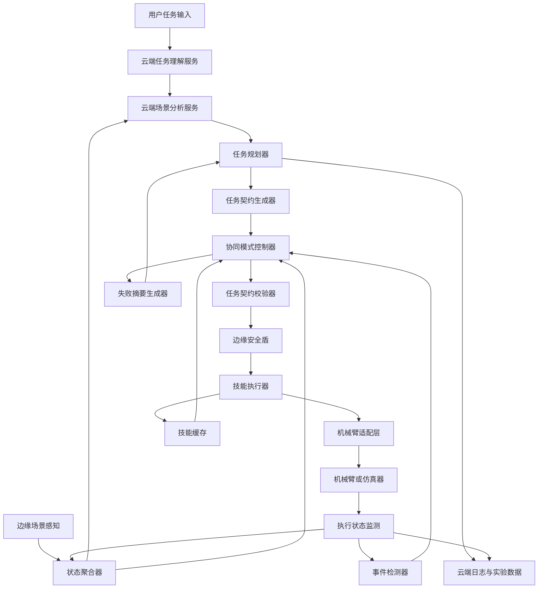

# 《面向边缘智能场景的小型机械臂云边协同控制系统的设计》项目整体规划与提示词工程

## 一、项目总体定位

本项目面向边缘计算资源有限、网络状态不稳定、机械臂控制实时性要求较高以及物理执行安全约束严格等问题，设计并实现一套“云端智能规划、边缘安全执行”的小型机械臂云边协同控制系统。

当前工程状态补充：Phase 9 已加入 MuJoCo 物理仿真 core readiness、ROS 2 / MoveIt 2 / Isaac Sim guarded integration 和 Sim2Real readiness 报告。该阶段仍不连接真实机械臂，不声明真实硬件安全或性能验证完成；真实硬件验证保留到 Phase 10。

在原有任务契约、边缘安全盾、风险感知调度、失败摘要、局部重规划和技能缓存机制基础上，进一步将云边协同方式明确划分为两种：

1. **周期云端监督模式** ：云端按照固定周期，例如每1秒，根据边缘端上传的最新场景和执行状态，主动判断是否需要保持、调整、暂停或更新当前任务指令。
2. **事件触发边缘自治模式** ：云端在任务开始时下发完整任务契约，边缘端自主执行；只有在任务完成、执行超时、执行结果偏离预期或出现异常时，边缘端才请求云端重新识别和更新任务。

两种模式共用同一套任务契约、边缘安全盾、技能执行器、设备适配层和实验评价体系，从而能够在统一系统中开展公平对比。该设计是对现有项目大纲中“云端智能规划、边缘安全执行”总体思路的进一步工程化和可验证化。

---

# 二、双模式云边协同机制

## 2.1 模式一：周期云端监督模式

建议正式命名为：

> **Periodic Cloud Supervisory Control，PCSC**

该模式下，云端不是只在任务开始时规划一次，而是按照固定周期持续接收边缘状态，并下发高层控制决策。

### 运行流程

1. 用户提交自然语言任务。
2. 边缘端采集场景图像、目标位置、机械臂状态和网络状态。
3. 云端生成初始任务契约。
4. 边缘端校验任务契约并开始执行。
5. 边缘端每隔固定周期上传最新状态。
6. 云端每隔固定周期运行监督决策。
7. 云端根据最新状态下发：
   * 继续当前步骤；
   * 更新目标位姿；
   * 替换后续步骤；
   * 暂停执行；
   * 请求补充观测；
   * 终止任务。
8. 边缘端重新进行安全校验后执行。

### 建议周期

系统默认设置为：

```text
cloud_supervision_period = 1000 ms
```

同时允许配置为：

```text
500 ms / 1000 ms / 2000 ms / 5000 ms
```

### 工程上的重要限制

“每1秒云端监督”不应被实现为“每1秒让大语言模型重新生成完整任务”。

建议将云端监督拆成两层：

#### 第一层：1 Hz轻量监督循环

每1秒运行一次，完成：

* 状态新鲜度检查；
* 目标位姿变化检测；
* 任务步骤完成度判断；
* 网络和设备状态检查；
* 风险评分；
* 当前计划是否仍然有效的判断。

#### 第二层：条件触发的大模型或视觉语言模型调用

只有出现以下情况时才调用大模型重新规划：

* 目标位置变化超过阈值；
* 场景出现新障碍；
* 当前计划不再适用；
* 识别置信度显著下降；
* 边缘端报告执行异常；
* 当前任务需要语义层面的重新解释。

因此，云端仍然每1秒下发监督决策，但该决策可以是：

```json
{
  "decision": "KEEP_CURRENT_PLAN"
}
```

不必每次都重新生成全部步骤。

### 优点

* 能够较快感知目标移动和场景变化；
* 云端对任务过程保持持续监督；
* 适合环境动态性较强的任务；
* 有利于研究云端闭环监督的实时性。

### 缺点

* 对网络稳定性依赖较高；
* 云端调用次数和通信开销较大；
* 容易受到网络抖动和旧指令影响；
* 必须解决指令过期、乱序和重复执行问题。

---

## 2.2 模式二：事件触发边缘自治模式

建议正式命名为：

> **Event-Triggered Edge Autonomous Control，ETEAC**

该模式下，云端只负责生成初始任务契约，边缘端按照契约自主执行，不需要持续等待云端更新。

### 运行流程

1. 用户提交任务。
2. 边缘端上传初始场景。
3. 云端完成任务理解和任务分解。
4. 云端下发完整任务契约。
5. 边缘端完成契约校验。
6. 边缘端自主执行多个连续步骤。
7. 以下事件触发云端重新识别或规划：
   * 任务成功完成；
   * 单个步骤执行时间超过预期；
   * 整体任务执行时间超过预期；
   * 抓取失败；
   * 目标位置变化；
   * 障碍物阻挡；
   * 目标丢失；
   * 本地重试次数达到上限；
   * 任务结果不满足成功条件。
8. 边缘端生成失败摘要或结果摘要。
9. 云端根据摘要进行局部重规划。
10. 边缘端继续执行更新后的任务契约。

### 事件类型建议

```text
TASK_COMPLETED
STEP_COMPLETED
STEP_TIMEOUT
TASK_TIMEOUT
GRASP_FAILED
TARGET_MOVED
TARGET_LOST
PATH_BLOCKED
SAFETY_REJECTED
LOCAL_RETRY_EXHAUSTED
NETWORK_RECOVERED
MANUAL_INTERRUPT
```

### 优点

* 云端调用次数较少；
* 网络通信开销较低；
* 边缘端自主性较高；
* 网络短时中断不会立即影响当前任务；
* 更适合静态或弱动态场景。

### 缺点

* 环境发生变化后，云端获知信息的时间可能较晚；
* 边缘端需要更完整的状态机和异常检测能力；
* 事件阈值设计不合理时，可能过早或过晚触发重规划。

---

## 2.3 两种模式的核心对比

| 对比维度       | 周期云端监督模式       | 事件触发边缘自治模式 |
| -------------- | ---------------------- | -------------------- |
| 云端介入方式   | 固定周期主动介入       | 边缘事件触发         |
| 默认周期       | 1秒，可配置            | 无固定周期           |
| 边缘自主程度   | 中等                   | 较高                 |
| 网络依赖程度   | 较高                   | 较低                 |
| 云端调用次数   | 较多                   | 较少                 |
| 动态环境适应性 | 较强                   | 依赖事件检测         |
| 通信成本       | 较高                   | 较低                 |
| 实现重点       | 时序一致性、指令版本   | 事件判定、失败摘要   |
| 适用场景       | 目标移动、场景变化较多 | 静态抓取、重复任务   |
| 网络中断处理   | 切换本地降级或停止     | 可继续执行已有契约   |

---

# 三、系统总体架构



---

# 四、系统模块划分

## 4.1 云端模块

### 1. 任务接入服务

负责：

* 接收自然语言任务；
* 创建任务编号；
* 保存原始任务；
* 记录任务模式；
* 接收边缘场景摘要。

### 2. 场景理解服务

输入包括：

* 场景图像或关键帧；
* 目标检测结果；
* 物体类别；
* 物体位姿；
* 机械臂当前状态；
* 边缘端诊断信息。

输出统一的场景摘要：

```json
{
  "objects": [],
  "robot_state": {},
  "obstacles": [],
  "scene_confidence": 0.92,
  "scene_version": 18
}
```

### 3. 云端任务规划器

负责：

* 任务理解；
* 目标物体和目标区域确认；
* 高层步骤生成；
* 任务契约生成；
* 局部重规划；
* 周期监督决策。

禁止生成：

* 电机PWM；
* 伺服脉宽；
* 未经校验的关节控制量；
* 可绕过边缘安全盾的直接命令。

### 4. 周期监督服务

仅在模式一启用，按照固定周期运行。

输入：

* 最新状态摘要；
* 当前任务契约；
* 当前步骤；
* 已完成步骤；
* 云端最新计划版本；
* 风险评分。

输出：

```text
KEEP_CURRENT_PLAN
UPDATE_CURRENT_STEP
REPLACE_REMAINING_STEPS
PAUSE_TASK
REQUEST_MORE_OBSERVATION
ABORT_TASK
```

### 5. 局部重规划服务

仅对失败步骤和后续步骤进行修改。

原则：

* 不重复已经成功完成的步骤；
* 不重置无关状态；
* 必须提高任务契约版本号；
* 必须明确修改原因；
* 必须重新生成成功条件和超时时间。

---

## 4.2 边缘端模块

### 1. 感知模块

负责：

* 相机图像采集；
* 目标检测；
* 目标位置估计；
* 工作区和障碍物识别；
* 夹爪或末端状态获取；
* 图像关键帧筛选。

### 2. 状态聚合器

将原始数据转化为结构化状态：

```json
{
  "task_id": "task-001",
  "timestamp": 1781320000,
  "scene_version": 18,
  "current_step_id": "step-03",
  "robot_state": {},
  "target_state": {},
  "network_state": {},
  "execution_state": {}
}
```

### 3. 协同模式控制器

支持：

```text
PERIODIC_CLOUD_SUPERVISION
EVENT_TRIGGERED_EDGE_AUTONOMY
AUTO
```

其中，`AUTO`不是第三种协同方案，而是两种模式的自动选择器。

### 4. 任务契约校验器

检查：

* JSON Schema是否合法；
* 必填字段是否存在；
* 任务版本是否为最新；
* 指令序号是否重复；
* 指令是否已经过期；
* 前置条件是否满足；
* 技能是否存在；
* 参数范围是否有效。

### 5. 边缘安全盾

安全盾必须独立于云端模型存在，并且不可被提示词、模型输出或远程参数关闭。

安全检查包括：

* 工作空间约束；
* 目标可达性；
* 关节软限位；
* 速度和加速度限制；
* 末端安全高度；
* 障碍物距离；
* 路径碰撞风险；
* 任务超时；
* 急停状态；
* 场景状态新鲜度。

### 6. 技能执行器

建议第一阶段实现以下原子技能：

```text
HOME
OBSERVE
LOCATE_OBJECT
MOVE_ABOVE
APPROACH
GRASP
LIFT
MOVE_TO_REGION
PLACE
RELEASE
RETREAT
VERIFY_RESULT
SAFE_STOP
```

### 7. 事件检测器

负责检测：

* 步骤完成；
* 步骤超时；
* 目标位置变化；
* 抓取失败；
* 目标丢失；
* 路径阻挡；
* 安全盾拒绝；
* 网络异常；
* 设备故障。

### 8. 技能缓存

保存：

* 技能标识；
* 适用任务；
* 对象类别；
* 参数模板；
* 成功率；
* 平均耗时；
* 最近执行时间；
* 安全限制；
* 版本和来源。

---

# 五、任务契约设计

任务契约是整个系统最核心的数据结构。

## 5.1 推荐数据结构

```json
{
  "schema_version": "1.0",
  "task_id": "task-20260613-001",
  "plan_version": 3,
  "command_seq": 27,
  "control_mode": "PERIODIC_CLOUD_SUPERVISION",
  "trigger_type": "PERIODIC_UPDATE",
  "issued_at": "2026-06-13T13:00:01+09:00",
  "valid_until": "2026-06-13T13:00:04+09:00",

  "user_instruction": "将红色方块放到左侧目标区域",

  "scene_version": 18,
  "expected_scene_version": 18,

  "task_target": {
    "object_id": "red_cube_01",
    "object_class": "cube",
    "target_region_id": "left_region"
  },

  "current_step_id": "step-03",

  "steps": [
    {
      "step_id": "step-03",
      "skill": "GRASP",
      "parameters": {
        "object_id": "red_cube_01",
        "grasp_type": "top_grasp"
      },
      "expected_duration_ms": 4000,
      "timeout_ms": 7000,
      "retry_limit": 2,
      "preconditions": [
        "target_visible",
        "target_reachable",
        "gripper_open"
      ],
      "success_conditions": [
        "gripper_closed",
        "object_attached"
      ]
    }
  ],

  "safety_constraints": {
    "max_joint_velocity": 0.5,
    "max_tcp_velocity": 0.15,
    "minimum_safe_height": 0.08,
    "workspace_id": "workspace_a",
    "collision_check_required": true
  },

  "failure_policy": {
    "local_retry_limit": 2,
    "on_timeout": "REQUEST_CLOUD_REPLAN",
    "on_safety_rejection": "PAUSE_AND_REPORT",
    "on_network_loss": "SAFE_STOP"
  },

  "completion_criteria": [
    "object_inside_target_region",
    "gripper_released",
    "robot_in_safe_pose"
  ]
}
```

---

## 5.2 周期模式新增字段

```json
{
  "supervision_period_ms": 1000,
  "decision": "KEEP_CURRENT_PLAN",
  "command_ttl_ms": 2500,
  "previous_command_seq": 26
}
```

边缘端必须拒绝：

* 已过期指令；
* `command_seq`小于或等于已执行序号的指令；
* 与当前任务编号不一致的指令；
* `scene_version`明显落后的指令。

---

## 5.3 事件模式新增字段

```json
{
  "trigger_type": "STEP_TIMEOUT",
  "trigger_event_id": "event-0081",
  "failed_step_id": "step-03",
  "last_successful_step_id": "step-02",
  "local_retry_count": 2
}
```

---

# 六、任务状态机设计

```text
CREATED
  ↓
OBSERVING
  ↓
PLANNING
  ↓
VALIDATING
  ↓
READY
  ↓
EXECUTING
  ├─→ WAITING_CLOUD_UPDATE
  ├─→ LOCAL_RECOVERY
  ├─→ PAUSED
  ├─→ SAFETY_STOPPED
  ├─→ FAILED
  └─→ COMPLETED
```

## 6.1 周期模式状态逻辑

```text
EXECUTING
  ↓ 每1秒上传状态
WAITING_SUPERVISORY_DECISION
  ├─ KEEP → EXECUTING
  ├─ UPDATE → VALIDATING → EXECUTING
  ├─ PAUSE → PAUSED
  └─ STOP → SAFETY_STOPPED
```

边缘端不应在等待云端响应期间冻结底层安全控制。

当云端超时时：

```text
低风险且当前技能可安全完成 → 继续当前原子技能
无法判断或风险升高 → 暂停
严重异常 → 安全停止
```

## 6.2 事件模式状态逻辑

```text
EXECUTING
  ├─ 正常完成 → 下一步骤
  ├─ 可恢复异常 → LOCAL_RECOVERY
  ├─ 本地重试耗尽 → WAITING_CLOUD_UPDATE
  └─ 高风险异常 → SAFETY_STOPPED
```

---

# 七、通信架构设计

## 7.1 推荐方案

采用：

* **REST API** ：任务创建、配置管理、实验数据查询；
* **MQTT** ：状态上传、指令下发、事件通知和确认；
* **对象存储或文件接口** ：场景图片、视频和大文件；
* **WebSocket** ：可选，用于监控界面实时显示。

## 7.2 MQTT主题建议

```text
robot/{robot_id}/telemetry
robot/{robot_id}/scene
robot/{robot_id}/event
robot/{robot_id}/command
robot/{robot_id}/command_ack
robot/{robot_id}/heartbeat
robot/{robot_id}/diagnostics
```

## 7.3 指令确认机制

云端下发每条命令后，边缘端返回：

```json
{
  "task_id": "task-001",
  "plan_version": 3,
  "command_seq": 27,
  "ack_status": "ACCEPTED",
  "reason": null,
  "edge_timestamp": "2026-06-13T13:00:01.200+09:00"
}
```

可能的状态：

```text
ACCEPTED
REJECTED_EXPIRED
REJECTED_DUPLICATE
REJECTED_SCHEMA_INVALID
REJECTED_SAFETY_CONFLICT
REJECTED_SCENE_MISMATCH
REJECTED_TASK_MISMATCH
```

---

# 八、技术选型建议

| 层级       | 建议技术                     |
| ---------- | ---------------------------- |
| 云端接口   | Python、FastAPI、Pydantic    |
| 消息通信   | MQTT                         |
| 数据库     | PostgreSQL或SQLite起步       |
| 缓存       | Redis，可在后期加入          |
| 边缘运行时 | Python异步服务               |
| 机械臂框架 | ROS 2或厂商SDK适配层         |
| 运动规划   | MoveIt 2或机械臂原生规划接口 |
| 仿真环境   | Gazebo、MuJoCo或厂商仿真器   |
| 目标检测   | OpenCV加轻量目标检测模型     |
| 数据校验   | JSON Schema、Pydantic        |
| 实验记录   | CSV、JSONL、数据库           |
| 指标分析   | Pandas、Matplotlib           |
| 容器化     | Docker Compose               |
| 测试       | Pytest、集成测试脚本         |
| 日志       | 结构化JSON日志               |

不建议在项目初期同时引入过多中间件。第一版可采用：

```text
FastAPI + MQTT + SQLite/PostgreSQL + Python Edge Runtime + 仿真机械臂
```

---

# 九、建议代码仓库结构

```text
cloud-edge-robot/
├── README.md
├── pyproject.toml
├── docker-compose.yml
├── .env.example
│
├── contracts/
│   ├── task_contract.schema.json
│   ├── telemetry.schema.json
│   ├── event.schema.json
│   ├── failure_summary.schema.json
│   └── examples/
│
├── cloud/
│   ├── api/
│   ├── planner/
│   ├── supervisor/
│   ├── replan/
│   ├── model_adapters/
│   ├── repositories/
│   └── tests/
│
├── edge/
│   ├── runtime/
│   ├── mode_controller/
│   ├── contract_validator/
│   ├── safety_shield/
│   ├── event_detector/
│   ├── skill_executor/
│   ├── skill_cache/
│   ├── perception/
│   ├── robot_adapters/
│   └── tests/
│
├── simulation/
│   ├── scenes/
│   ├── robot_mock/
│   ├── fault_injection/
│   └── scripts/
│
├── shared/
│   ├── models/
│   ├── messaging/
│   ├── logging/
│   └── config/
│
├── experiments/
│   ├── configs/
│   ├── runners/
│   ├── metrics/
│   ├── results/
│   └── plots/
│
├── dashboard/
├── scripts/
└── docs/
    ├── architecture.md
    ├── task_contract.md
    ├── safety_design.md
    ├── experiment_plan.md
    └── deployment.md
```

---

# 十、分阶段实施计划

## 阶段0：需求冻结与基础设计

### 工作内容

* 冻结两种协同模式定义；
* 确定机械臂或仿真器；
* 确定原子技能集合；
* 定义任务契约；
* 定义实验指标；
* 建立代码仓库和编码规范。

### 验收标准

* 系统架构文档完成；
* 任务契约Schema可校验；
* 两种模式数据流程明确；
* 至少提供5个任务契约示例。

---

## 阶段1：仿真机械臂与设备适配层

### 工作内容

* 实现统一 `RobotAdapter`接口；
* 实现 `MockRobotAdapter`；
* 接入仿真环境；
* 支持归位、移动、抓取、释放等基础动作；
* 实现动作状态回传。

### 验收标准

* 不依赖云端即可完成固定抓取放置；
* 所有动作均有超时处理；
* 仿真机械臂状态可结构化读取；
* 错误可通过故障注入复现。

---

## 阶段2：任务契约与边缘执行运行时

### 工作内容

* 实现任务契约数据模型；
* 实现Schema校验；
* 实现任务状态机；
* 实现技能注册表；
* 实现任务执行日志。

### 验收标准

* 合法任务能够执行；
* 缺字段任务被拒绝；
* 重复指令不会重复执行；
* 过期指令被拒绝；
* 所有状态迁移可追溯。

---

## 阶段3：边缘安全盾

### 工作内容

* 工作空间校验；
* 位姿可达性校验；
* 速度和高度限制；
* 路径安全检查；
* 急停和安全停止；
* 安全拒绝原因编码。

### 验收标准

人工构造以下危险任务时必须拒绝：

* 目标越界；
* 速度超限；
* 目标不可达；
* 路径碰撞；
* 指令过期；
* 设备处于急停状态。

---

## 阶段4：云端初始规划服务

### 工作内容

* 自然语言任务解析；
* 场景摘要输入；
* 任务步骤分解；
* 任务契约生成；
* 模型输出修复；
* 模型调用失败降级。

### 验收标准

* 典型任务可稳定生成合法契约；
* 不输出底层关节控制；
* 非法输出能够自动修复或拒绝；
* 所有模型调用均记录提示词版本。

---

## 阶段5：周期云端监督模式

### 工作内容

* 实现1 Hz状态上传；
* 实现云端监督循环；
* 实现指令版本和序号；
* 实现命令TTL；
* 实现KEEP、UPDATE、PAUSE和STOP；
* 实现网络延迟和乱序测试。

### 验收标准

* 云端每个周期均产生明确监督结果；
* 旧指令不会覆盖新计划；
* 重复指令不会重复执行；
* 云端断开后边缘进入预设降级状态；
* 目标移动后能够更新后续步骤。

---

## 阶段6：事件触发边缘自治模式

### 工作内容

* 实现步骤超时；
* 实现任务超时；
* 实现抓取失败检测；
* 实现本地重试预算；
* 实现事件上报；
* 实现结果摘要和失败摘要。

### 验收标准

* 正常执行期间不持续调用云端；
* 任务完成能够主动上报；
* 超时能够触发云端更新；
* 本地重试耗尽后能够请求重规划；
* 重规划不重复已完成步骤。

---

## 阶段7：技能缓存与风险感知模式选择

### 工作内容

* 技能模板保存；
* 技能相似度匹配；
* 历史成功率统计；
* 网络和风险评分；
* `AUTO`模式选择；
* 模式切换日志。

### 建议调度规则

```text
场景稳定 + 技能命中率高 + 网络较差
→ 事件触发边缘自治模式

场景动态 + 目标变化频繁 + 网络稳定
→ 周期云端监督模式

安全风险较高
→ 暂停或安全停止，不切换为激进模式
```

---

## 阶段8：系统实验与对比评价

完成：

* 双模式对比；
* 网络故障注入；
* 目标移动实验；
* 障碍物变化实验；
* 抓取失败实验；
* 云端服务中断实验；
* 技能缓存消融实验；
* 安全盾消融实验。

---

## 阶段9：真实机械臂接入与成果整理

### 工作内容

* 替换仿真适配器；
* 完成真实设备参数标定；
* 降低初始速度和工作范围；
* 完成真实场景实验；
* 整理论文图表；
* 编写专利技术交底书；
* 整理部署和复现实验文档。

---

# 十一、实验设计

## 11.1 实验任务

建议至少设计以下任务：

1. 单目标抓取放置；
2. 不同颜色目标选择；
3. 多物体顺序搬运；
4. 目标中途移动；
5. 路径中途增加障碍物；
6. 抓取后物体脱落；
7. 任务执行超时；
8. 网络延迟和断网；
9. 重复任务技能复用；
10. 云端规划产生不安全参数。

---

## 11.2 网络实验参数

| 条件         | 建议设置                   |
| ------------ | -------------------------- |
| 网络时延     | 20、100、300、500、1000 ms |
| 抖动         | 0、50、100、300 ms         |
| 丢包率       | 0%、5%、10%、20%           |
| 断网时间     | 1、3、5、10秒              |
| 云端响应超时 | 1、2、5、10秒              |

---

## 11.3 主要指标

### 任务指标

* 任务成功率；
* 平均任务完成时间；
* 平均步骤完成时间；
* 首次成功率；
* 本地重试次数。

### 云边协同指标

* 单任务云端调用次数；
* 云端规划总耗时；
* 云端监督更新次数；
* 边缘请求重规划次数；
* 单任务上传数据量；
* 单任务通信次数。

### 异常恢复指标

* 异常发现时间；
* 云端响应时间；
* 局部重规划时间；
* 异常恢复成功率；
* 恢复后的额外执行时间。

### 安全指标

* 危险任务拒绝率；
* 正常任务误拒绝率；
* 过期指令拒绝率；
* 重复指令拦截率；
* 安全停止触发时间；
* 碰撞次数。

### 资源指标

* 边缘CPU占用；
* 边缘内存占用；
* 模型调用成本；
* 通信带宽；
* 单次任务运行成本。

---

## 11.4 核心研究假设

### 假设H1

在动态场景和网络稳定条件下，周期云端监督模式能够更快发现环境变化并更新任务，但云端调用次数和通信开销较高。

### 假设H2

在静态场景或网络质量较差条件下，事件触发边缘自治模式能够降低云端调用次数和通信依赖，同时保持较高任务成功率。

### 假设H3

任务契约、边缘安全盾和指令版本机制能够有效阻止过期、重复和不安全云端指令作用于真实机械臂。

### 假设H4

失败摘要驱动的局部重规划，相比完整任务重规划，能够减少恢复时间和重复动作。

### 假设H5

基于网络状态、场景动态性和任务风险选择两种协同模式，能够在成功率、响应时间和运行成本之间取得更优平衡。

---

# 十二、运行时提示词工程

## 12.1 提示词总体原则

所有云端模型提示词必须遵循：

1. 输出严格结构化JSON；
2. 不输出关节角、PWM或电机控制量；
3. 只能调用已注册技能；
4. 必须提供前置条件和成功条件；
5. 必须声明超时和失败策略；
6. 不确定时请求补充观测，不得猜测；
7. 不得绕过边缘安全盾；
8. 局部重规划不得重复已完成步骤；
9. 所有输出必须经过Schema校验；
10. 提示词、模型参数和输出结果均需记录版本。

---

## 12.2 初始任务规划提示词

### System Prompt

```text
你是小型机械臂云边协同控制系统的云端任务规划器。

你的职责是根据用户任务、场景摘要、机械臂能力和安全约束，
生成边缘端可以验证和执行的高层任务契约。

你只能使用系统提供的原子技能，不得创造不存在的技能。
你不得输出机械臂关节角、电机控制量、PWM、伺服脉宽或底层轨迹点。
所有实际动作必须由边缘端技能执行器和安全盾完成。

你必须遵守以下规则：

1. 输出必须是符合指定JSON Schema的单个JSON对象。
2. 不要输出Markdown、解释文字或代码块标记。
3. 每个步骤必须包含step_id、skill、parameters、
   expected_duration_ms、timeout_ms、preconditions和success_conditions。
4. 步骤之间必须满足逻辑顺序。
5. 不能确认目标、目标区域或场景状态时，
   应生成REQUEST_MORE_OBSERVATION类型的结果。
6. 所有任务均必须包括安全约束和失败策略。
7. 不允许绕过边缘安全盾。
8. 不允许假设未出现在场景摘要中的物体。
9. 当前任务只能使用允许的技能列表。
10. 优先生成最短、可验证、可恢复的任务序列。

允许的技能：
{{ALLOWED_SKILLS}}

机械臂能力：
{{ROBOT_CAPABILITIES}}

安全策略：
{{SAFETY_POLICY}}

任务契约JSON Schema：
{{TASK_CONTRACT_SCHEMA}}
```

### User Prompt

```text
请为以下任务生成初始任务契约。

用户任务：
{{USER_INSTRUCTION}}

控制模式：
{{CONTROL_MODE}}

最新场景摘要：
{{SCENE_SUMMARY}}

机械臂当前状态：
{{ROBOT_STATE}}

已知障碍物：
{{OBSTACLES}}

请仅返回符合Schema的JSON对象。
```

---

## 12.3 周期云端监督提示词

```text
你是周期云端监督决策器。

系统每隔{{SUPERVISION_PERIOD_MS}}毫秒向你提供一次最新状态。
你需要判断当前计划是否仍然有效。

你只能输出以下决策之一：

KEEP_CURRENT_PLAN
UPDATE_CURRENT_STEP
REPLACE_REMAINING_STEPS
PAUSE_TASK
REQUEST_MORE_OBSERVATION
ABORT_TASK

决策规则：

1. 场景和执行状态未发生实质变化时，输出KEEP_CURRENT_PLAN。
2. 不得因为微小定位噪声频繁修改计划。
3. 目标位置变化超过阈值且影响当前步骤时，更新当前步骤。
4. 仅后续路径受影响时，只替换剩余步骤。
5. 状态信息过期或置信度不足时，请求补充观测。
6. 安全风险升高时暂停或终止任务。
7. 不得修改已经完成的步骤。
8. 新计划必须提高plan_version和command_seq。
9. 所有指令必须设置有效期。
10. 不得输出底层机械臂控制量。

当前任务契约：
{{CURRENT_CONTRACT}}

最新边缘状态：
{{LATEST_EDGE_STATE}}

最近执行记录：
{{RECENT_EXECUTION_HISTORY}}

当前风险评分：
{{RISK_SCORE}}

请严格按照监督决策Schema输出JSON。
```

推荐输出格式：

```json
{
  "task_id": "task-001",
  "plan_version": 4,
  "command_seq": 28,
  "decision": "KEEP_CURRENT_PLAN",
  "reason_code": "SCENE_STABLE",
  "valid_until": "2026-06-13T13:00:05+09:00",
  "updated_steps": []
}
```

---

## 12.4 事件触发重规划提示词

```text
你是小型机械臂任务局部重规划器。

边缘端已经执行了任务的一部分，并因某个事件请求云端更新。
你必须保留已经成功完成的步骤，只对失败步骤或后续步骤进行修改。

严格规则：

1. 不得重复已经成功完成的动作。
2. 不得重新执行可能造成碰撞或重复抓取的步骤。
3. 优先进行局部修复，而不是重新生成完整任务。
4. 必须结合当前机械臂状态和目标状态规划。
5. 必须提高plan_version。
6. 必须说明本次修改对应的trigger_event_id。
7. 不确定时请求补充观测。
8. 不得输出底层控制量。
9. 输出必须符合任务契约Schema。
10. 所有新步骤必须重新定义超时和成功条件。

原始任务：
{{ORIGINAL_TASK}}

当前任务契约：
{{CURRENT_CONTRACT}}

已完成步骤：
{{COMPLETED_STEPS}}

失败摘要：
{{FAILURE_SUMMARY}}

最新场景摘要：
{{LATEST_SCENE_SUMMARY}}

机械臂当前状态：
{{CURRENT_ROBOT_STATE}}

请只返回更新后的任务契约JSON。
```

---

## 12.5 任务契约修复提示词

该提示词只用于模型输出未通过Schema校验的情况。

```text
你是任务契约JSON修复器。

下面的模型输出没有通过JSON Schema校验。
你只能修复格式、字段类型、枚举值和必填字段问题，
不得改变原始任务意图，不得新增未授权技能，
不得删除安全限制。

原始输出：
{{INVALID_OUTPUT}}

Schema校验错误：
{{VALIDATION_ERRORS}}

任务契约Schema：
{{TASK_CONTRACT_SCHEMA}}

请只返回修复后的JSON对象。
如果无法安全修复，请返回：

{
  "repair_status": "FAILED",
  "reason": "..."
}
```

---

## 12.6 失败摘要生成提示词

原则上失败摘要应由边缘端规则程序生成，而不是依赖大模型。若需要模型辅助归纳，可使用：

```text
你是机械臂任务失败摘要助手。

请根据结构化执行日志生成简洁、可用于局部重规划的失败摘要。

不得推测日志中不存在的原因。
必须区分：
- 已确认事实；
- 边缘端诊断结果；
- 可能原因；
- 建议重新规划范围。

输入日志：
{{EXECUTION_LOGS}}

请输出符合FailureSummary Schema的JSON对象。
```

---

# 十三、Codex/Agent端到端开发总提示词

下面的提示词可直接作为整个项目的总控开发提示词。

```text
你是一名高级机器人系统架构师、云边协同系统工程师和Python开发负责人。

请在当前代码仓库中，从零开始设计和实现：

《面向边缘智能场景的小型机械臂云边协同控制系统》

一、项目核心目标

系统采用“云端智能规划、边缘安全执行”架构，并支持两种云边协同模式：

1. PERIODIC_CLOUD_SUPERVISION
   云端按照可配置周期，默认1000毫秒，根据边缘上传的最新状态，
   主动下发KEEP、UPDATE、PAUSE、REQUEST_OBSERVATION或ABORT决策。

2. EVENT_TRIGGERED_EDGE_AUTONOMY
   云端在任务开始时下发完整任务契约。
   边缘端自主执行，仅在任务完成、步骤超时、任务超时、
   抓取失败、目标移动、路径阻挡、本地重试耗尽或安全拒绝时，
   主动向云端请求识别或局部重规划。

两种模式必须共用：
- 任务契约；
- 边缘安全盾；
- 技能执行器；
- 机械臂适配层；
- 状态机；
- 日志与实验指标体系。

二、不可违反的架构约束

1. 云端不得直接控制机械臂关节、电机或PWM。
2. 云端只能生成结构化任务契约或高层监督决策。
3. 所有任务必须经过边缘任务契约校验器。
4. 所有动作必须经过边缘安全盾。
5. 边缘端拥有最终执行权和拒绝权。
6. 安全盾不得通过远程参数、提示词或模型输出关闭。
7. 所有消息必须包含task_id、plan_version、command_seq和timestamp。
8. 周期模式必须实现命令TTL、去重、乱序检查和ACK。
9. 事件模式必须实现失败摘要和局部重规划。
10. 已完成步骤不得在重规划中被重复执行。
11. 网络中断时必须执行明确的降级策略。
12. 所有状态转换、模型调用、指令下发和安全拒绝必须可追溯。

三、建议技术栈

- Python
- FastAPI
- Pydantic
- MQTT
- PostgreSQL或SQLite
- Pytest
- Docker Compose
- 结构化JSON日志
- 仿真或MockRobotAdapter优先
- 后续支持ROS 2或真实机械臂SDK

四、必须实现的模块

contracts:
- TaskContract
- Telemetry
- CloudCommand
- CommandAck
- EdgeEvent
- FailureSummary
- SkillTemplate

cloud:
- task API
- initial planner
- periodic supervisor
- local replanner
- model adapter
- prompt registry
- contract repair
- audit logging

edge:
- mode controller
- task state machine
- contract validator
- safety shield
- event detector
- skill executor
- skill cache
- telemetry publisher
- command subscriber
- robot adapter
- local recovery manager

simulation:
- mock robot
- mock camera
- movable target
- obstacle injection
- grasp failure injection
- network delay and packet-loss injection

experiments:
- batch experiment runner
- metric collector
- CSV/JSON result export
- comparison plots
- reproducible configuration files

五、第一版原子技能

HOME
OBSERVE
LOCATE_OBJECT
MOVE_ABOVE
APPROACH
GRASP
LIFT
MOVE_TO_REGION
PLACE
RELEASE
RETREAT
VERIFY_RESULT
SAFE_STOP

使用技能注册表，不允许通过字符串动态执行任意函数。

六、安全盾最低要求

必须检查：
- 指令是否过期；
- plan_version是否落后；
- command_seq是否重复；
- 工作空间；
- 目标可达性；
- 最大关节速度；
- 最大末端速度；
- 最低安全高度；
- 障碍物距离；
- 急停状态；
- 任务和步骤超时；
- 当前场景版本是否与指令匹配。

安全盾返回：
ALLOW
ALLOW_WITH_LIMITS
PAUSE
REQUEST_CORRECTION
REJECT
EMERGENCY_STOP

七、开发顺序

Phase 0：仓库初始化、配置和数据模型。
Phase 1：MockRobotAdapter和固定技能执行。
Phase 2：任务契约、状态机和日志。
Phase 3：边缘安全盾。
Phase 4：云端初始任务规划服务。
Phase 5：周期云端监督模式。
Phase 6：事件触发边缘自治模式。
Phase 7：失败摘要、局部重规划和技能缓存。
Phase 8：故障注入和双模式对比实验。
Phase 9：文档、部署脚本、验收脚本和真实机械臂适配接口。

不得跳过前一阶段的测试直接进入后一阶段。

八、代码质量要求

1. 所有公共函数和类必须有类型注解。
2. 核心逻辑不得使用空实现、pass或TODO占位。
3. 不得在代码中写死密码、密钥和设备地址。
4. 提供.env.example。
5. 核心模块必须有单元测试。
6. 两种模式必须有端到端集成测试。
7. 对网络异常、重复消息、乱序消息和过期消息进行测试。
8. 所有异常必须转换为结构化错误。
9. 测试必须可在没有真实机械臂和云端模型时运行。
10. 模型调用必须提供MockModelAdapter。
11. 每个阶段完成后更新README和阶段报告。
12. 不要删除已有有效代码或文档，修改前先检查兼容性。

九、阶段汇报格式

每完成一个阶段，输出：

1. 本阶段完成摘要；
2. 新增和修改文件；
3. 核心设计说明；
4. 已运行测试及结果；
5. 尚未解决的问题；
6. 下一阶段计划；
7. 本地运行命令；
8. 验收命令。

十、开始执行要求

首先执行以下工作：

1. 审查当前仓库。
2. 输出仓库现状和差距分析。
3. 建立完整目录结构。
4. 完成Phase 0和Phase 1。
5. 运行格式检查、类型检查和单元测试。
6. 生成一键启动脚本。
7. 汇报实际完成结果。

不要只输出设计说明，必须直接创建和修改代码文件。
不要伪造测试结果，必须实际执行测试命令。
遇到环境限制时，应实现Mock方案并记录限制，不要停止整个项目。
```

---

# 十四、每阶段交给Codex的通用提示词模板

```text
继续实施项目的Phase {{PHASE_NUMBER}}：{{PHASE_NAME}}。

开始前：

1. 阅读README、docs/architecture.md和上一阶段报告。
2. 检查已有实现，不得重复创建同类模块。
3. 列出本阶段现状、差距和实施步骤。
4. 保持现有API兼容，必须修改时提供迁移方案。

本阶段必须完成：

{{PHASE_REQUIREMENTS}}

必须补充测试：

{{TEST_REQUIREMENTS}}

验收条件：

{{ACCEPTANCE_CRITERIA}}

完成后必须：

1. 实际运行测试。
2. 修复本阶段引入的问题。
3. 更新README和相关文档。
4. 生成本阶段完成报告。
5. 给出完整运行和验收命令。
6. 不允许仅给出建议而不修改代码。
7. 不允许伪造测试结果。
```

---

# 十五、关键风险与控制措施

## 15.1 云端每秒调用成本过高

控制措施：

* 每秒运行轻量监督器；
* 仅在状态显著变化时调用大模型；
* 上传结构化状态而非持续上传完整视频；
* 使用关键帧和差异帧；
* 支持监督周期动态调整。

## 15.2 云端指令乱序

控制措施：

* `plan_version`；
* `command_seq`；
* 指令TTL；
* 边缘端幂等处理；
* ACK确认；
* 旧指令拒绝。

## 15.3 网络中断导致任务失控

控制措施：

* 原子技能一旦开始，可在安全范围内完成或停止；
* 边缘端具有本地看门狗；
* 高风险任务断网立即停止；
* 低风险任务允许完成当前步骤；
* 缓存安全停止技能。

## 15.4 模型输出不可执行

控制措施：

* 限定技能集合；
* JSON Schema校验；
* 自动修复仅限格式和字段；
* 业务语义错误直接拒绝；
* 安全盾二次校验。

## 15.5 仿真成功但真实机械臂失败

控制措施：

* 使用统一RobotAdapter；
* 真实设备接入时降低速度；
* 先空载、再软物体、最后普通物体；
* 真实实验限制工作空间；
* 保留物理急停装置。

---

# 十六、最终成果组织

项目最终建议形成以下成果包：

```text
01_项目总体设计
02_系统架构与接口规范
03_任务契约标准
04_云端服务代码
05_边缘运行时代码
06_机械臂适配代码
07_仿真与故障注入环境
08_双模式实验代码
09_实验数据与图表
10_部署和测试文档
11_MEM学位论文
12_专利技术交底书
13_系统演示视频
```

论文重点不宜写成“实现了一个机械臂抓取系统”，而应突出：

> 本研究设计了两种面向不同网络和任务环境的云边协同控制机制，并通过统一任务契约、边缘安全盾、指令版本控制、事件触发机制和局部重规划方法，解决云端智能模型输出难以安全、实时、稳定作用于资源受限机械臂的问题。

这样既保留了项目的工程可实现性，也形成了清晰的研究变量、对比实验和论文创新主线。
