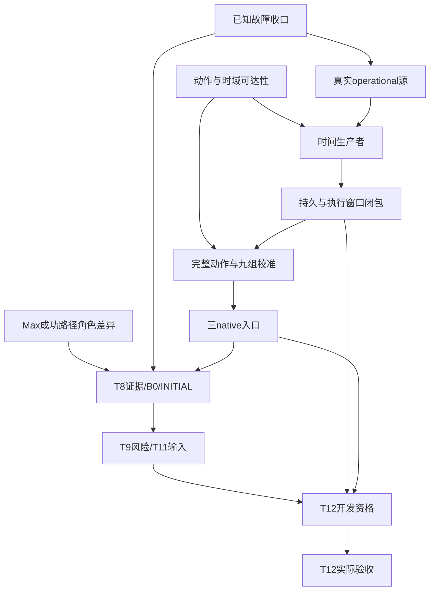

# T12 收敛研发 · GPT-6.1-sol Execution Plan

> **For agentic workers:** REQUIRED SUB-SKILL: Use superpowers:subagent-driven-development (ROOT调度) or superpowers:executing-plans (任务实施者) to implement this plan task-by-task. Steps use checkbox (`- [ ]`) syntax for tracking. 用户指定实施模型为 `gpt-6.1-sol`；新问题修复规划仍由 `gpt-6-astra` 完成。

**Goal:** 在保留用户选定架构与验收阈值的前提下，关闭动作/时域/来源与T12实际开发准入缺口，取得可独立复核的T12a实际决策链。

**Architecture:** 复用已跑通的Qwen3.8-Max、OpenCV、可见姿态标记、顶视相机和唯一控制器/执行器。先确认动作误差与时间合同可满足，再闭合operational来源、完整动作校准及三native消费者；真实INITIAL/校准/有限预登记候选就绪后进入T12开发selection探索；完整selection证据就绪后启用其accepted阶段。该验证器不要求未来T13/METHOD/FINAL，也不替代native/SafetyShield。

**Tech Stack:** 现有Python/Pydantic/NumPy/OpenCV、MuJoCo、SQLite与现有Max调用适配；不安装新模型、SDK或授时硬件。

**Spec:** `docs/superpowers/specs/2026-10-04-cloud-edge-device-research-design.md`、其继承的`2026-10-03-rgbd-evidence-research-design.md`；`docs/superpowers/plans/2026-10-04-cloud-edge-device-research-roadmap.md`；`2026-10-05-operational-clock-repair-supplement.md`；既有native-calibration-source设计及Astra R1–R10。

**状态：READY_FOR_DELEGATED_EXECUTION。** 本文件由ROOT整理既有Astra计划与新证据形成，是执行编排文件，不冒称新Astra修复计划。计划交付不表示P1–P12实施完成。用户于2026-10-07明确要求编制详细计划并交GPT-6.1-sol开展，按该授权直接交接。原计划与原失败字节保持。

## 2026-10-07 执行责任与基线

- 实施模型：`gpt-6.1-sol`，reasoning_effort=`high`，每份派单记录实际agent ID；这是调度请求参数，不冒称独立核验了服务内部模型身份。
- ROOT负责队列、不同作者独审、actual资源调度及Git交付；实施者不派子代理。新问题/计划外失败/范围扩大先保留原件，由ROOT调用`gpt-6-astra`生成新的plan.md/json，复核后交Sol修复。已批准预期RED沿计划进行。
- 用户本轮委派指令替代旧计划只允许ROOT实施或复用旧线程的编排限定；技术边界、冻结原件、运行次数和ROOT-only actual不变。先保存实际作者移交，不假称旧线程恢复。
- 现有目录是普通checkout，并非独立worktree。为保留未提交/未跟踪活动源及原冻结路径，本次原位单写者、逐任务source-before快照；不从干净HEAD覆盖当前状态，不stash/reset/clean。研发分支为`research/20261004-continuation`。
- 只读实核本地/上游/远端均为`a98356c75aafe16a32fe57040ca411ae15370c2b`；旧be1c10cd待推描述是历史。各项交付后重新核对三端SHA。
- 当前danger-full-access/approval never；不传sandbox_permissions。旧require_escalated条款是旧环境记录，不是本轮参数。
- OC2原57/61保持；round69元数据恢复完成，round67源码已有活动增量，已登记63目标case，尚未看到新的完整GREEN收据。
- RW1新82/82 GREEN及mypy通过，两个owned源仍匹配round71输入；待格式、窄回归和他人独审，不重跑82例或mypy。
- Max成功链路继续复用；2026-10-06文本请求只补可用性，不替代当前双图角色/source冻结。4807/4807只证明保存帧OBSERVED。

## 分批执行与状态管理

| 批次 | 任务 | 可检查交付 | actual前置 |
|---|---|---|---|
| A | P1，随后P2/P3软件 | 已知失败收尾、动作可达性合同、角色差异 | 首批CPU与只读 |
| B | P4→P5→P6 | 真实来源前缀、窗口、生命周期 | P1独审与P2合同 |
| C | P7→P8 | 完整动作校准与三个native消费者 | 单组原件合格后才至少九独立组 |
| D | P9→P10 | 机会/200故障、B0、新120、INITIAL、风险 | 角色/native/预算/独立池 |
| E | P11→P12 | T12开发准入与32个预登记episode | INITIAL/risk/selection/native与软件独审 |

P1/P2/P3依赖上独立；同工作区代码仅一个实施者写，只读审查和规划可独立进行。P1的OC2/RW1分别验收。P2发现关键动作无支持路径时停止依赖批量，独立工作继续。actual始终先满足任务所列条件，由ROOT唯一串行调度；无凭据或资源时如实记录，不写入、打印或复制secret。

每任务状态为READY→IN_PROGRESS→AUTHOR_VERIFIED→INDEPENDENT_REVIEW→VERIFIED→DELIVERED。新失败NEEDS_ASTRA；前置缺失WAITING_PREREQUISITE。软件、实际来源、物理、正式研究分字段。恢复工作先读台账，禁止重派已完成任务；新的派单不重置旧命令次数。

每任务保存input-check.json、source-before、完整差异及source-after、命令argv/cwd/非敏感环境/退出码/原stdout-stderr、测试唯一节点分母、SHA256、step-report.md/json和delivery-paths.txt。独审使用完整before/after差异，不能只用git diff HEAD判断有未跟踪源码的本轮改动。已通过且源仍适用的测试不重复运行。独审不能由实施作者自认完成。

不承诺固定工期；运行预算以对应完整实际路径证据为准。T12软件/实际开发/正式研究不是同一出口，METHOD/FINAL/T13和统计收益仍另列。

## Global Constraints

- 云端Qwen3.8-Max已有真实成功链路；复用已有endpoint/profile/secret引用，不索要聊天明文、不重新配置账户、不重复通用35call探针。只验变更角色/源/坐标/成本绑定。
- 边缘模型选型后置；保留用户相机、可见标记、控制器和唯一SkillExecutor/SafetyShield。640×480等开发采集域不得静默冒充默认320×240云图/资格域，实际intrinsics和变换须注册。
- 保留10mm、普通/condition5秒、5000ms接收年龄、1000ms未来规则；0.005秒为SimulationS采样gap，不等于连续速度证明；coverage=0.9，至少9独立支持组件才能出现有限分位。
- D为真实操作计数、含适用suspend语义；S为同backend/episode物理模拟时间。完整未来H_D不能由sim timeout、过去均值、resolution或A/B历史slab推出；缺支持UNKNOWN。
- 原任务/恢复预算、deadline、retry、no-progress不刷新；deadline等值拒绝。抬升≥50mm、保持≥0.5sim秒、释放后完整区域稳定≥1sim秒。硬停止独立。
- 所有方法provider在途上限1、最新待发有界合并；B0周期0.5/1/2/5秒；静态≥90%、整体≥80%、物理违规≤1%；INITIAL不选N。
- 不把source哈希、public bool、caller有限数、观测帧全OBSERVED、软件测试或独立教师真值当native/实际方法权限。原UTC路由、旧冻结及全失败分母保持。
- 最新活动实现可能已超过历史报告；实施前仅核对实际受影响输入与最新验证收据，不覆盖活动代码、不要求全仓安静、不因源码已出现就记PASS。
- 新产品根因/扩大范围/计划外行为失败先Astra；本计划预先包含owned代码的正常ruff格式整理、同一已命名fixture根因修正、独立线程容量不足的root内联回退。若行为AST、断言意义或授权范围变化，不得冒称常规修正。

## Review Focus

1. 缺目标/遮挡/部分可见物体：P8三反例保证缺目标0动作、完整范围不足UNKNOWN，不用离线真值在线补PASS。
2. 主动物体搬运与参考漂移混淆、S/D混用及缺full future：P2/P7/P8固定目标与mutable contact反例，不能制造finite/0。
3. 晚回复、取消、模式/candidate变化与lease重新分配：P5/P6/P11提交再次读取，原deadline不刷新，ACK不等于start。
4. 伪scope/source/软件flag/规则概率及费用：P3/P11/P12拒绝假权限、规则不冒称模型请求，所有已发送超时/retry入账、账单未知null。
5. 同component伪九组、失败组丢失、正式标签泄漏：P7/P9/P10保持infinity/原分母、组隔离与正式label只离线。

---

## 原始失败与事实输入

| 原件 | 事实及本计划处理 |
|---|---|
| `artifacts/research/process/20261004-qwen38max-closed-loop/acceptance.md:15-23,49-55` | 35真实请求全部HTTP200、0/20API阻塞、独立valid=true；normalized_1000成功路径可复用；旧正常1/12不是API不可用。P3仅迁移差异。 |
| `artifacts/research/process/20261004-ced-development/t7b-native-calibration-source/design.md:7-35` | 若v指总主动运动，LIFT87.8mm/搬运345.2mm无法过10mm。P2先判可达性，复用已有native_references。 |
| `src/cloud_edge_robot_arm/vision/action_evidence.py:42`；`src/cloud_edge_robot_arm/auto_mode/runtime_composition.py:352-353,513`；`src/cloud_edge_robot_arm/auto_mode/joint_policy.py:575-586` | native界None；真实adapter和policy两层固定STOP/UNKNOWN。P8与P11分别补源和实际资格，绝不直接删guard。 |
| `artifacts/research/process/20261004-ced-development/astra-repair-planning/clock-dependency-review.md:32-34,60-72` | 历史A/B不证明当前UTC；S/D与future horizon独立。P4–P8处理完整闭包。 |
| `artifacts/research/process/20261004-ced-development/report-step60.md:5-9,29` | 4807全OBSERVED仅记录帧可见性；不当native/九组。P7用新独立组。 |
| `artifacts/research/process/20261004-ced-development/astra-rounds/round67-oc2-green-partials/plan.md:7-17` | 原57/61，mappingproxy序列化与合法终态断言；活动实现须以新收据复核。P1复用。 |
| `artifacts/research/process/20261004-ced-development/astra-rounds/round69-oc2-preflight-metadata/plan.md:7-9` | metadata dict误作Path，非产品反例。P1只复用尚欠步骤。 |
| `artifacts/research/process/20261004-ced-development/astra-rounds/round71-rw1-static-format/plan.md:5` | 原82/82后E501103>100及format；P1按已批准范围完成，不重复发明测试。 |

## 静态性能风险与处理边界

现行native_calibration.estimate→revalidate→from_application/reconstruct及registration全原件hash可能在接在线后反复逐组逐帧重算，消耗5秒窗口。这是调用图的静态风险，尚无接在线实测超时结论。P7在离线/启动完整认证，P8每提交只重查受控不可变认证代次及活owner/来源/时间。认证完成后才采供动作的新帧；任何重新认证也必须先结束再新采集，不能拿认证前旧帧续TTL。严禁mtime/文件hash缓存、caller PASS或未受控pickle充当来源权威；同时不要求每决策重解码数千raw。P8/P11记录实际热路径开销及剩余TTL，慢则正确拒绝，不能调大5秒。

## 接口与数据契约

所有下列新增合同均标为 **PROPOSED**，不是现有实现。现有类继续原含义，不给旧schema静默增加权限。

1. `vision/operational_windows.py`（NEW）提供 `OperationalWindowOwner.from_worker(worker: SimulationWorker, *, job_id: str) -> OperationalWindowOwner`、`issue(kind: str, event: OperationalBracket, *, budget_ns: int, parent_ids: tuple[str, ...]) -> str`、`check(window_id: str, *, after: OperationalEventToken) -> EvidenceVerdict`。工厂仅在每个现行job/attempt的实际worker startup内签发，读取当前真实lease/唯一open attempt和私有启动能力，再创建独立OC1 clock；不能接受已结束P4 prefix的owner/lease，也不能用公开worker构造或job_id字符串自授权限。P4只验证来源生产机制，不提供后续任务可借用live权限；prefix适配只在该prefix自己的活生命周期内使用。owner内部持有实际OC1 clock，读取当前D并交叉检查真实worker/lease；ID只指向私有/持久注册窗口，不是调用方给定deadline。`check`不接受caller-now。`export_record(window_id: str) -> dict[str, Any]`为只读持久描述，不输出可复制live权限；恢复必须由同boot/epoch来源重新验证，否则终止原attempt且不重置预算。窗口schema记录domain/boot/source/原事件ID、lower/upper、deadline、parent IDs、job/lease/attempt/fencing和kind。
2. `vision/native_references.py`复用现有 `NativeActionReference` / `resolve_native_reference(...)`。新增 `NativeActionTiming`（frozen dataclass）：`schema_version: Literal['native.action_timing.operational.v1']`、`episode_id: str`、`capture_sim_s: float`、`current_sim_s: float`、`full_horizon_sim_s: float`、`future_wall_bound_ns: int | None`、`capture_window_id: str`、`action_window_id: str`、`mapping_source_digest: str`。它是描述数据，不授来源权限。Task2冻结语义后，原件与消费者共同采用该schema。
3. `vision/native_calibration.py`新增 **PROPOSED** `CertifiedNativeArtifacts`（private构造、不可复制live资格）与 `NativeCalibrationSource.certify_operational_from_application(role_binding: RoleRuntimeBinding) -> NativeCalibrationSource`。在离线/启动或显式重新装载阶段完整重算registered raw、independent components、horizon和source，得到脱离可写文件/字典别名的深度不可变内存artifact，绑定实际app/worker epoch、loaded source/role/registry generation和支持域；不得接受调用方预计算PASS。热路径只消费这个已认证实例并重验当前owner、app/role/source activation generation、current reference/window，不重新hash全部raw或重复decoder。启用新配置/代码/registry generation时旧实例失效，须重新完整认证，再采新帧；进程重启不反序列化live handle。磁盘变动不能悄悄换掉已载入的不可变值，下一次装载必须按原哈希重验；这不是防恶意管理员的外部签名/只读文件安全保证。
   `vision/native_calibration.py`新增 `NativeCalibrationSource.estimate_operational(online: OnlineEvidenceSnapshot, contract: TaskContract, step: TaskStep, *, owner_inputs: Mapping[str, Any], reference: NativeActionReference, role_binding: RoleRuntimeBinding, timing: NativeActionTiming, windows: OperationalWindowOwner) -> NativeCalibrationEstimate`。该方法消费上段已认证实例，不调用现有UTC estimate的全raw重算链；复用原 `NativeCalibrationEstimate`，operational注册限定其reference-motion单位为m/SimulationS秒；必须由注册schema和timing共同绑定，不能单独消费scalar。原UTC `estimate(..., now: datetime)`不变。`owner_inputs`只能由现有worker/current-owner reader产生，公开Mapping或哈希不构成来源。
4. `vision/action_evidence.py`的现有 `native_action_contract(online, contract, step) -> ActionEvidenceContract`增加keyword-only可选参数 `native_source: NativeCalibrationSource | None = None, role_binding: RoleRuntimeBinding | None = None, owner_inputs: Mapping[str, Any] | None = None, timing: NativeActionTiming | None = None, windows: OperationalWindowOwner | None = None`。缺少完整独立来源时保持两个界None。新增 `validate_native_action_evidence(action: ActionEvidenceContract, online: OnlineEvidenceSnapshot, contract: TaskContract, step: TaskStep, *, native_source: NativeCalibrationSource, role_binding: RoleRuntimeBinding, owner_inputs: Mapping[str, Any], timing: NativeActionTiming, windows: OperationalWindowOwner) -> EvidenceVerdict`。它重新求reference/source/window/完整horizon并做条件检查；D负责TTL/deadline，S负责运动年龄和物理horizon，不能继续把datetime秒与SimulationS速度混乘。
5. `research/native_calibration_collection.py`（NEW）提供 `prepare_native_calibration(config: Path, *, output: Path) -> dict[str, Any]`、`collect_native_calibration_once(protocol: Path, *, assignment_id: str, output: Path) -> dict[str, Any]`、`verify_native_calibration_collection(protocol: Path, *, output: Path) -> dict[str, Any]`。前者只预登记且无actual；第二个只执行一个已登记assignment，复用原teacher/backend/recorder；第三个只读原件调用扩展后的 `reconstruct_registered_calibration(registration: NativeCalibrationRegistration) -> NativeCalibrationDiagnostics`。新CLI见Task7。不得把该教师收集器当native在线执行许可。
6. `research/t12_admission.py`（NEW）定义frozen `T12AdmissionRegistration`：`stage: Literal['SELECTION_EXPLORATION','SELECTION_ACCEPTED'], initial_evidence_id: str, initial_protocol_path: Path, risk_artifact_path: Path, candidate_manifest_path: Path, selection_manifest_path: Path | None, native_registry_path: Path, role_bundle_hash: str, policy_version: str, clock_schema: str, current_source_hashes: Mapping[str, str]`。以上均由应用固定注册，artifact路径必须在登记root内且独立重验内容，不接受请求传路径/结果bool。
   `T12AdmissionCheck`字段：`status: Literal['VALID','INVALID','UNKNOWN'], scope: Literal['T12_DEVELOPMENT'], reasons: tuple[str, ...], evidence_digest: str | None, context_hash: str, candidate_set_hash: str, role_bundle_hash: str, window_id: str | None`。没有execution_admitted或method_frozen布尔值。构造Check本身不授权限。
   `T12DevelopmentAdmissionVerifier.from_application(*, registration_id: str, initial_auditor: InitialSourceAdmissionAuditor, role_binding: RoleRuntimeBinding, native_source: NativeCalibrationSource, windows: OperationalWindowOwner) -> T12DevelopmentAdmissionVerifier`；registration_id由实际应用固定索引解析，不能由模型指定。
   `verify(self, snapshot: RuntimeCompositionSnapshot, event: DecisionEvent, candidates: CandidateSet) -> T12AdmissionCheck`；`revalidate(self, check: T12AdmissionCheck, snapshot: RuntimeCompositionSnapshot, event: DecisionEvent, candidates: CandidateSet) -> EvidenceVerdict`。另提供 `verify_policy(self, context: DecisionContext, admission: JointPolicyAdmission) -> T12AdmissionCheck`，在同一app-owned当前snapshot reader重建context/candidates，与输入和已注册阶段逐项比较；上文verify/revalidate与此入口共享同一认证代次。三个入口重验当前应用已认证artifact代次/源/owner与D窗口，不只比check hash，不在请求热路径重新解码全部原件；类型用TYPE_CHECKING避免runtime_composition与admission循环import。
   阶段复用现有 `JointPolicyAdmission.stage`：SELECTION_EXPLORATION只要求真实INITIAL、校准artifact、预登记有限候选及当前源；selection_manifest_path此时必须None，不能要求自己的结果。SELECTION_ACCEPTED额外独立重算已完成selection来源/全部候选/胜出权重。两阶段均禁未验收LOCAL_RECOVER、均不要求METHOD/FINAL。
7. `RuntimeCompositionAdapter.__init__`新增keyword-only `admission_verifier: T12DevelopmentAdmissionVerifier | None = None`；其余参数原样兼容。`RuntimeCompositionResult.scope`增加 `T12_DEVELOPMENT`，增加 `admission_check: T12AdmissionCheck | None = None`。实际evaluate必须调用真正verifier；提交调用revalidate后仍走native与SafetyShield/唯一执行器。没有verifier保留原STOP；`software_only=True`结果永远不能变成T12_DEVELOPMENT。`JointEvidencePolicy.__init__`也新增同型keyword-only `admission_verifier: T12DevelopmentAdmissionVerifier | None = None`，现有AdmissionProvider只返回请求描述，不能授权；`decide`必须调用verify_policy，同时替换自身的actual固定STOP为真实资格检查，hard stop和原子动作延期保持。已有 `InitialSourceAdmissionAuditor` / `ResearchAdmissionResult`的method_admitted/execution_admitted恒false保持。


## 依赖图、并行与单写者



- 初始并行组：P1、P2、P3；P3无新实际调用时不占GPU。P11软件可在接口冻结后使用明确CPU原件先开发，actual依赖不缩短。
- `execution.py / worker_runtime.py / event_autonomy仓储 / simulation_runtime仓储`由一个集成人写，按P5→P6→P8→P11序列合并；各自新测试可分工，不同时改共享源。
- `protocol_generation.py / teacher / backend`由R07既有责任方单写；RW1→RW2/3序列，OC2保护窗口内不改teacher。固定机会/故障证据可独立于T12策略软件推进，不等待T13。
- 模型/GPU/renderer/physics实际队列由root唯一调度串行，禁止calibration、故障teacher与pilot同时占用；只读元数据/CPU可独立继续。
- 关键路径：P2可达性 + P1→P4 → P5→P6→P7→P8 → P9→P10→P11→P12；P3差异与R07离线证据并行汇入P9。若P2发现物理/未来界不可支持，先停依赖actual，不能承诺工期。

## 执行说明

命令均在仓库根运行；已有`.venv/bin/python`。`artifacts/research/process/20261004-ced-development/t12-convergence-execution`为本计划后续新证据根，每任务新目录独占，不覆盖历史。新CLI和参数标PROPOSED，先实现/测试再运行。`MAX_PROFILE_ID`/`MAX_MODEL_CONTROL_DB`从已跑通的应用引用读取，禁止在日志输出凭据；预登记manifest提供具体assignment而非猜ID。每次有产品改动仅先命名RED→最小实现→一次owned GREEN→owned静态→独审→限定actual；已有通过且source仍适用的证据复用，不为计划重跑。

### Task 1: P1 — 复用既有round67/69/71，关闭当前限定失败

**唯一交付/入口：** 先核对最新完成收据及精确source版本。已看见OC2失败归档实现增量，未取得新GREEN收据前不声称完成；禁止从旧失败快照覆盖活动代码。

**依赖：** 无；可独立开始

**Files:**
- `REUSE astra-rounds/round67-oc2-green-partials/plan.md`
- `REUSE astra-rounds/round69-oc2-preflight-metadata/plan.md`
- `REUSE astra-rounds/round71-rw1-static-format/plan.md`

**Interfaces:** 完全继承这三份计划；RW1→RW2/3继续继承round57-recovery-wall，不为同一mappingproxy/终态/fixture/格式根因另造产品接口。

- [ ] **Step 1:** 读取最新failure→Astra→implementation→verification链；按结果分已完成、待验证、未实施，并保存有限输入核对。
- [ ] **Step 2:** 仅执行原计划尚欠步骤：OC2 partial原件/失败分类；RW1既有82例与静态最终门。已完成RED/GREEN不为新计划重跑。
- [ ] **Step 3:** 各自冻结静止owned来源并独审；恢复wall接teacher依旧等OC2所保护teacher窗口释放，独立文件可继续。

**验证/实际命令：**
- 执行原round67/69/71中的精确命令及原次数上限；本计划不额外增加一次全套GREEN。

**验收出口：** 两个独立出口：OC2软件/失败分母可供P4；RW1软件可供既有RW2/3。方法/真实source仍不晋升。

**失败停点：** 出现不同产品根因、source漂移无法解释或失败分母丢失，保留原输出并下一轮Astra；纯既有格式整理按已批准范围完成。

- [ ] **交付：** 保存本任务局部报告、原始命令/退出码/完整stdout-stderr、输入输出SHA与actual分母；按下述显式路径Git规程提交。

#### P1a：OC2的准确接续

**只准修改：** src/cloud_edge_robot_arm/research/operational_capture_v1.py、src/cloud_edge_robot_arm/research/operational_prefix_v1.py、tests/test_operational_capture_v1.py。

- [ ] 读round67/69计划、round69恢复收据、round67/implementation/recovered-source-before.json与test-registration.json；核对当前增量，记录GPT-6.1-sol接手。已完成元数据恢复不重做。
- [ ] 完成原异常持久化/partial/精确终态分类；primary与secondary分列，不修改通用terminal mapper，不笼统放宽断言。
- [ ] 继承61基础+2新增的63case登记；原验证次数仍有余额时只跑一次完整GREEN，同进程保留JUnit节点。发现已有运行先复用原件。
- [ ] GREEN后运行原计划尚欠的Ruff check、format --check、mypy及四文件R03回归，各至多一次。原计划允许的纯格式整理不改语义；新根因先Astra。
- [ ] 冻结九路径与原件分母，局部报告交独审；最高作者状态OWNED_SOFTWARE_VERIFIED_OC2_TASK23_AWAITING_INDEPENDENT_REVIEW。actual仍0。

#### P1b：RW1的准确接续

**只准格式修改：** src/cloud_edge_robot_arm/research/protocol_generation.py、tests/test_protocol_generation_sources.py。

- [ ] 读round71和round68原82例/mypy/静态失败，核对bounded pins，保存作者移交和两文件before。
- [ ] 在新的round68/round71-static中运行原指定两文件ruff format一次；保留全diff并证明完整AST、参数/装饰器、类型注释与断言字符串等价。
- [ ] 通过等价检查后Ruff check、format --check各一次，再运行原pending_regression窄选择一次。新RED/82GREEN/mypy/collect-only/platform/actual均0次。
- [ ] 冻结两源，明确原测试hash与格式后hash的等价证据，交不同作者独审；最高作者状态VERIFIED_RW1_TASK1_AWAITING_INDEPENDENT_REVIEW。RW2/3和恢复0002仍须后续前置。

**两个分支的完整命令合同：** 本次交接目录p1-command-contracts.json复制了round67/71原verification的完整argv/env/max_runs。执行前核对原plan.json SHA，按剩余次数执行，不能因换模型重置。共享teacher/backend/OC1和原worker/schema保护范围保持。

### Task 2: P2 — 冻结可满足的动作参考与双时间域合同

**唯一交付/入口：** 复用现有native_references及已有transport反例；无actual、无九组批量。

**依赖：** 无；可独立开始

**Files:**
- `MODIFY src/cloud_edge_robot_arm/vision/native_references.py`
- `MODIFY src/cloud_edge_robot_arm/vision/native_calibration.py`
- `MODIFY src/cloud_edge_robot_arm/research/native_geometry_calibration.py`
- `MODIFY tests/test_native_references.py`
- `MODIFY tests/test_native_calibration_source.py`
- `NEW artifacts/research/process/20261004-ced-development/t12-convergence-execution/P2/contract.md`

**Interfaces:** 采用上文NativeActionTiming；现有resolve_native_reference签名保持。固定世界TCP参考与OBJECT_CONTACT分别登记支持范围；原UTC注册不改语义。

- [ ] **Step 1:** 复用test_actual_transport_displacement_cannot_meet_original_total_motion_gate，写精确合同表：每技能参考、几何误差量、运动量、完整S horizon、future D要求、生产者、三消费者、不可支持理由。
- [ ] **Step 2:** 新增test_fixed_goal_zero_reference_velocity_is_not_zero_body_velocity：只有重算相同payload和完整source证明固定世界endpoint时reference速度可0；实际body移动不因此拒绝，tracking/holding仍须独立界。新增test_mutable_grasp_reference_without_future_support_remains_unknown：mutable contact没有future支持不能得到finite/0。
- [ ] **Step 3:** 新增test_native_timing_never_multiplies_sim_speed_by_wall_age：S age2/H3/v.001/e.004得到.009；D TTL独立5秒允许、5秒+1ns拒绝。新增test_full_future_wall_bound_missing_is_unknown_when_required：sim timeout或过去均值不能填future_wall_bound_ns。
- [ ] **Step 4:** 运行命名RED后最小补齐类型/注册语义；原已有transport反例只作为回归，不重新声称RED。将GRASP动态参考和完整未来D的支持路径作可行性判定：有真实来源可支持才列SUPPORTED；没有则明确NOT_SUPPORTED并在这里停止依赖该动作的批量。
- [ ] **Step 5:** 若需从原OBJECT_CONTACT速度模型改为吸收target drift的全horizon contact-completion误差，先单独输出版本化量定义/校准设计交root审查；该语义尚不在本计划直接实施授权内，须下一Astra限定补充，不用e中藏误差或v=0临时过门。

**验证/实际命令：**
```bash
.venv/bin/python -m pytest -q tests/test_native_references.py tests/test_native_calibration_source.py -k "transport_displacement or fixed_goal_zero or mutable_grasp or native_timing or full_future_wall"
```

**验收出口：** 合同表每个受支持动作都具有原10mm与完整horizon下可到达正分支；不支持动作明确UNKNOWN。这是可行性出口，不宣称已有校准值。

**失败停点：** 若完整抓放关键动作没有支持路径，停止九组/大先导，报告具体数学或来源缺项；不能靠加样本修不可达合同。

- [ ] **交付：** 保存本任务局部报告、原始命令/退出码/完整stdout-stderr、输入输出SHA与actual分母；按下述显式路径Git规程提交。

### Task 3: P3 — 复用已跑通Max，只对齐T12角色与成本绑定

**唯一交付/入口：** 用户确认Qwen3.8-Max已跑通；历史35真实HTTP200与独立valid=true支持该事实。无重新开通、重配账户或通用35call复测。

**依赖：** 无；可独立开始

**Files:**
- `MODIFY configs/research/ced_roles.yaml`
- `MODIFY src/cloud_edge_robot_arm/vision/role_models.py（仅发现必要差异时）`
- `MODIFY tests/test_rgbd_role_models.py`
- `MODIFY tests/test_ced_runtime_binding.py`
- `NEW artifacts/research/process/20261004-ced-development/t12-convergence-execution/P3/role-delta.json`

**Interfaces:** 复用现有角色工厂支持coordinate_system Literal[pixel,normalized_1000]及planner已有坐标解释；优先继承成功normalized_1000而非新建转换器。复用现有RoleRuntimeBinding和CostLedger。

- [ ] **Step 1:** 读取成功acceptance及其公共request/config/source索引，建立旧成功链路→现行T12角色差异表；凭据仅应用原secret引用，不读取/打印/复制或索要聊天明文。
- [ ] **Step 2:** 将现行ced角色坐标显式对齐normalized_1000，保留成功320×240双图、temperature0/max_tokens512/thinkingfalse的适用请求配置；若当前合法配置已一致则不重复改写。按现有role工厂测试实际参数，不从报告伪造不可变权重hash。
- [ ] **Step 3:** 新增test_ced_max_reuses_successful_normalized_transport，断言模型身份/两图/坐标链一致；test_existing_max_success_is_not_new_source_freeze，断言旧请求可证明可用性但不能替代新source绑定；test_role_cost_delta_preserves_all_sent_requests，断言所有sent超时/retry仍入账、未知账单null。
- [ ] **Step 4:** 只读旧公开原件完成差异核对。无变化部分复用旧证据；确有新增角色协议未被原件覆盖时，只登记并执行满足当前既有合同的最小有界请求集合，保留失败，不重跑35call通用实验。P9在任何actual前强制校验role_probe，因此不能等P9自身请求补这个前置。优先复用已经满足现行ced.role-probe合同的原件；若只有旧成功Max材料，则仅生成当前缺少的角色契约记录。现有freeze要求warm_runs+1完整，当前warm_runs=3时明确执行cold+3warm共4请求；这是现行角色/source的增量证据，不是重做连接可用性或35call复测。最终角色probe在P8受影响源码静止后绑定，P3软件/配置差异可先并行。

**验证/实际命令：**
```bash
.venv/bin/python -m pytest -q tests/test_rgbd_role_models.py tests/test_ced_runtime_binding.py -k "normalized or source_freeze or role_cost_delta or role"
```
```bash
MUJOCO_GL=egl .venv/bin/python scripts/probe_rgbd_roles.py --config configs/research/ced_roles.yaml --output artifacts/research/process/20261004-ced-development/t12-convergence-execution/P3/current-role-probe --profile-id "$MAX_PROFILE_ID" --model-control-db "$MAX_MODEL_CONTROL_DB" --secret-env BIGSMALL_VLM_API_KEY --execute --allow-paid
```
- 上述actual命令只在无可复用的合格现行role-probe原件时执行；先核对全部受影响源码静止，4个请求严格沿现有合同。

**验收出口：** Max成功路径可由现行角色配置明确引用；源/hash/坐标/成本差异逐项closed或待特定actual。不再列“缺key/模型未跑通”为全局阻塞。

**失败停点：** 新角色差异导致明确失败时按具体新根因Astra；既有调用P95超5秒不放宽TTL，晚回复按现有预算新采集/拒绝路径处理。

- [ ] **交付：** 保存本任务局部报告、原始命令/退出码/完整stdout-stderr、输入输出SHA与actual分母；按下述显式路径Git规程提交。

### Task 4: P4 — 获得一次真实operational startup→RESET→capture→now来源正分支

**唯一交付/入口：** OC2最终owned软件、静态、来源冻结和独审收据全部通过；现有prefix actual尚未执行则只执行一次；如已有有效终态直接复用。

**依赖：** P1

**Files:**
- `REUSE scripts/run_operational_prefix_v1.py`
- `REUSE configs/research/operational_prefix_v1.json`
- `REUSE src/cloud_edge_robot_arm/research/operational_prefix_v1.py`
- `REUSE src/cloud_edge_robot_arm/research/operational_capture_v1.py`
- `NEW artifacts/research/process/20261004-ced-development/t12-convergence-execution/P4/actual/`

**Interfaces:** 现有OperationalPrefixApplicationV1.from_startup(config_path, output=...)、execute_once()及verify_operational_prefix_originals_v1(root,catalog)。不重建OC1。

- [ ] **Step 1:** 核对限定source/config/env/资源与真实renderer互斥队列；保存预注册先于RESET的持久记录和原租约/fencing。
- [ ] **Step 2:** 仅默认inputs-only预检一次，输出必须actual_execution=NOT_RUN；复用近期仍适用预检，不为了本计划重做闭包。
- [ ] **Step 3:** root执行一次--execute-once；完整保存stdout/stderr/exit、D brackets、同S步骤、真实cached acquisition、所有partial和失败，不自动重试。
- [ ] **Step 4:** 独立公共reader读取这个新原件一次；核对source_prefix_complete、原预注册/RESET/120settle/capture/current因果链和所有source pins。

**验证/实际命令：**
```bash
.venv/bin/python scripts/run_operational_prefix_v1.py --config configs/research/operational_prefix_v1.json --output artifacts/research/process/20261004-ced-development/t12-convergence-execution/P4/preflight
```
```bash
MUJOCO_GL=egl .venv/bin/python scripts/run_operational_prefix_v1.py --config configs/research/operational_prefix_v1.json --output artifacts/research/process/20261004-ced-development/t12-convergence-execution/P4/actual --execute-once
```
- reader沿既有OC2计划调用verify_operational_prefix_originals_v1；root把实际目录与真实catalog参数固化到本次readout命令，不发明catalog。

**验收出口：** 首次真实source-positive限定范围成立；不算九组、native、G1或T12实际决策完成。

**失败停点：** 失败保留新attempt和原始分母，先Astra定位；无UDP授时要求，无Max调用要求，不以UTC缺证阻塞本D域来源。

- [ ] **交付：** 保存本任务局部报告、原始命令/退出码/完整stdout-stderr、输入输出SHA与actual分母；按下述显式路径Git规程提交。

### Task 5: P5 — OC3时间生产者与窗口计算闭包

**唯一交付/入口：** 可先在P2合同明确后写CPU软件；实际运行必须P4真实来源通过。只迁移应用拥有的同机窗口。

**依赖：** P2, P4

**Files:**
- `NEW src/cloud_edge_robot_arm/vision/operational_windows.py`
- `MODIFY src/cloud_edge_robot_arm/vision/worker_runtime.py`
- `MODIFY src/cloud_edge_robot_arm/vision/supervision.py`
- `MODIFY src/cloud_edge_robot_arm/vision/marker_association.py`
- `MODIFY src/cloud_edge_robot_arm/repositories/event_autonomy/visual_bootstrap.py`
- `MODIFY src/cloud_edge_robot_arm/repositories/event_autonomy/visual_supervision.py`
- `MODIFY src/cloud_edge_robot_arm/edge/evidence/models.py`
- `MODIFY src/cloud_edge_robot_arm/edge/evidence/conditions.py`
- `NEW tests/test_operational_windows.py`

**Interfaces:** 生产上文OperationalWindowOwner，复用OperationalClockOwner的within_age/start_deadline/before_deadline，不另造counter；原UTC字段保留诊断与旧协议语义。

- [ ] **Step 1:** 写时间边界RED：5秒允许/5秒+1ns拒绝、deadline等值拒绝、缺pair/foreign domain/copied handle拒绝、合法重叠接受、未来/乱序先拒绝。
- [ ] **Step 2:** 写test_reply_reobserve_and_new_event_do_not_refresh_origin；签发bootstrap/plan/grounding/监督/marker/condition窗口统一clamp原task/verification/lease截止，晚回复不重新起TTL。
- [ ] **Step 3:** 实现schema分派及实际capture/发送/返回/当前事件ID到同域窗口注册；cached frame使用原acquisition而非读取缓存时刻。
- [ ] **Step 4:** 保留外部非空UTC deadline、第三方lease/证书/远端图片严格UTC；无桥接输出UNKNOWN。新增test_external_utc_deadline_cannot_be_relabelled_operational。
- [ ] **Step 5:** 新增test_utc_jump_is_diagnostic_only_for_supported_local_domain以及source/budget变化失效；最小实现后跑owned一次GREEN和静态。

**验证/实际命令：**
```bash
.venv/bin/python -m pytest -q tests/test_operational_windows.py tests/test_operational_time_v1.py
```
```bash
PYTHONDONTWRITEBYTECODE=1 .venv/bin/python -m ruff check src/cloud_edge_robot_arm/vision/operational_windows.py tests/test_operational_windows.py
```

**验收出口：** 生产者使用同一真实D权威；所有本地时间窗口来自原事件和原预算。外部UTC不被覆盖；仅SOFTWARE，实际闭包待P6。

**失败停点：** 发现未知新增窗口类别或源跨域超出列明范围，先保存定位并Astra扩范围；不悄悄给旧now换counter。

- [ ] **交付：** 保存本任务局部报告、原始命令/退出码/完整stdout-stderr、输入输出SHA与actual分母；按下述显式路径Git规程提交。

### Task 6: P6 — OC3持久事务、执行边界与时钟生命周期闭包

**唯一交付/入口：** P5窗口接口冻结。shared worker/repository/execution由单一集成人写；P7 producer可在不触及保护teacher/backend时并行。

**依赖：** P5

**Files:**
- `MODIFY src/cloud_edge_robot_arm/repositories/event_autonomy/visual_owner.py`
- `MODIFY src/cloud_edge_robot_arm/repositories/event_autonomy/visual_verification.py`
- `MODIFY src/cloud_edge_robot_arm/repositories/event_autonomy/memory.py`
- `MODIFY src/cloud_edge_robot_arm/repositories/event_autonomy/sqlite.py`
- `MODIFY src/cloud_edge_robot_arm/repositories/event_autonomy/protocol.py`
- `MODIFY src/cloud_edge_robot_arm/simulation_runtime/worker.py`
- `MODIFY src/cloud_edge_robot_arm/simulation_runtime/sqlite_repository.py`
- `MODIFY src/cloud_edge_robot_arm/vision/execution.py`
- `MODIFY src/cloud_edge_robot_arm/vision/worker_owner.py`
- `MODIFY src/cloud_edge_robot_arm/vision/owner_registration.py`
- `MODIFY src/cloud_edge_robot_arm/edge/recovery/verification_router.py`
- `MODIFY src/cloud_edge_robot_arm/research/clock.py`
- `NEW tests/test_operational_runtime_closure.py`

**Interfaces:** 消费OperationalWindowOwner.check；事务内与真正dispatch前分别当前read。持久记录只能由实际issuer恢复；不得序列化live handle后直接重用。

- [ ] **Step 1:** RED一条真正memory/SQLite正链：原task→bootstrap→source publication→grounding→PRE_SAFETY→PRE_SKILL→ACK/start/effect；不伪造最终VALID，不用mock verifier返回绕过校验。
- [ ] **Step 2:** 写test_lease_reassignment_between_decide_and_dispatch_rejects、test_ack_does_not_prove_start、test_restart_keeps_original_deadline_or_terminates、test_missing_suspend_scope_rejects、test_worker_domains_cannot_authorize_each_other；4.9秒返回/5.1秒dispatch拒绝。
- [ ] **Step 3:** 为新schema接事务内D读取、lease/heartbeat/fencing与publication一致判定；原UTC lease作为过渡附加veto须明记，完整新路径不能部分D部分UTC却宣称同域。
- [ ] **Step 4:** 请求/WAIT/render/controller段保存完整(D_BEGIN,D_END,S_BEGIN,S_END,kind,step,owner)；PCSC仍独立0.5/1/2/5秒，原task/recovery wall预算不刷新。
- [ ] **Step 5:** 运行一次owned GREEN；实际restart正分支只在同boot来源可重连时验收，否则以终止旧attempt为支持边界。平台CLOCK_BOOTTIME文档不是实际suspend测量；不得为了测试擅自挂起用户整机，真实suspend未验证明确标NOT_RUN，需该能力的scope不晋升。

**验证/实际命令：**
```bash
.venv/bin/python -m pytest -q tests/test_operational_runtime_closure.py tests/test_visual_worker_runtime.py tests/test_visual_worker_supervision_runtime.py
```
- 按新增owned源精确执行ruff check/format --check与mypy；不全仓重复测试。

**验收出口：** 本地窗口、持久预算、取消/lease、提交和执行前读取闭合；运行配置明确restart/suspend支持范围，不声称未测能力。

**失败停点：** 任何漏窗口、复用旧预算、跨boot比较或late-dispatch必须拒绝；新产品根因先Astra，不能弱化lease解决正例。

- [ ] **交付：** 保存本任务局部报告、原始命令/退出码/完整stdout-stderr、输入输出SHA与actual分母；按下述显式路径Git规程提交。

### Task 7: P7 — 完整动作校准生产与原件读出；再决定九组资格

**唯一交付/入口：** P2必须给拟支持动作完整可满足合同；P6满足对应source/time范围。CPU collector与reader可提前以软件夹具开发，九组actual不可先跑。

**依赖：** P2, P4, P6

**Files:**
- `NEW src/cloud_edge_robot_arm/research/native_calibration_collection.py`
- `NEW scripts/collect_native_calibration.py`
- `NEW configs/research/native_operational_calibration.yaml`
- `MODIFY src/cloud_edge_robot_arm/research/native_geometry_calibration.py`
- `MODIFY src/cloud_edge_robot_arm/vision/native_calibration.py`
- `NEW tests/test_native_calibration_collection.py`
- `MODIFY tests/test_native_calibration_source.py`

**Interfaces:** 采用上文三函数和estimate_operational；新CLI参数--config PATH --output PATH --prepare-only，或--protocol PATH --assignment-id ID --output PATH --collect-once，或--protocol PATH --output PATH --verify；三mode互斥。protocol使用新operational schema，UTC旧读取器不回填。

- [ ] **Step 1:** 写RED：无真实RESET/预登记/owner/source不完整、oracle进入online拒绝；missing/failed group保留为infinity；同component不同文件名不增加独立组；horizon截到早成功拒绝；raw变更与timestamp重贴拒绝。
- [ ] **Step 2:** 实现prepare_only锁定组/scene/component/asset/相机intrinsics/标记/完整geometry、动作参考、horizon、domain、source、预算和有界attempt规则；沿现有teacher/recorder执行器复用，不创建第二执行器。旧4807仅开发诊断，不混进heldout。
- [ ] **Step 3:** 为每assignment保存全horizon动作/物理、acquisition、owner/endpoint/payload、D/S、失败/UNKNOWN；在线只用相机/本体与已注册source，独立真值只供离线重建。P6有通过来源后先一组完整production/readout，确认合同可被实际原件满足，再开展剩余登记组。
- [ ] **Step 4:** 读出几何全刚体点误差和完整动作终态/支持窗误差；固定目标坐标不动的证明与实体运动分开。GRASP缺future/contact支持保持UNKNOWN，不能直接套固定目标零速度。
- [ ] **Step 5:** 独立组件n至少9、coverage=.9，rank=ceil((n+1)*.9)。n=9时rank9是最坏一个，任何缺失组都使该门None；九组是最低有限分位条件，不等于90%精度已被保证、不是成功率样本量，也不是九次同轨迹。保留失败分母并禁止为过门删除/任意补样。

**验证/实际命令：**
```bash
.venv/bin/python -m pytest -q tests/test_native_calibration_collection.py tests/test_native_calibration_source.py
```
```bash
.venv/bin/python scripts/collect_native_calibration.py --config configs/research/native_operational_calibration.yaml --output artifacts/research/process/20261004-ced-development/t12-convergence-execution/P7/protocol --prepare-only
```
```bash
MUJOCO_GL=egl .venv/bin/python scripts/collect_native_calibration.py --protocol artifacts/research/process/20261004-ced-development/t12-convergence-execution/P7/protocol --assignment-id native-0001 --output artifacts/research/process/20261004-ced-development/t12-convergence-execution/P7/native-0001 --collect-once
```
```bash
.venv/bin/python scripts/collect_native_calibration.py --protocol artifacts/research/process/20261004-ced-development/t12-convergence-execution/P7/protocol --output artifacts/research/process/20261004-ced-development/t12-convergence-execution/P7/readout --verify
```

**验收出口：** 离线/启动完整认证与热路径分离通过；先单组来源与完整horizon通过，再按预登记原件获得至少九独立支持组及有限≤10mm的适用动作界；任何条件不满足只交诊断/UNKNOWN，不发布native资格。

**失败停点：** 单组合同不满足即停批量并Astra；资源成本依据新完整路径实测，不拿20sim秒或稀疏201帧wall预算代替完整采集成本。

- [ ] **交付：** 保存本任务局部报告、原始命令/退出码/完整stdout-stderr、输入输出SHA与actual分母；按下述显式路径Git规程提交。

### Task 8: P8 — 同一证明接三native消费者

**唯一交付/入口：** P7有已审source与动作/域支持。软件可以用合法可重算夹具先写；真实finite必须实际注册满足。

**依赖：** P6, P7

**Files:**
- `MODIFY src/cloud_edge_robot_arm/vision/action_evidence.py`
- `MODIFY src/cloud_edge_robot_arm/vision/execution.py（现行两处native_action_contract调用）`
- `MODIFY src/cloud_edge_robot_arm/repositories/event_autonomy/visual_verification.py（现行第三处调用）`
- `MODIFY src/cloud_edge_robot_arm/edge/evidence/validator.py`
- `MODIFY tests/test_native_action_submit.py`
- `MODIFY tests/test_visual_evidence_contract.py`
- `NEW tests/test_native_operational_consumers.py`

**Interfaces:** 统一使用上文native_action_contract新增keyword参数及validate_native_action_evidence。旧三参数调用仍缺界UNKNOWN，不把model/fact-map scalar升级。

- [ ] **Step 1:** 写三入口参数化RED：同一个已注册source/真实owner/current reference到达有限正例；caller finite、伪registration、外来owner、source变化、S/D混用与缺full horizon都拒绝。
- [ ] **Step 2:** 实现新schema独立D TTL和S几何运动公式e+v_S*(age_S+H_S)<=.01；canonical身份/sensor/calibration/条件/版本与SafetyShield不变，未来D窗口如合同强制而无支持仍UNKNOWN。
- [ ] **Step 3:** PRE_SAFETY及Shield改变参数后的PRE_SKILL重新求resolved reference与完整payload；AFTER_EFFECT新帧验证独立完成效果，不要求未来效果在动作前PASS，不把ACK或controller返回当完成。
- [ ] **Step 4:** 加入test_missing_requested_target_cannot_start_motion、test_occluded_extent_cannot_prove_placement、test_partial_pixels_inside_region_do_not_prove_whole_object_inside的现有回归定位，缺任何一项则在本task新增；分别断言0dispatch/UNKNOWN/非PASS。
- [ ] **Step 5:** 写test_hot_native_checks_do_not_redecode_calibration_raw，用spy使raw decoder/完整registration遍历在认证后调用即失败，三消费者检查仍基于受控sealed实例和当前owner重验；test_source_activation_generation_change_invalidates_seal与test_recertification_precedes_new_capture证明source改变不能靠mtime缓存继续。分别记录startup认证wall/RSS、单次与整段热路径wall/P95/P99，budget由原5秒窗口剩余量判定，不捏造固定毫秒指标。单一executor真实限定smoke一次，保存每次三个入口判定与原始源；未知就停止，不因校准收集动作成功而native免检。

**验证/实际命令：**
```bash
.venv/bin/python -m pytest -q tests/test_native_operational_consumers.py tests/test_native_action_submit.py tests/test_visual_evidence_contract.py
```
- 限定actual使用P7已冻结worker/原件schema的一个新开发assignment，精确命令在P7CLI/现有pilot入口选择后写入运行清单；禁止用calibration组兼作方法验收组。

**验收出口：** 三消费者无旁路、同语义、同来源；有限正例确实由原件重算，负例保持UNKNOWN/INVALID；这是端侧资格，尚非T12策略收益。

**失败停点：** 前置/后置矛盾、缺界或新动作源缺口先Astra；不改10mm、完整horizon、5秒及原效果门。

- [ ] **交付：** 保存本任务局部报告、原始命令/退出码/完整stdout-stderr、输入输出SHA与actual分母；按下述显式路径Git规程提交。

### Task 9: P9 — 完成原T8固定证据、B0筛选及INITIAL

**唯一交付/入口：** 继承R07及R08原计划，不等待T13在线恢复。RW1软件→RW2教师wall接入→RW3实际验证顺序必须闭合；同teacher单写者。

**依赖：** P1, P3, P8

**Files:**
- `REUSE docs/superpowers/plans/2026-10-05-astra-repair-plan.md R7/R8`
- `REUSE astra-rounds/round57-recovery-wall/plan.md`
- `MODIFY src/cloud_edge_robot_arm/research/protocol_generation.py（原R07/RW2/3范围）`
- `REUSE src/cloud_edge_robot_arm/research/protocol_evidence.py`
- `REUSE src/cloud_edge_robot_arm/research/freeze_evidence.py`
- `REUSE scripts/generate_rgbd_protocol_evidence.py`
- `REUSE scripts/prepare_rgbd_protocol_evidence.py`
- `REUSE scripts/run_rgbd_pilot.py`
- `REUSE scripts/freeze_rgbd_protocol.py`
- `MODIFY configs/research/ced_selection.yaml`
- `MODIFY configs/research/ced_foundation.yaml`

**Interfaces:** 复用prepare_protocol_evidence/verify_protocol_evidence、原generation/teacher及initial_spec_from_evidence。固定机会collector缺口仍由既有R07对应实施细化收口，不能以汇编器产生成功；若原方案未给完整具体collector接口，先Astra补该范围，非T12凭空造标签。

- [ ] **Step 1:** 按既有R07冻结完整历史排除与机会/fault池、eligibility/有界尝试；真实故障200证明、固定机会与全分母原件保持，旧1/200按其来源合格性判断，不自动移入新scope。
- [ ] **Step 2:** RW2/3只在OC2保护teacher源窗口释放后接原fault-start+60秒wall守卫；命令和精确successor协议SHA沿既有方案，无在线T13依赖。
- [ ] **Step 3:** 将ced_selection.yaml/ced_foundation.yaml目前null的pools_path、role_probe、protocol_evidence填为本P9真实pools/evidence及P3已核验现行role-probe目录；foundation.selection_evidence绑定本P9真实selection终态。selection不需要自身selection_evidence，不能用空壳或旧summary替代。先做配置来源绑定CPU断言，再T3角色差异关闭、P8端侧资格通过后，在120互斥selection组×4周期运行B0；static≥.90、overall≥.80、safety≤.01，从合格者选请求最少/延迟较低；无合格者NO_FEASIBLE_BASELINE。
- [ ] **Step 4:** 胜出后另120基础先导，核对原件/角色/成本/时域；Tcap=P99成功耗时×2向上10秒取整并夹[120,600]；未结算在途不得漏计。
- [ ] **Step 5:** 固定机会/200故障、角色、完整基础先导与预算齐备再freeze INITIAL；N留空。此依赖继承既有协议，不是新增T12模块要求。

**验证/实际命令：**
```bash
.venv/bin/python -m pytest -q tests/test_protocol_generation_sources.py tests/test_ced_pilot_stages.py tests/test_ced_initial_freeze.py
```
```bash
.venv/bin/python scripts/prepare_rgbd_protocol_evidence.py --pools artifacts/research/process/20261004-ced-development/t12-convergence-execution/P9/pools.json --output artifacts/research/process/20261004-ced-development/t12-convergence-execution/P9/evidence
```
```bash
.venv/bin/python scripts/prepare_rgbd_protocol_evidence.py --verify --output artifacts/research/process/20261004-ced-development/t12-convergence-execution/P9/evidence
```
```bash
MUJOCO_GL=egl .venv/bin/python scripts/run_rgbd_pilot.py --stage selection --config configs/research/ced_selection.yaml --output artifacts/research/process/20261004-ced-development/t12-convergence-execution/P9/selection --profile-id "$MAX_PROFILE_ID" --model-control-db "$MAX_MODEL_CONTROL_DB" --secret-env BIGSMALL_VLM_API_KEY --execute --allow-paid
```
```bash
MUJOCO_GL=egl .venv/bin/python scripts/run_rgbd_pilot.py --stage foundation --config configs/research/ced_foundation.yaml --output artifacts/research/process/20261004-ced-development/t12-convergence-execution/P9/foundation --profile-id "$MAX_PROFILE_ID" --model-control-db "$MAX_MODEL_CONTROL_DB" --secret-env BIGSMALL_VLM_API_KEY --execute --allow-paid
```
```bash
.venv/bin/python scripts/freeze_rgbd_protocol.py --stage initial --expected-protocol-version ced.research.v2 --config configs/research/protocol.yaml --pilot artifacts/research/process/20261004-ced-development/t12-convergence-execution/P9/foundation --output artifacts/research/process/20261004-ced-development/t12-convergence-execution/P9/initial
```

**验收出口：** 原INITIAL真实成立，无缺证/YAML/摘要放行。200故障证明只为离线可恢复性，不能宣称在线G4。

**失败停点：** NO_FEASIBLE_BASELINE或来源/预算不足保留全部失败；回到具体共因，不重跑同批、不提前FINAL。MAX变量只从成功应用解析现有profile/DB引用，不要求用户重新配置。

- [ ] **交付：** 保存本任务局部报告、原始命令/退出码/完整stdout-stderr、输入输出SHA与actual分母；按下述显式路径Git规程提交。

### Task 10: P10 — T9真实风险校准与T11共同运行策略输入

**唯一交付/入口：** INITIAL真实通过；现行asset/camera/domain支持一致。可先完成软件契约，actual fitting只用登记train/calibration/selection。

**依赖：** P9

**Files:**
- `REUSE src/cloud_edge_robot_arm/vision/risk/models.py`
- `REUSE src/cloud_edge_robot_arm/vision/risk/features.py`
- `REUSE src/cloud_edge_robot_arm/vision/risk/fit.py`
- `REUSE src/cloud_edge_robot_arm/vision/risk/calibration.py`
- `REUSE scripts/calibrate_rgbd_risk.py`
- `MODIFY src/cloud_edge_robot_arm/auto_mode/runtime_events.py（仅新时间schema所需）`
- `MODIFY src/cloud_edge_robot_arm/auto_mode/baseline_policies.py（仅共同域接入所需）`
- `MODIFY tests/test_rgbd_risk_calibration.py`
- `MODIFY tests/test_runtime_auto_baselines.py`
- `MODIFY tests/test_research_risk_sources.py`
- `NEW configs/research/t12_policy_selection.yaml`

**Interfaces:** 沿现行RiskModelArtifact/DecisionContext/CostSnapshot；输出risk artifact与selection manifest绑定INITIAL/角色/源/支持域，供P11登记。

- [ ] **Step 1:** 新增/复用test_oracle_features_never_enter_edge_judgment，校准只读calibration，权重/阈值只读selection，正式机会标签不可在线或用于调参；按ancestor/component分组。
- [ ] **Step 2:** 用现行数据工厂登记生成所需独立域数据；不把10000组作为先验硬门。运行已有calibrate脚本，保存概率可靠性/误差覆盖/UNKNOWN及适用边界。
- [ ] **Step 3:** T11 B0/B1/B2在共同角色/端侧/时钟/候选/预算下接SKILL_BOUNDARY、验证PASS/FAIL、证据失效、异常、CLOUD_RETURN和独立tick；不同策略不被迫同频请求。
- [ ] **Step 4:** P10只冻结有限candidate manifest（本P10/candidates.json）与t12_policy_selection.yaml，不等待T12自己的结果。该配置显式引用P9已登记selection场景，schema ced.t12-policy-selection.v1，禁止train/calibration/formal组，预登记完整有限权重集合/胜出规则及所有失败分母。P11的SELECTION_EXPLORATION取得资格后运行这些候选并产出selection manifest；规则scores/confidence与校准概率分开，未知成本保持null并使依赖其物理候选不可用，不临时给估计常量。

**验证/实际命令：**
```bash
.venv/bin/python -m pytest -q tests/test_rgbd_risk_calibration.py tests/test_runtime_auto_baselines.py tests/test_research_risk_sources.py
```
```bash
.venv/bin/python scripts/calibrate_rgbd_risk.py --dataset datasets/rgbd-ced-calibration-v2 --config configs/research/risk.yaml --initial-protocol artifacts/research/process/20261004-ced-development/t12-convergence-execution/P9/initial --output artifacts/research/process/20261004-ced-development/t12-convergence-execution/P10/risk
```

**验收出口：** 风险artifact及已完成的baseline/risk selection可从隔离原件重算，T12自己的候选集合只预登记、实际选择交P11；共同运行策略具备可绑定的真实成本/时域输入；不是METHOD冻结或正式G2。

**失败停点：** 校准失败/覆盖不足或数据域漂移不能填概率，按具体新根因Astra；dataset若不存在按原工厂生产，不复制旧组改名。

- [ ] **交付：** 保存本任务局部报告、原始命令/退出码/完整stdout-stderr、输入输出SHA与actual分母；按下述显式路径Git规程提交。

### Task 11: P11 — 实现T12真实开发资格验证器，关闭固定STOP的软件缺口

**唯一交付/入口：** 真实exploration资格必须P9真实INITIAL与P10风险/有限候选；accepted还需本P11选择结果。软件可在P2/P5接口冻结后用合法可重算CPU原件并行实施，不能借软件结果打开实际路由。

**依赖：** P6, P8, P10

**Files:**
- `NEW src/cloud_edge_robot_arm/research/t12_admission.py`
- `NEW tests/test_t12_admission.py`
- `MODIFY scripts/run_rgbd_pilot.py（PROPOSED joint-selection显式入口）`
- `MODIFY src/cloud_edge_robot_arm/auto_mode/runtime_composition.py`
- `MODIFY src/cloud_edge_robot_arm/auto_mode/joint_policy.py`
- `MODIFY tests/test_joint_visual_policy.py`
- `MODIFY tests/test_runtime_composition.py`
- `MODIFY src/cloud_edge_robot_arm/vision/worker_runtime.py（应用注册及消费桥）`
- `MODIFY tests/test_visual_worker_runtime.py`

**Interfaces:** 使用上文T12AdmissionRegistration/Check/Verifier及adapter新增参数。InitialSourceAdmissionAuditor完全保留SOURCE-only语义。verify/revalidate只验证INITIAL+有效风险/selection+role/source/owner/native/窗口，不要求T13/METHOD/FINAL。

- [ ] **Step 1:** 写test_initial_calibration_finite_candidates_allow_selection_exploration_without_own_result和test_selection_accepted_requires_complete_selection_proof，分别保证exploration不等待自身结果、accepted必须有完整selection证据；再写test_valid_initial_risk_selection_admits_t12_with_recovery_disabled_without_method：合法原件下verify.status VALID、scope T12_DEVELOPMENT、LOCAL_RECOVER不可执行、METHOD/FINAL文件不存在仍可形成普通规则选择。不得用mock verdict true。
- [ ] **Step 2:** 写test_missing_or_tampered_initial_risk_selection_never_admits；旧SOURCE审核成功、伪scope hash、调用方Check和software_only都不能打开实际资格；保留tests/test_runtime_composition.py原默认actual关闭与伪hash反例。
- [ ] **Step 3:** 实现应用固定registration索引；在应用启动/阶段切换完整复算INITIAL source审计、风险artifact/calibration/selection lineage并形成与native相同受控的不可变认证代次；每次verify只重验当前loaded artifact代次/role/source/clock/native/owner，不反复调用全raw INITIAL auditor，证据缺失UNKNOWN、矛盾/篡改INVALID。未知model weight/billing保持null，不把不可取得的hash当新阻塞。
- [ ] **Step 4:** 同时修两处固定STOP：RuntimeCompositionAdapter.evaluate调用verify，JointEvidencePolicy.decide调用同一verifier.verify_policy；补test_policy_and_adapter_both_require_same_actual_admission_generation，任一缺verifier/代次不一致都停止。实际持久budget reservation复用现有owner事务，不能把软件policy对复制pool的扣减冒充实际扣费。最低成本选择仍由现有JointEvidencePolicy/CostDecisionJudge。decision持久记录完整event/context/candidate/role/window/风险及成本来源。
- [ ] **Step 5:** 新增现有pilot的PROPOSED --stage joint-selection入口，消费P10候选配置、P9相同隔离selection场景和本任务exploration verifier；对每个预登记候选完整配对，失败/超时/原始成本保留，按预登记规则选择并写本P11/selection/selection.json。该配置不是P12验收32组，不能把未执行候选删掉。选择收据独审后重新认证为SELECTION_ACCEPTED，再发新帧。随后写test_candidate_or_mode_changes_before_submit_rejects、test_expired_between_decide_and_dispatch_rejects、test_stop_always_available、test_method_manifest_not_a_development_precondition；提交前重新读owner、clock和candidates后revalidate，再原native+SafetyShield+唯一executor。禁止只把原固定STOP删除或允许public flag。

**验证/实际命令：**
```bash
.venv/bin/python -m pytest -q tests/test_t12_admission.py tests/test_runtime_composition.py tests/test_joint_visual_policy.py tests/test_decision_judgment.py tests/test_visual_worker_runtime.py
```
```bash
PYTHONDONTWRITEBYTECODE=1 .venv/bin/python -m ruff check src/cloud_edge_robot_arm/research/t12_admission.py src/cloud_edge_robot_arm/auto_mode/runtime_composition.py src/cloud_edge_robot_arm/auto_mode/joint_policy.py tests/test_t12_admission.py tests/test_runtime_composition.py
```
```bash
MUJOCO_GL=egl .venv/bin/python scripts/run_rgbd_pilot.py --stage joint-selection --config configs/research/t12_policy_selection.yaml --methods artifacts/research/process/20261004-ced-development/t12-convergence-execution/P10/candidates.json --initial artifacts/research/process/20261004-ced-development/t12-convergence-execution/P9/initial --output artifacts/research/process/20261004-ced-development/t12-convergence-execution/P11/selection --profile-id "$MAX_PROFILE_ID" --model-control-db "$MAX_MODEL_CONTROL_DB" --secret-env BIGSMALL_VLM_API_KEY --execute --allow-paid
```

**验收出口：** 真实开发资格有合法可复算正分支和原拒绝反例；无METHOD/FINAL不自锁，缺INITIAL仍严格拒绝。该资格不是freeze METHOD也不是动作权限token。

**失败停点：** 任何新增前置导致T12→T13→METHOD→T12循环立即停止并修正计划；新的产品根因先Astra。

- [ ] **交付：** 保存本任务局部报告、原始命令/退出码/完整stdout-stderr、输入输出SHA与actual分母；按下述显式路径Git规程提交。

### Task 12: P12 — T12a实际决策验收与分层交付

**唯一交付/入口：** 应用固定真实source/risk/selection/INITIAL及现有Max成功链路；软件独审、source freeze、完整预算通过。actual队列独占，无默认开启LOCAL_RECOVER。

**依赖：** P3, P8, P9, P10, P11

**Files:**
- `MODIFY src/cloud_edge_robot_arm/research/pilot_worker.py（仅传递现有policy/verifier）`
- `MODIFY scripts/run_rgbd_pilot.py（显式development配置/分母与方法入口）`
- `NEW configs/research/t12_development.yaml`
- `NEW artifacts/research/process/20261004-ced-development/t12-convergence-execution/P12/development-methods.json`
- `NEW scripts/validate_t12_development.py`
- `NEW tests/test_t12_development_acceptance.py`
- `NEW artifacts/research/process/20261004-ced-development/t12-convergence-execution/P12/acceptance.md`
- `NEW artifacts/research/process/20261004-ced-development/t12-convergence-execution/P12/acceptance.json`

**Interfaces:** PROPOSED新增只读CLI validate_t12_development.py --runs PATH --initial PATH --risk PATH --selection PATH --output PATH，复用已有原件reader与账本；不运行模型/物理，不自行制造标签。现有pilot若无开发方法选择入口，新增显式--stage development --methods PATH --initial PATH，保持selection/foundation/power旧行为；methods是开发配置而非METHOD冻结。P12实现者生成t12_development.yaml（schema ced.t12-development.v1、seed2026100612）及development-methods.json：B0=P9胜出周期，B1=P10冻结阈值，B2=P10固定规则，JOINT=P11 SELECTION_ACCEPTED胜出有限候选；同INITIAL/角色/端侧/时钟/预算/资产。配置校验拒绝原ced_selection的120组schema混用。

- [ ] **Step 1:** 先RED校验器：摘要SUCCESS无原件拒绝、漏timeout/retry拒绝、旧帧重贴拒绝、相同scene不同方法来源不一致拒绝、未知分母保留、rule不计model request、无METHOD不是拒绝理由。
- [ ] **Step 2:** 冻结8个新独立scene/component，每个4方法配对，共32个episode：2个预登记正常任务、1缺目标、1无效深度、1首次dispatch前job取消、1新帧后现有硬停源触发、1受控等待导致证据过期、1晚到云返回/当前证据失效。seed/scene与触发条件在任何运行前固定，复用现有SceneSpec及取消/故障注入入口，禁止依结果挑组；若现有入口缺该触发，先在明确development入口实现且测试，不猜实际字段。正常2×4个episode有失败就保留并标不满足正链；实际时序只记录测得值，4.9/5.1边界仅CPU测试，不强求实际精确值。B0/B1/B2/T12a共同条件不变。保存完整决策时间线、实际请求/字节/本地规则成本、同一executor启动与效果来源。
- [ ] **Step 3:** 先一组正常完整链可达：真实风险/成本→有限候选→judge→提交复核→native/Shield→动作→新帧效果；再执行预登记剩余对照。正常正例缺失则不刷批量；所有失败保留。
- [ ] **Step 4:** 独立读出核对一次实际运行中策略决策/模式切换或合法拒绝、decision到提交端到端耗时、无重复记账、无已完成动作重放、LOCAL_RECOVER仍禁用。原子技能内普通决定延期而硬停止不等模型。
- [ ] **Step 5:** 仅满足原T12a/原T12范围时登记其限定验收：确定性候选/provider/成本、真实同场景时间线、实际提交与拒绝路径。T13在线恢复、METHOD/功效120/FINAL/正式G2仍另列未验收，不假称T12成功证明请求节省。按交付规程显式路径提交推送。

**验证/实际命令：**
```bash
.venv/bin/python -m pytest -q tests/test_t12_development_acceptance.py tests/test_joint_visual_policy.py tests/test_decision_judgment.py
```
```bash
MUJOCO_GL=egl .venv/bin/python scripts/run_rgbd_pilot.py --stage development --config configs/research/t12_development.yaml --methods artifacts/research/process/20261004-ced-development/t12-convergence-execution/P12/development-methods.json --initial artifacts/research/process/20261004-ced-development/t12-convergence-execution/P9/initial --output artifacts/research/process/20261004-ced-development/t12-convergence-execution/P12/runs --profile-id "$MAX_PROFILE_ID" --model-control-db "$MAX_MODEL_CONTROL_DB" --secret-env BIGSMALL_VLM_API_KEY --execute --allow-paid
```
```bash
.venv/bin/python scripts/validate_t12_development.py --runs artifacts/research/process/20261004-ced-development/t12-convergence-execution/P12/runs --initial artifacts/research/process/20261004-ced-development/t12-convergence-execution/P9/initial --risk artifacts/research/process/20261004-ced-development/t12-convergence-execution/P10/risk --selection artifacts/research/process/20261004-ced-development/t12-convergence-execution/P11/selection/selection.json --output artifacts/research/process/20261004-ced-development/t12-convergence-execution/P12/verified
```

**验收出口：** T12a实现与实际决策验收独立闭合；证据有真正常正链和规定拒绝路径，来源/成本/提交可重算。正式收益与T13不在本出口内。

**失败停点：** 新CLI参数是PROPOSED，软件完成前命令不可运行。正常链失败先定位/Astra；不得用全STOP、软件fixture或某一教师SUCCESS宣称T12完成。

- [ ] **交付：** 保存本任务局部报告、原始命令/退出码/完整stdout-stderr、输入输出SHA与actual分母；按下述显式路径Git规程提交。

## T12自身完成标准与后续研究的分界

- T12a需要：已有规则/成本候选接口成立；实际INITIAL+风险/selection+source有效；真实事件→候选→判断→提交复核→唯一执行器或正确拒绝；相同场景B0/B1/B2/T12a时间线及实际请求/字节可重算；无重复计费、旧帧/晚回复/取消不能提交；未验收LOCAL_RECOVER不可用。P12有正常完整正链，不能全STOP就算完成。
- 当前正式路径的INITIAL本来要求固定机会/200离线故障证据与合格B0/新120，P9如实保留；这些不是“T12又新增200个软件任务”，不能为了短路径删掉。
- T13在线恢复/局部修复、METHOD冻结、另120功效、FINAL、正式G2/G4及复现是后续链；T12开发资格绝不能以它们为前置，否则形成新循环。P11明确新增无METHOD仍可开发准入的反例。
- 校准9组、native正分支、开发任务成功都不自动证明G1≥90%或请求节省。T12代码/实际验收与正式统计分别报告。

## Git与证据交付

每项已验证交付先限定报告再显式路径提交；不把其他活动改动统一暂存。实施者为实际owned源/tests/config及可公开报告生成逐路径delivery-paths.txt，核对SHA/secret扫描/原件边界后由root执行：

```bash
git add --pathspec-from-file="$TASK_DELIVERY_PATHS"
git diff --cached --stat
git diff --cached --check
git commit -m "$TASK_COMMIT_MESSAGE"
git push origin HEAD:research/20261004-continuation
git rev-parse HEAD
git rev-parse '@{u}'
git ls-remote origin refs/heads/research/20261004-continuation
```

TASK_DELIVERY_PATHS/TASK_COMMIT_MESSAGE先在任务交付记录登记真实路径/文案。ROOT在独审通过后按既有授权显式路径提交推送研发分支，并核对本地、上游、远端SHA。禁止git add -A及暂存其他活动文件。2026-10-07已确认远端a98356c7包含旧交付；旧拒绝仅保留历史，不构成本轮重复请求批准的理由。若发生新拒绝或网络失败保留输出并遵守当前规则，不绕过拒绝。

完整raw、运行DB、凭据、模型权重、SDK依既有边界留存；远端manifest/报告不冒称完整复现包。用户未提供的secret不写报告。初始候选plan不执行上述Git命令。

## 自审记录

- Spec coverage：三层分工/不换设备P2/P3/P8；身份/遮挡/效果P8；角色版本/成本P3/P11/P12；时域/预算P5/P6；INITIAL解除循环P9；风险/组隔离P7/P10；T12规则主线P11/P12；T13和正式统计明确留后续，无新增前置。
- Step scan：12项各有入口、具体files、接口、命名断言、命令、独立出口/失败停点；P1/P9明确复用已存在详细方案，不重跑旧宽测试。未确定可支持的未来界被明确作为P2阻止昂贵actual的判定，不填伪参数。
- Type consistency：新window、timing、estimate_operational、native wrapper、T12 verifier的定义与消费者签名一致；旧InitialSourceAdmissionAuditor/ResearchAdmissionResult的false权限保持；adapter与JointEvidencePolicy两个actual固定STOP均接同一verifier，selection两阶段避免自依赖；新类全部标PROPOSED。新文件路径与已有文件已只读核对。
- Review Focus：上述五项分别由P8、P2/P7/P8、P5/P6/P11、P3/P11/P12、P7/P9/P10测试覆盖。
- Proportion：复用现有OC1/OC2/native-reference/风险/账本/teacher，不新造执行器、时钟、模型服务或全研究框架。无工期保证；新增计划不表示任何实现/actual已完成。

## 实施前输入复核

下表为本轮只读版本SHA。活动文件仅代表本次读取快照，不要求回退；开始对应任务时将更新后的有效验证收据与owned源比较，漂移需要重新判断计划适用性。仅核对该任务实际依赖，不冻结全仓。

| Path | SHA256 | Bytes |
|---|---|---:|

| `AGENTS.md` | `8567e10635a650e2619905d6b3a6e0a885812060fecb1cdd4487bbf118593649` | 1774 |
| `docs/superpowers/specs/2026-10-04-cloud-edge-device-research-design.md` | `dae788ab850288de1a524de37e21391e1e026b62375eaf06c798b8c87d49e0c1` | 15178 |
| `docs/superpowers/specs/2026-10-03-rgbd-evidence-research-design.md` | `b8ddd92015caac9fc96c9682da1878b85445a7ed9d00c480a0edbac54b11bef2` | 30797 |
| `docs/superpowers/plans/2026-10-04-cloud-edge-device-research-roadmap.md` | `f42eac090def66ea17c76a6edb9f4c0cdc1cc6b9a881b2269bc7e84b3ff94392` | 30800 |
| `docs/superpowers/plans/2026-10-03-rgbd-evidence-research-roadmap.md` | `99438f6a8c056634c7aa4fa1a2316257bce9bb89156d40e8ef9c5f0747990014` | 109314 |
| `docs/superpowers/plans/2026-10-05-astra-repair-plan.md` | `7e7514b37b7351208176c1d660771facd7dadf668eb3a5cb9de0b3c43aa50579` | 38831 |
| `docs/superpowers/plans/2026-10-05-operational-clock-repair-supplement.md` | `6bf5022020253b73f08d00adf2785e1ca86ff1e34ca389a55e6c716fcc147030` | 6081 |
| `artifacts/research/process/20261004-qwen38max-closed-loop/acceptance.md` | `6fc8f4bcc8ce35267522cc974fd019ea2953338c480956b75606961d69606f19` | 6451 |
| `artifacts/research/process/20261004-ced-development/t7b-native-calibration-source/design.md` | `343b9bf7626acf55b0982965856c7dcbf3b9c5ade37a7050dd0c7d86782363e9` | 16236 |
| `artifacts/research/process/20261004-ced-development/astra-repair-planning/clock-dependency-review.md` | `0a957c9e8a5a4e19db2578ae0722b6342fefce29bf12879ebd4e72715b4bdf10` | 23219 |
| `artifacts/research/process/20261004-ced-development/report-step60.md` | `a7aa8d06c618d5332bd004e7a50b079eb3f547053818c222ee8baeeee211e644` | 6532 |
| `artifacts/research/process/20261004-ced-development/astra-rounds/t12-root-cause-audit-20261006/plan.md` | `defd48368218c228650944a3540e4e3c9e0a57d7f1f554c26b1b6128fd519f1c` | 16137 |
| `artifacts/research/process/20261004-ced-development/astra-rounds/round57-recovery-wall/plan.md` | `5dd08d0e57660c49044b321820d5ee83d52e6f1c026c494bbaae85eb31fe93db` | 18804 |
| `artifacts/research/process/20261004-ced-development/astra-rounds/round67-oc2-green-partials/plan.md` | `62bc42d4e638fb3e0f7d423f3d6752c0e8818c2ed1adfd926e8cf71f549f2f47` | 39566 |
| `artifacts/research/process/20261004-ced-development/astra-rounds/round69-oc2-preflight-metadata/plan.md` | `32b03a09b4ecd3b4ddbd860c5671ff98b42f1dd5c2c6c65e42637ccc9ce805de` | 8476 |
| `artifacts/research/process/20261004-ced-development/astra-rounds/round71-rw1-static-format/plan.md` | `102e53c0414ff9d683814e9c0277171d8998a7da8e005f128a7277a19e33fd67` | 26477 |
| `configs/research/ced_roles.yaml` | `54cfa5787f81f284d999703e4fd5da47ae59c5d53784f8636393ab4d2e759f22` | 2031 |
| `src/cloud_edge_robot_arm/research/operational_time_v1.py` | `b1fa45a96837072d7bcf8cec57d1a7ae01dceeabec0131503b6aee5ab27dd90b` | 20734 |
| `src/cloud_edge_robot_arm/research/operational_capture_v1.py` | `9ee5af2625a52c9e47d0e1d5e1865f793ba3719cd28a3eaf2a246215c7a669f1` | 14476 |
| `src/cloud_edge_robot_arm/research/operational_prefix_v1.py` | `05df6d7c638afcb07bf0d269a5211578bcda56a55c8ec47e0c6ac1bcbd294f72` | 60061 |
| `src/cloud_edge_robot_arm/research/native_geometry_calibration.py` | `7d555c23c5d2ffcdc1a9ba5aacd4601c71e1f6691b69da56893fad6b45dc822d` | 29791 |
| `src/cloud_edge_robot_arm/research/admission.py` | `7e8cfca9f4987a23d97926982ff701fd9b93211461e6d2625c791328493446cf` | 13404 |
| `src/cloud_edge_robot_arm/research/protocol_generation.py` | `07e12a8921cc41b2f0229235614f8a16ec3b4520bd266b0bc46bc198ecc09bd7` | 65393 |
| `src/cloud_edge_robot_arm/vision/native_references.py` | `3bba0206ec529c84fdf7e4fd2592a538a4036bcba626772986cf25f5a2d99ff9` | 11089 |
| `src/cloud_edge_robot_arm/vision/native_calibration.py` | `0888c38f4caf4dd65c27c29315d8253a1aa8fa1a6fece0bf2b18bcc9bcedb2a6` | 26273 |
| `src/cloud_edge_robot_arm/vision/action_evidence.py` | `a122df9e5e4edba513a96abeed46b3b1d9f3dff13a51df5d56cfd63388591edc` | 2520 |
| `src/cloud_edge_robot_arm/vision/role_models.py` | `13b59bd3679cd4893de60431e1392ec495bc1a964aa8493536defc435d91c0c9` | 9668 |
| `src/cloud_edge_robot_arm/edge/evidence/validator.py` | `cb71ee7c8e05bdb751b34ce6be17c0c7fa29d7cd20fa557b240592d426552674` | 7989 |
| `src/cloud_edge_robot_arm/auto_mode/runtime_composition.py` | `05ac89da5c71cf2cc9874976cf9fa4abdedf3609ca92baa5269746f8b5e6cfb6` | 22302 |
| `src/cloud_edge_robot_arm/auto_mode/joint_policy.py` | `e3073299a5bd20185e4ef4ab4398496be102544dcf223feebaac792ec489e3a8` | 33176 |
| `scripts/run_operational_prefix_v1.py` | `fe8e8c9e021ec437b601895de724f1d10f17eb221fea6b8302c304a65fbcffa9` | 1885 |
| `scripts/generate_rgbd_protocol_evidence.py` | `f887cf186d18fb1f662fa6afb0cb9cab29969a1568601e1e3ddd83500ba097b1` | 3249 |
| `scripts/prepare_rgbd_protocol_evidence.py` | `279262b81fdd5eb0b93da6d8abfb02e328dccb978c2c135083ab0d0c2b117ed7` | 1564 |
| `scripts/calibrate_rgbd_risk.py` | `728bba634580afc427e28b4943bf69e46162a79b08f400448749023dafe1f2f7` | 21269 |
| `scripts/probe_rgbd_roles.py` | `471b03ea46058bb2aff8fe7d839a4d2b7947110d944fc5650afe608a3a004a76` | 29271 |
| `scripts/run_rgbd_pilot.py` | `478e5a4d856e1ec4a7b53e15f824ec1cf9136569ef88b7777cf0399dae65db49` | 36762 |
| `scripts/freeze_rgbd_protocol.py` | `11c9bffc99f8c86a0724ab35e14adea8d6044280538d3ae81d41963c26e2b64d` | 2311 |

本轮无产品执行；规划者身份来源为root对gpt-6-astra的显式委派，没有独立运行时模型认证声明。


## 计划自检与交接边界

- P1–P12完整保留原Astra技术细节、接口、准确测试/命令、依赖和停止条件；所有PROPOSED标记保留。
- P9教师不依赖T13；P11 exploration不要求自身selection结果；T12开发不要求METHOD/FINAL。
- shared worker/repository/execution按P5→P6→P8→P11单写者串行；P2/P7/P8的校准接口顺序冻结。
- 本轮只编制文件，未运行产品测试/模型/采集/物理；首份派单为P1。正式验收仍false。
