# 开题报告说明版：从零理解 BIG-small，并准备整个项目

**对应课题：面向边缘智能场景的小型机械臂云边协同控制系统的设计。**

本文用于个人学习、项目准备和开题讲解。默认你还不熟悉机器人、视觉模型和科研实验，先用一个具体任务解释，再对应正式报告里的术语、创新点和验收要求。

依据为[当前开题报告](开题报告.md)、[研究设计](../../../docs/superpowers/specs/2026-10-03-rgbd-evidence-research-design.md)和[开发路线图](../../../docs/superpowers/plans/2026-10-03-rgbd-evidence-research-roadmap.md)。**状态快照截至 2026-10-03**，同时核对了较新的 [T6a 过程记录](../../../artifacts/research/process/20261003-t6a/acceptance-progress.json)。本文所有教学算例均为假设数字；所有提升目标均尚待正式实验验证。

文中直接引用配套 SVG 图，每幅图下有文字解释，并保留可展开的 Mermaid 源码供修改。复制或分享本文件时，请一并保留相对路径 `assets/beginner-guide-20261003/` 中的图片。

## 阅读路线

第一次先读第 1—4 节，理解项目在做什么；第二次读第 5—10 节，理解创新和证据；第三次按第 11—15 节准备知识、代码阅读和开题表达。不用一开始记住全部缩写。

| 想先解决的问题 | 从哪里看 |
|---|---|
| 我能否用一分钟讲清课题？ | [第 1 节](#section-1)、[第 14 节](#section-14) |
| 相机、模型、机械臂各做什么？ | [第 2—4 节](#section-2) |
| 相比已有方法，究竟改进什么？ | [第 5—7 节](#section-5) |
| 现在已经做到了哪一步？ | [第 8 节](#section-8) |
| 怎样证明方法确实更好？ | [第 9—10 节](#section-9) |
| 零基础应该先学什么、做什么？ | [第 11—13 节](#section-11) |
| 开题前准备到什么程度？ | [第 14—15 节](#section-14) |

<a id="section-1"></a>

## 1. 先把课题说成一件具体的事

设想桌上有一个红色方块。你告诉机械臂：“把红色方块放到蓝色区域里。”

它需要先找到方块，判断方块离相机多远，生成抓取和放置步骤，再实际移动。执行过程中，方块可能被遮挡，放置区域可能移动，网络可能变慢，夹爪也可能没有抓牢。因此，发出一份计划之后，系统仍需持续确认：**现在看到的信息还能用吗？动作真的做成了吗？下一步该继续、重新观察，还是请求帮助？**

本项目研究的就是这一过程。把复杂的理解和规划交给模型服务，把现场检查、技能执行和及时停止放在边缘控制环节，再研究两者何时协作、怎样在出错后恢复。

可以先记住下面这段介绍：

> 我的课题研究机械臂在视觉不确定和网络延迟条件下，怎样进行可靠、节省调用的云边协同。系统用 RGB-D 获取现场证据，用视觉语言模型理解任务，用本地技能驱动物理仿真。重点研究何时需要新观测或云端帮助，以及证据失效后怎样只修复必要的任务部分，并验证修复效果。当前主要在 MuJoCo 中验证，真实硬件实验尚未开展。

这个项目最终需要回答三个问题：

1. **能不能真正完成任务？** 图片输入、模型调用和动作执行都要有实际记录。
2. **能不能在保证任务表现的条件下少调用云端？** 少请求的同时，要检验成功率和物理风险。
3. **出错以后能不能有依据地恢复？** 保留仍然有效的进度，修复失效部分，并重新验证。

<a id="section-2"></a>

## 2. 认识系统里的五个角色

### 2.1 角色分工

| 角色 | 用日常语言理解 | 在本项目中负责什么 |
|---|---|---|
| RGB-D 相机 | 提供彩色照片和距离信息的眼睛 | 告诉系统看到了什么、位于哪里、证据是什么时候采到的 |
| 视觉语言模型 VLM | 能结合图片和文字理解任务的模型 | 理解“红色方块”“蓝色区域”，提出结构化计划或判断 |
| 边缘决策与验证 | 靠近执行现场的检查和调度程序 | 检查证据、选择下一步、确认模型建议是否仍适用 |
| 技能执行器与安全检查 | 把动作步骤落实并检查约束的程序 | 驱动移动、夹取、释放；拦截不满足权限或约束的动作 |
| 物理仿真与独立评价 | 模拟桌面世界，以及独立核查结果的工具 | 计算运动和接触；事后判断是否真的抓起、放稳 |

**云端和边缘首先表示职责分工。** 当前研究可以在一台主机上用不同进程模拟两端，再注入通信延迟和丢包。模型在本机运行，不代表逻辑上所有调用都属于边缘；论文还要分别记录逻辑角色和实际运行位置。

**“大”和“小”也先按角色理解。** 大模型提供语义与规划能力，边缘侧由规则、校准风险模型和执行程序共同工作；不要求必须从头训练两个神经网络。

### 图 1：系统全景


<details>
<summary>查看可编辑的 Mermaid 图示源码</summary>

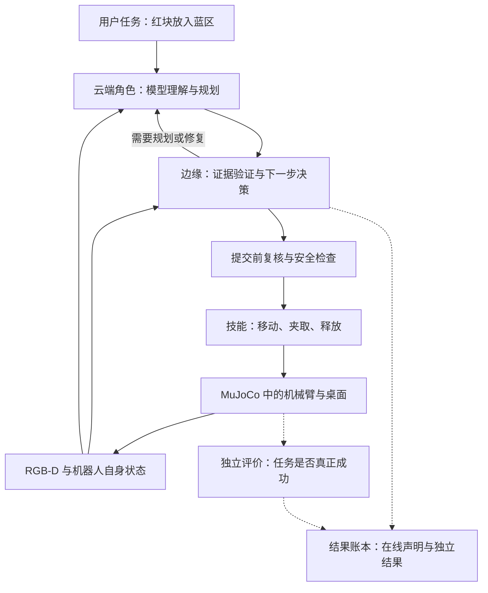

</details>

**读图方法：** 中间的环要反复运行，不能只走一次。独立评价器把结果写入实验账本，不向在线决策提供仿真答案。

### 2.2 第一批需要掌握的术语

| 术语 | 零基础解释 | 容易混淆的地方 |
|---|---|---|
| RGB | 普通彩色图像的红、绿、蓝三个通道 | 只有彩色图通常不能直接给出可靠的米制距离 |
| Depth / 深度 | 每个有效像素对应的距离信息；本项目用相机光轴方向的米制深度 | 彩色深度展示图用于看图，几何计算用原始深度数值 |
| VLM | 视觉语言模型，同时处理图片与文字 | 接收文字描述的语言模型，不能冒充实际看过图片 |
| MuJoCo | 用于计算机械臂运动、物体接触等现象的物理仿真工具 | 有仿真画面不等于任务通过物理执行完成 |
| API / 接口 | 两个程序交换输入和输出的约定 | 接口返回成功，需要说明是哪一层成功 |
| IK / 逆运动学 | 根据期望末端位置和姿态，求机械臂关节配置 | 求到关节配置，还需检查可达范围、路径和实际执行 |
| 状态机 | 规定任务有哪些状态，以及何时能从一个状态进入另一个 | 日志写“完成”不能代替进入完成状态所需的证据 |
| 技能 / Skill | 有明确参数和执行条件的动作单元，如抓取、放置 | 技能名字存在，不代表已经有物理执行证据 |
| Episode | 一次从初始场景开始、到结束的完整任务尝试 | 一次任务中的多张图片不能算多个独立任务 |
| 契约 / Contract | 说明任务、依据、条件、权限和效果的结构化记录 | 不是法律合同，也不代表检查通过后永远有效 |
| 基线 / Baseline | 用来公平比较的已有方法 | 应合理调参，不能故意挑弱配置 |
| 消融 / Ablation | 去掉一个机制，观察效果如何变化 | 用来判断提升是不是由该机制带来的 |
| 校准 / Calibration | 检查并修正风险分数与实际错误频率之间的对应关系 | 模型说“很有信心”不能直接代替校准 |
| 真值 / Ground truth | 仿真器或独立标注提供的参考答案 | 可用于离线标签、教师和评价；不能泄露给在线视觉决策 |
| 冻结 / Freeze | 锁定模型、参数、数据和规则的版本 | 正式测试后不能看结果再改规则、挑样本 |

<a id="section-3"></a>

## 3. 系统怎样从图片走到三维动作

### 3.1 为什么要同时用彩色与深度

彩色图帮助识别“哪个是红方块”；深度帮助计算“这个方块离相机多远”。相机标定则告诉程序，怎样把图像坐标转换成空间坐标。

图像里的像素 `(u, v)` 只是“第几列、第几行”。机械臂需要的是工作空间中的三维位置，通常用米表示。两者中间必须有可靠的转换。

### 图 2：从一个像素到一个动作


<details>
<summary>查看可编辑的 Mermaid 图示源码</summary>

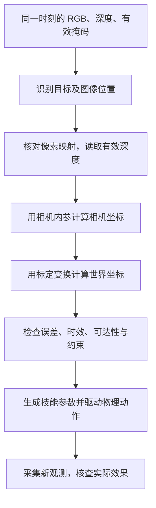

</details>

**读图方法：** 找到图片中的目标只是第二步。后面任何一步失效，都可能导致“看起来认对了，抓取却失败”。

若使用简化的针孔相机模型，已知光轴深度 `Z`，可以先理解：

```text
相机坐标 X = (u - cx) × Z / fx
相机坐标 Y = (v - cy) × Z / fy
相机坐标 Z = 该像素的有效深度
```

`fx、fy、cx、cy` 是相机内参。你暂时不必推导公式，只要知道：**像素、深度和内参必须匹配同一张图、同一分辨率。** 图片缩放了，像素位置或内参也要正确换算；标定错误会让后续几何整体偏移。

算出相机坐标后，还要转换到世界坐标。即使位置正确，也需考虑夹爪姿态、机械臂是否够得到、路径是否碰撞，以及目标在动作完成前会不会移动。

### 3.2 “同步”和“新观测”为什么重要

假如彩色图拍到方块在左边，深度图却来自方块移动后的时刻，两幅图单独看都正常，组合后可能得到错误位置。所以 RGB、深度和对应标签必须对齐。

动作完成后，也必须在**同一个仍在运行的场景**里重新采集。把场景重置后再拍一张照片，看到的是重置后的世界，不能用于证明刚才的动作成功。

准备到这一步，你应能解释：为什么“有照片”“模型识别正确”“三维定位正确”“抓取成功”需要分别验收。

<a id="section-4"></a>

## 4. 真正的执行闭环是什么

开环可以理解为“发出动作以后就认为做完了”。闭环要求执行后获得反馈，再根据反馈决定下一步。模型提出计划、技能函数返回成功，都只是闭环中的一个环节。

### 图 3：执行、验证和恢复如何连起来


<details>
<summary>查看可编辑的 Mermaid 图示源码</summary>

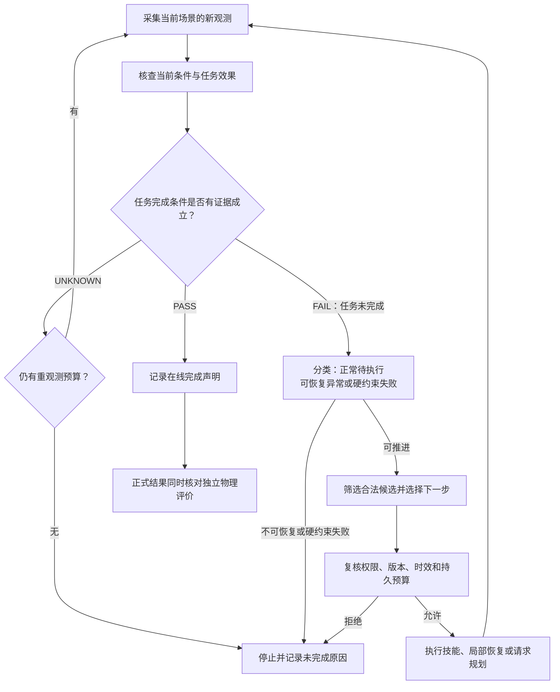

</details>

**读图方法：** “尚未完成”在任务开始时很正常，要继续执行；出现故障时才进入相应恢复。图中把部分失败处理合并显示，具体路由仍按正式设计实现。独立物理评价只决定实验记录是否算成功，不反向指导在线恢复。

### 4.1 三种验证结果

| 结果 | 含义 | 放置任务的例子 |
|---|---|---|
| PASS | 当前证据足以支持条件成立 | 在线证据支持物体已释放并稳定在目标区域 |
| FAIL | 当前证据明确否定条件 | 看得清楚，物体还在目标区域外 |
| UNKNOWN | 证据不够，暂时无法判断 | 目标被遮挡、深度缺失或时间戳不完整 |

UNKNOWN 不能当成成功，也不一定说明动作失败。系统应在允许的预算内重新观察；如果仍无法确认，就如实停止或报告未完成。

### 4.2 跟着一个任务走完整个环

以下是**预期行为示例，尚非已完成实验记录**：

| 时刻 | 发生什么 | 应怎样处理 |
|---|---|---|
| 1 | 看到红方块和蓝区 | 检查 RGB-D 是否同步、目标身份是否可靠 |
| 2 | 生成抓取及放置计划 | 绑定观测、计划版本和技能条件 |
| 3 | 执行抓取 | 经安全检查后驱动关节和夹爪，保留实际动作记录 |
| 4 | 抓取函数返回成功 | 采集新观测，进一步确认物体确实被抓起 |
| 5 | 蓝区位置发生变化 | 重新检查放置相关依赖，判断原计划是否仍可用 |
| 6 | 抓取效果仍成立，放置计划失效 | 保留抓取结果，修复受影响的运输与放置部分 |
| 7 | 新计划准备好了 | 核对边缘接受、激活和实际启动，不能直接记完成 |
| 8 | 放置后因遮挡而看不清 | 有限重观测；预算耗尽则记录未完成 |
| 9 | 在线证据确认完成 | 记录在线声明，独立评价另行核对物理结果 |

### 4.3 为什么要限制重试

重复拍照不一定获得新信息，重复规划也不一定让任务前进。系统因此要保存重观测次数、恢复次数、无进展次数和绝对截止时间。

预算应跨重启或同因事件延续。换一个事件编号、收到一张没有实质变化的新图，不能把预算重新归零。这样才能区分“仍在运行”和“正在有效推进”。

<a id="section-5"></a>

## 5. 创新一 C1：什么时候继续，什么时候求助

### 5.1 先理解三个已有比较对象

| 方法 | 直观做法 | 本项目怎样使用 |
|---|---|---|
| PCSC / B0 | 到了固定时间就进行云端监督 | 周期在验证集上合理选择，作为主要成本对照 |
| ETEAC / B1 | 风险或异常超过固定阈值才求助 | 检查新方法是否优于简单事件触发 |
| 规则 AUTO / B2 | 根据预先设定的规则选择协同方式 | 检查校准信息和新决策机制是否有额外价值 |

这些名字对应项目中的具体机制。记住各自“什么时候触发”，比背缩写更重要。

### 5.2 C1 拟增加什么

C1 联合考虑三个问题：

1. **不确定性：** 目前的信息有多不可靠？是识别不清、深度缺失，还是技能能力不足？
2. **时效：** 观测到现在过去多久，动作还要多久，目标可能移动多少？
3. **成本：** 重新拍照、本地恢复和请求云端各需多少时间与资源？

程序先生成合法候选，再在候选中选择下一步。候选通常包括继续执行、重观测、本地恢复、请求云端和停止；未实现的恢复能力不能提前列为可选。

### 图 4：C1 的决策顺序


<details>
<summary>查看可编辑的 Mermaid 图示源码</summary>

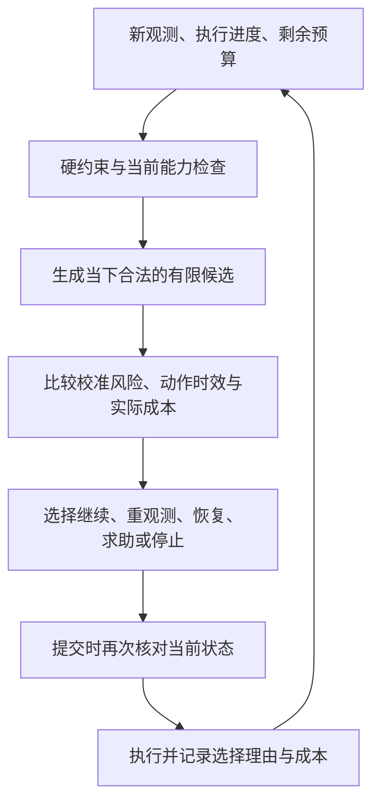

</details>

**读图方法：** 先确定哪些选择有资格执行，再比较哪个更合适。模型建议不能跳过安全检查，收到建议时也要检查现场是否已变化。

例如，只是深度短暂缺失，重新观察可能比完整重规划更有效；目标和动作条件都稳定，就可能继续已有技能；语义目标改变或现有技能无法满足任务时，才有理由增加云端参与。

这些例子说明决策逻辑，具体选择要由真实数据、校准结果和成本决定，不能预先写死为“永远优于云端”。

### 5.3 怎样解释“创新”，而非堆功能

研究增量在于：**让动作所需的证据质量和有效时间参与运行中的行动选择，并验证这种选择是否减少无效求助。** 要通过比较和消融判断收益来自不确定性、时效信息还是其他因素。

“接入了一个模型”“增加了一个选择按钮”只能说明实现了功能。C1 是否成立，要看 G2 的成本目标和成功、风险约束是否同时通过。

<a id="section-6"></a>

## 6. 创新二 C2：证据失效后，修复到什么范围才够

C2 包含两个相连的部分：用视觉证据限定动作权限；依据失效依赖选择恢复范围，再验证效果。

### 6.1 把契约理解为带条件的动作说明书

| 说明书上的问题 | 应记录什么 |
|---|---|
| 这是哪个任务的动作？ | 任务身份、计划版本、步骤序号 |
| 根据什么决定执行？ | 观测编号、采集时间、标定版本 |
| 证据还能支持动作多久？ | 几何误差界、目标运动界、预计动作时长 |
| 执行前必须成立什么？ | 目标可见、路径有效、夹爪状态等前置条件 |
| 做完后应看到什么？ | 抓起、释放、稳定放置等效果条件 |
| 哪些进度需要保留？ | 已完成且仍经复核成立的效果及其依赖 |

这是一份概念说明，具体字段和接口以路线图实现为准。哈希可以帮助检查版本一致性，但单靠哈希不能说明物体移动了几毫米，也不能证明信息来源可信。

### 6.2 为什么“照片还没超时”不代表能执行

可以把正式报告中的时效条件先理解成一个“误差预算”：

```text
当前几何误差上界
+ 目标速度上界 ×（照片已经过去的时间 + 动作预计持续时间）
≤ 当前动作允许的误差
```

**教学算例：** 假设误差上界为 3 mm，目标速度上界为 20 mm/s，照片年龄为 0.1 s，动作还需 0.2 s，则估计上界为 `3 + 20 × (0.1 + 0.2) = 9 mm`。若允许误差是 10 mm，这一项条件通过；若照片年龄增加到 0.3 s，则得到 13 mm，这一项条件不通过。

这只是帮助理解的假设计算，不是项目实测值。通过这一项也不能替代碰撞、可达性等检查。速度上界或深度无法可靠获得时，应输出 UNKNOWN，不能猜一个有利数字继续执行。

### 图 5：任务依赖与局部修复


<details>
<summary>查看可编辑的 Mermaid 图示源码</summary>

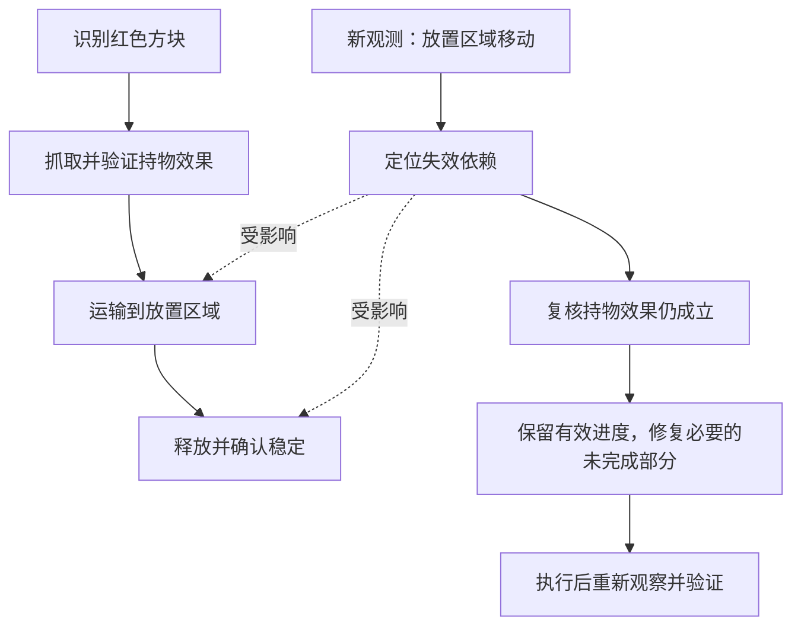

</details>

**读图方法：** 这里假设抓取效果仍被新证据支持。若物体已经掉落，抓取效果也失效，修复范围就必须扩大。“最小”表示依据当前依赖选择必要范围，不承诺全局最短轨迹。

### 6.3 修复建议、接受和成功是不同阶段

### 图 6：一次修复怎样才算真正闭环


<details>
<summary>查看可编辑的 Mermaid 图示源码</summary>

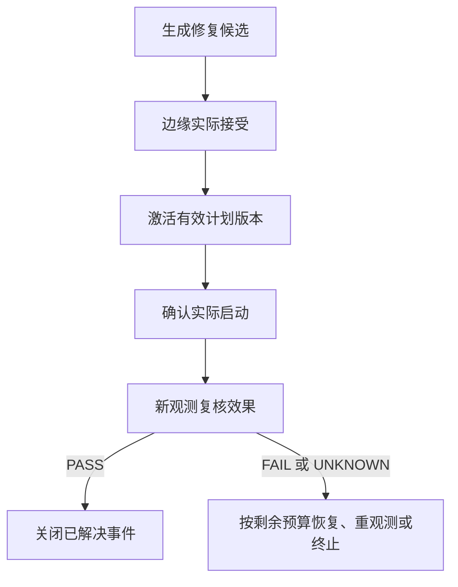

</details>

**读图方法：** 收到回执只能证明到达某个交接阶段，不能证明物体已经放好。干跑只检查规划或流程，不应产生真实执行回执或伪造状态切换。

公平对照 B4 也保护已完成效果。比较的是“重规划全部未完成任务”和“只修复必要的未完成部分”；不能让 B4 重做已完成的不可重复动作，从而人为制造优势。

<a id="section-7"></a>

## 7. Jev 的思路在这里起什么作用

当前报告借鉴的思路是：**整理结构化状态，提出范围明确的问题，由程序组合判断，并用实际反馈继续决策。**

比如，把“你觉得下一步怎么办”拆成：当前有哪些合法候选？证据是否足够？在这些候选中，哪一项更合适？每个问题都应有明确输入、输出类型和异常处理。

本项目拟先用规则和校准成本建立这一流程，再把 Jev 或其他判断模型作为可替换的提供者进行比较。模型拒答、超时或输出不合法时，程序仍要知道如何回退。

需要区分四种东西：规则打分、模型对候选的分布、自报信心、经实验校准的失败风险。它们含义不同，不能把“模型倾向某个选择”直接当成“动作有同样概率成功”。这一边界来自正式报告所引用的 [Jev 简介](https://docs.typesafe.ai/introduction)与[置信度说明](https://docs.typesafe.ai/confidence)。

先让提供者只给建议、不影响执行，称为影子比较；它可以检查建议质量，却不能证明任务收益。实际收益仍需在冻结配置下进行闭环实验，并计入全部远程判断请求和网络成本。

你在开题时可以说“借鉴其结构化判断与程序编排思路”，但核心创新仍然是 C1/C2。Jev 当前是可选扩展，尚无本项目接入收益证据。

<a id="section-8"></a>

## 8. 项目现在做到哪里了

**你从零学习，不等于工程从零开始。** 仓库已经有系统框架和部分验收证据；当前任务是理解、复用和补齐真实研究闭环。

| 内容 | 当前可支持的表述 | 仍需完成或证明的内容 |
|---|---|---|
| 系统基础 | 已有规划、边缘执行、安全检查、运行队列及工作台等基础 | 新方法完整集成及研究收益 |
| T1 来源审计、T2 同步采集 | 已完成对应阶段验收 | 动态场景及后续方法仍需分别验证 |
| RGB-D 平面采集 | 100 个桌面点反投影最大误差约 2.728 mm，满足该项 5 mm 门槛 | 不能据此宣称 G1 目标中心定位或抓放达标 |
| T6a 静态数据工厂 | 进行中；100 组数据已完成生成、校验、导出和重建，含 35 正例、65 负例；1000 组已生成 | 编写时 1000 组的独立校验、导出和重建仍在进行，全部验收尚未完成 |
| T3 本地视觉模型 | 就绪待推进，候选配置存在 | 真实双图调用、性能测量和模型冻结尚未接受 |
| T4/T5 物理技能与教师 | 有 MuJoCo 物理后端基础 | 研究要求的物理抓放、教师轨迹与独立评价尚待验收 |
| T7 及 C1/C2 | 方案、任务依赖与验收要求已明确 | 真实闭环、主方法和正式比较尚未完成 |
| 真实硬件 | 本轮研究不实施，当前未验证 | 仿真结果不能当成硬件性能结论 |

T6a 的状态来自较新的[当前交接](../../../docs/research/process/handover.md)及[进展记录](../../../artifacts/research/process/20261003-t6a/acceptance-progress.json)。后台任务会继续推进，本表只记录编写时快照；继续实施前请打开最新进展记录。较早路线图中“尚未开始”的文字不能覆盖已记录的后续进展；也不能因有生成文件就提前把 T6a 标为完成。

还要记住三种不同的“通过”：

```text
软件测试通过 → 说明被测代码行为符合相应检查
实际阶段验收 → 说明规定输入、模型或动作路径已经运行并满足该阶段要求
研究结论成立 → 需要公平对照、完整记录、统计分析和目标判定
```

旧实验的 5,580 条记录属于历史批次，full 验收仍未通过，不能放入新方法的物理评测分母。开题时应说明已有证据的用途和边界，避免把记录数量直接等同于研究成果。

<a id="section-9"></a>

## 9. 怎样证明“有提升”

### 9.1 对照、消融和先导分别做什么

**对照实验**回答“新方法和合理的旧方法相比怎么样”。相同任务、模型、初始场景、技能和约束下，只改变待比较机制。配对表示不同方法面对同一套预定条件，并不要求两条执行轨迹始终相同。

**消融实验**回答“提升来自哪里”。例如从完整 C1 中去掉不确定性信息，或者去掉时效信息，再看表现变化。

**先导实验**是正式比较前的小规模试运行。第一轮检查基础闭环和预算；完整方法冻结后的第二轮估计所需样本量。它们不并入正式测试结果，也不能无限用来挑有利参数。

| 对照编号 | 比较对象 | 用来检验什么 |
|---|---|---|
| B0 | 合理调参的周期云端监督 | C1 是否减少请求，并满足成功和风险约束 |
| B1 | 固定阈值事件触发 | C1 是否优于简单异常触发 |
| B2 | 冻结的规则 AUTO | C1 是否优于已有人工规则 |
| B3 | 时间有效期与确定性检查 | C2 的校准证据和动作时效是否改善门控 |
| B4 | 重规划全部未完成任务 | C2 是否在保留有效进度时更高效地恢复 |
| B5 | 均匀域随机化数据 | 可选定向采样是否有额外训练收益 |

### 9.2 量化目标怎样读

下表为学习摘要，统计细则以正式报告第四、八章及研究设计为准。**这些都是预注册目标，不是目前已经达到的性能。**

| 目标 | 要验证的内容 | 主要门槛 |
|---|---|---|
| G0 真实性 | 发生的阶段是否实际走了规定路径 | 已发生的感知、模型和动作阶段全部真实可审计；泄露、伪装成功、跨集合组重复为 0 |
| G1 基础能力 | 能否定位并完成基本任务 | 定位误差 P90 ≤10 mm；标称静态任务成功率点估计 ≥90% |
| G2 / C1 | 是否值得改变云边决策方式 | 对 B0 云请求均值降低 ≥30%，同时通过成功率和物理风险非劣检验 |
| G2a 次级 | 通信量和较慢任务是否改善 | 字节均值降低 ≥25%；失败惩罚任务耗时 P95 降低 ≥15%，分别报告 |
| G3 / C2 | 是否更少错误放行动作 | 对 B3 误放行相对降低 ≥50%，绝对误放行 ≤2%，错误拒绝 ≤5% |
| G4 / C2 | 出错后是否有效恢复 | 200 个冻结故障任务中恢复成功 ≥80%；对 B4 惩罚恢复耗时中位数降低 ≥30%；已完成不可重复动作重复提交为 0 |
| G5 扩展 | 定向数据是否改善域外表现 | 同为 2000 个训练组时，域外成功率相对均匀采样提高 ≥5 个百分点 |

G1 的定位点与独立标注的平顶刚性块顶部几何中心比较，计算三维距离误差；只对正确识别且深度有效的目标统计，因此还要报告识别覆盖率和无效深度拒绝率。只留下容易样本，可能让定位数字好看，却不能证明整体感知可靠。

G2 的成功率非劣条件是“新方法减基线”的成功率差，一侧 95% 置信下界严格大于 −3 个百分点；物理违规率差的一侧 95% 上界不超过 +1 个百分点。还需按预定规则处理多重检验。**没有显著差异不等于已经证明非劣。**

先过 G0/G1 的基础门槛，再验收主方法。C1 需要 G2 同时满足成本、成功和风险要求；C2 需要 G3 与 G4 都通过。次级指标或可选扩展表现良好，不能替代主目标。

### 9.3 四个常见数字，用假设例子理解

- **相对降低 30%：** 假设 B0 每任务平均请求 10 次，新方法为 7 次，则 `(10−7)/10 = 30%`。仍要验证成功和风险条件，不能只看省下三次。
- **提高 5 个百分点：** 假设成功率从 80% 到 85%，这是增加 5 个百分点；相对提升为 `5/80 = 6.25%`。两种说法不能互换。
- **P90 / P95：** 把数值排序后，观察约 90% 或 95% 样本不超过的水平。它们关心较差或较慢一端的表现，与平均值不同。
- **误放行率：** 假设 100 个无效机会里错误放行 2 次，误放行率是 2%。分母是无效机会；错误拒绝率则以有效且安全的机会为分母，UNKNOWN 独立记录。

置信区间用于表达有限样本估计的不确定性。开题阶段先理解“点估计好看还不够”，再学习具体区间与配对检验。基线为零时，相对降幅没有定义，应记 N/A 并报告绝对值。

### 9.4 哪些记录不能被删掉

主成功率使用全部预分配任务作分母，包括超时、模型错误、安全停止和基础设施阻塞；可运行子集可以另报。云端的规划、监督和判断调用，以及失败、超时、重试请求都要计入成本。

如果只统计成功任务的耗时，一个“很快失败”的方法可能显得更快。因此主评价采用预先确定的失败惩罚：任务失败赋统一任务截止值，恢复失败按固定 60 秒计入惩罚恢复耗时。成功任务原始耗时另外报告。

正式主比较每方法从 600、1200、1800、2400 个独立场景中按功效规则选择 N；G4 另有 200 个恢复故障任务。不是把几千张相邻视频帧当成几千次独立实验，也不能运行到结果显著才停止。

<a id="section-10"></a>

## 10. 数据从哪里来，怎样避免“提前看答案”

### 10.1 四类数据的作用

| 数据 | 可以用来做什么 | 不能直接推出什么 |
|---|---|---|
| 静态 RGB-D 与离线标签 | 检查图像、几何、场景分组和感知输入 | 不能说明机械臂已经抓取成功 |
| 物理教师轨迹 | 保存实际驱动和接触过程，提供可核查动作示范 | 不能把技能模板名称当成已执行轨迹 |
| 风险与校准数据 | 学习轻量失败风险，校准误差或风险估计 | 不能把模型自报信心直接当真实概率 |
| 冻结测试与故障数据 | 公平评估最终方法与恢复能力 | 不能反过来调参数、挑训练薄弱点 |

基础 VLM 在当前研究中固定，主要训练轻量风险与恢复决策模块。你需要先理解“调用模型做推理”和“用数据修改模型参数做训练”的区别，暂时不需要从头训练通用视觉语言模型。

### 图 7：数据分组与独立评价


<details>
<summary>查看可编辑的 Mermaid 图示源码</summary>

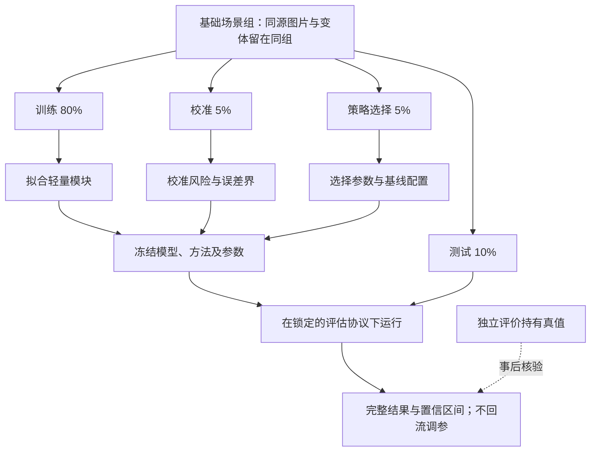

</details>

**读图方法：** 图中四个分支表示感知数据的隔离原则。正式主比较候选池、两轮先导、200 个恢复故障和域外集合还要另行建立互斥清单，不能把这个 10% 测试分支直接当作全部正式实验。

假设有 1000 个独立基础场景组，对应 800 训练、50 校准、50 策略选择、100 测试。这里的数字只是比例示意；当前 1000 组是否完成，仍以最新验收记录为准。

同一个场景换一段任务文字、截取不同视频帧或产生修复轨迹，仍可能属于同一来源组。若它们分别进入训练和测试，模型可能“见过相近答案”，测试结果就会偏乐观。

“域随机化”指改变物体、摩擦、光照、噪声或遮挡等条件，让开发与评价覆盖变化；“域外”指预先规定、没有用于训练的条件。配置文件写了某个扰动，还要核查它是否真正作用于物理状态或图像。

<a id="section-11"></a>

## 11. 零基础先准备什么

### 11.1 按学习依赖准备，不必同时攻克所有技术

### 图 8：个人学习顺序


<details>
<summary>查看可编辑的 Mermaid 图示源码</summary>

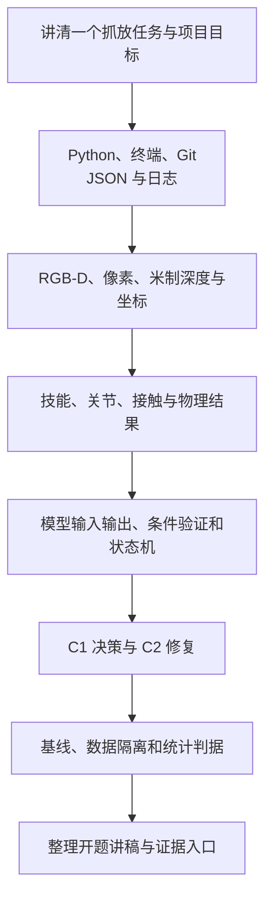

</details>

**读图方法：** 每完成一层，都留下一个小成果。重点是能解释并核查系统，而非先背完所有概念。

| 准备模块 | 学到什么程度即可进入下一步 | 自己留下的成果 |
|---|---|---|
| 项目全景 | 不看文稿，用自己的话讲清任务、分工、C1/C2 和当前边界 | 一页项目说明与自己画的系统图 |
| Python 与工程工具 | 能读函数、字典、异常、类型提示和 JSON；会查看差异与测试输出 | 对一份验收 JSON 的逐项中文注释 |
| 图像与几何 | 能区分像素、深度、相机坐标和世界坐标，理解单位与标定 | 一次假设反投影计算及检查清单 |
| 物理动作 | 能区分位置目标、关节驱动、物体接触和成功判定 | 一张抓取各阶段及其证据表 |
| 模型与接口 | 能说明图片如何提交、输出如何解析、失败如何记录 | 一组合法输出与非法输出的教学例子 |
| 闭环与状态机 | 能解释 PASS/FAIL/UNKNOWN，画出失败后回到哪里 | 第 4 节案例的手工事件时间线 |
| 研究评价 | 会算均值、比例和相对降幅，理解配对、区间与非劣 | 一页指标字典：名称、分子、分母、目标 |

后续再深入逆运动学、控制器、校准算法、配对统计和具体代码实现。Isaac、ROS 2 细节、缓存扩展与可选判断模型，可以等主闭环理解清楚后再展开。

### 11.2 环境与资料要准备成清单

| 准备项 | 现在先做什么 |
|---|---|
| 项目与 Python 环境 | 确认仓库根目录和已有虚拟环境，记录版本；沿用仓库配置 |
| 计算与存储 | 记录 CPU、内存、GPU、显存、空闲磁盘；后续按先导实测确定规模 |
| 模型 | 明确候选、运行服务、输入方式及待测延迟；未经 T3 验收不称已可用 |
| 仿真 | 先理解并使用主线 MuJoCo，区分渲染可用与物理任务可用 |
| 数据 | 从已验收的 100 组示例开始阅读，确认来源、划分和质量报告 |
| 学术材料 | 核对学校开题模板、研究问题、图表及参考文献的要求 |
| 学习记录 | 每次记录“看了什么、理解了什么、证据在哪里、还有什么疑问” |

当前准备阶段可以复用已有工程与仿真环境。是否需要扩充设备，应依据模型和先导的实际资源测量决定。

### 11.3 可以直接执行的七次学习安排

这里按“次”组织，每次完成相应成果再继续，不要求固定一天学完。

1. **第一次：讲清任务。** 阅读第 1—2 节，画出五个角色，录一段一分钟介绍。
2. **第二次：看懂一条数据。** 打开现有数据质量报告，解释 RGB、深度、标定、分组和有效性分别是什么。
3. **第三次：区分四种成功。** 分别写出“解析成功、技能返回成功、在线完成、独立物理成功”的证据要求。
4. **第四次：手工跑一次闭环。** 用第 4 节的九个时刻演示 PASS/FAIL/UNKNOWN 和预算，不需要先跑模型。
5. **第五次：比较两项创新。** 用一页纸分别写出旧方法、新机制、预计收益和验证方法。
6. **第六次：算指标。** 用假设数字计算相对降幅、百分点和错误率，明确例子不是实验结果。
7. **第七次：模拟开题。** 按第 14 节讲述，把答不清的问题对应到章节、代码或证据文件继续查。

<a id="section-12"></a>

## 12. 整个开发项目怎样推进

个人学习顺序和代理开发队列不是一回事。你可以从零学习，但实现应接续已有验收；研究材料中的十二周安排用于资源规划，实际开发按依赖推进。

### 图 9：从当前基础到正式研究结论


<details>
<summary>查看可编辑的 Mermaid 图示源码</summary>

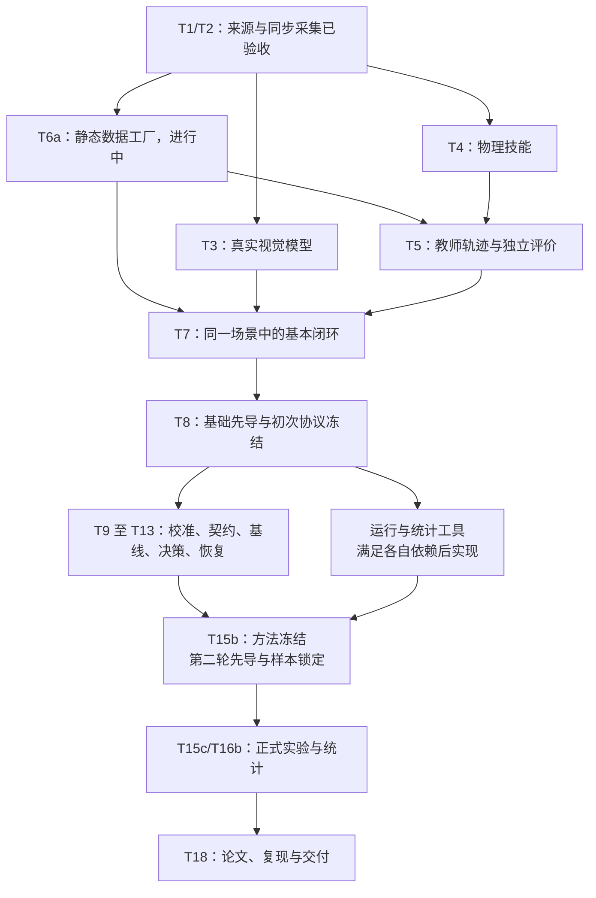

</details>

**读图方法：** 这是核心依赖的简图，详细子项仍看路线图。工具分支内部也有前置条件，并非 T8 一完成所有工具即可同时开工。数据与结果界面按各自依赖推进，不作为正式实验的前置门槛。T6b 全量数据等待教师和基础先导；G5、Isaac、缓存及 Jev 扩展单独安排。

| 阶段 | 你要能回答的问题 | 应看到的主要证据 |
|---|---|---|
| 数据与模型 | 系统真的收到了同一场景的图片吗？模型真的看图了吗？ | 原始 RGB-D、时间与标定、实际请求及模型配置 |
| 物理技能 | 物体因执行动作而变化，还是被程序直接改了位置？ | 驱动、步进、接触、提升与释放记录 |
| 基础闭环 | 动作后是否在同一 episode 得到新反馈？ | 连续观测、三值判断、成功与失败路由 |
| 两项方法 | 选择依据和修复范围是否符合设计？ | 决策输入、合法候选、证据依赖、恢复预算与交接事件 |
| 正式实验 | 方法是否公平面对相同条件？失败有没有保留？ | 冻结协议、配对清单、完整任务与成本账本 |
| 成果交付 | 别人能否从原始记录重建结论？ | 分析脚本、版本摘要、指标与图表来源 |

模型暂时不可用时，独立的数据和物理分支仍可推进。基本闭环没完成时，应优先补齐闭环；不能靠增加可选模块代替核心验收。

<a id="section-13"></a>

## 13. 第一次打开仓库，按什么顺序看

### 13.1 先看文档，再沿一条数据链读代码

1. [当前交接](../../../docs/research/process/handover.md)：知道最新进度和下一步。
2. [开题报告第九章](开题报告.md)：知道为什么要研究，而非只看功能清单。
3. [研究设计](../../../docs/superpowers/specs/2026-10-03-rgbd-evidence-research-design.md)：知道目标、对照和分母怎样定义。
4. [执行路线图](../../../docs/superpowers/plans/2026-10-03-rgbd-evidence-research-roadmap.md)：把研究问题对应到任务和验收。
5. [100 组数据质量结果](../../../artifacts/research/process/20261003-t6a/smoke-validate.json)：接触一个已经有证据的具体产物。

早期说明材料保留了旧阶段的统计和范围。准备当前开题时，以本次报告、研究设计及对应时间的验收记录为依据；不要混用不同批次的数字。

### 13.2 代码地图

下列是已经存在的入口，便于阅读；目录或类存在，不等于路线图中新增行为已经验收。

| 想了解什么 | 从哪个入口看 |
|---|---|
| 图像、深度及观测结构 | [vision/observations.py](../../../src/cloud_edge_robot_arm/vision/observations.py) |
| 实际观测采集 | [vision/capture.py](../../../src/cloud_edge_robot_arm/vision/capture.py) |
| 视觉模型如何进入规划 | [vision/planner.py](../../../src/cloud_edge_robot_arm/vision/planner.py) |
| 静态场景及数据工厂 | [datasets/rgbd](../../../src/cloud_edge_robot_arm/datasets/rgbd/) |
| 高层规划流程 | [cloud/planning/pipeline.py](../../../src/cloud_edge_robot_arm/cloud/planning/pipeline.py) |
| 任务执行与条件判断 | [task_executor.py](../../../src/cloud_edge_robot_arm/edge/runtime/task_executor.py)、[condition_evaluator.py](../../../src/cloud_edge_robot_arm/edge/runtime/condition_evaluator.py) |
| 动作如何经过安全检查 | [edge/safety/shield.py](../../../src/cloud_edge_robot_arm/edge/safety/shield.py) |
| 仿真动作如何进入后端 | [simulation/mujoco/backend.py](../../../src/cloud_edge_robot_arm/simulation/mujoco/backend.py) |
| 实验作业怎样排队和运行 | [simulation_runtime](../../../src/cloud_edge_robot_arm/simulation_runtime/) |

读每个模块时只问四件事：输入是什么？输出是什么？失败怎样表示？它的结果怎样被下一步验证？遇到不熟悉的实现细节先做标记，沿数据链继续走。

### 13.3 初次阅读时可用的命令

以下命令在项目根目录执行，使用当前已有 `.venv`；它们用于查看，不生成数据、不调用模型、不启动机械臂。若迁移到新环境，先按仓库的环境说明完成配置。

```bash
# 确认所在目录及已有改动
pwd
git status --short

# 阅读当前交接与阶段进度
sed -n '1,100p' docs/research/process/handover.md
cat artifacts/research/process/20261003-t6a/acceptance-progress.json

# 看一份实际数据质量报告
cat artifacts/research/process/20261003-t6a/smoke-validate.json

# 查看数据校验脚本的参数说明
.venv/bin/python scripts/validate_rgbd_dataset.py --help
```

先看报告和已有数据，再决定是否需要生成新的数据。实际生成、导出和重建的命令见当前交接，使用前确认输出目录和正在运行的任务，避免覆盖证据或重复占用渲染资源。

<a id="section-14"></a>

## 14. 怎样把正式报告讲给别人听

### 14.1 十一章分别回答什么

| 正式报告章节 | 用一句话理解 | 你应准备的讲解材料 |
|---|---|---|
| 一、背景与意义 | 为什么机械臂需要这种云边协作？ | 网络延迟、观测失效与任务成本的具体例子 |
| 二、相关研究 | 别人已做什么，本课题从哪里继续？ | 相关方向、已有方法及明确的比较边界 |
| 三、项目现状 | 当前有哪些可靠基础？ | 最新状态表与可以打开的验收文件 |
| 四、目标与假设 | 到什么程度才算研究目标通过？ | G0—G5 的目标、分母和成立条件 |
| 五、建模边界 | 系统中的时间、状态和权限如何定义？ | 观测年龄、执行节奏和角色分工 |
| 六、方法方案 | C1/C2 怎样在系统中工作？ | 本文图 3—6 与一个完整案例 |
| 七、数据与仿真 | 数据怎么产生、隔离和核验？ | 数据流程、真值使用范围、仿真边界 |
| 八、实验设计 | 怎样公平、可信地比较？ | 基线、消融、配对、先导和冻结流程 |
| 九、创新与评价 | 新机制有什么预期增量？ | 两项创新各一张“问题—机制—证据”卡片 |
| 十、可行性与风险 | 做不出来或资源不足时如何处理？ | 已有基础、关键缺口、主线与可选扩展 |
| 十一、计划与成果 | 怎样推进，最后交付什么？ | 核心依赖图、阶段产物和复现清单 |

学习文献时，为每篇记录五项：研究问题、输入输出、主要机制、证据范围、与 C1/C2 的关系。先围绕云边协同、感知不确定性、运行时验证和恢复这几条主线阅读；引用来自正式报告，不把别人论文的性能当成本项目成绩。

### 14.2 一次五分钟讲解可以这样组织

- **前 45 秒：问题。** 用红方块任务说明为什么执行中需要再观察、再判断。
- **接下来 45 秒：系统。** 展示图 1，说明视觉、模型、边缘和物理执行的分工。
- **接下来 90 秒：创新。** C1 讲“何时求助”，C2 讲“证据失效后修复哪里、怎样验收”。
- **接下来 60 秒：实验。** 讲 B0/B3/B4、主要目标及公平性条件。
- **最后 60 秒：基础与计划。** 明确当前验收到哪里、关键缺口是什么、下一步如何推进。

这是个人练习节奏，学校的正式时长与模板优先。每个大数字都应能解释它的分母、来源和性质：实测事实、预期目标，还是教学例子。

### 14.3 常见问题的准备要点

**“你的创新是不是把大模型和机械臂接起来？”**

回答应落到两项机制：利用校准感知风险与动作时效进行运行中决策；利用视觉证据依赖选择局部修复，并验证效果。接入能力是研究基础，创新成立还需要公平对照与消融。

**“为什么不让大模型一直控制？”**

说明本课题采用分层职责，让模型处理理解与规划，让现场程序负责约束检查和执行。不同分工是否节省成本、影响任务表现，需要通过实验比较；不宜笼统否定所有端到端方法。

**“少调用云端会不会只是因为少干活？”**

说明请求均值按全部分配任务计算，并与成功率、物理风险条件一起验收；超时、失败和阻塞都保留。G2 不能仅凭调用减少就通过。

**“局部修复为什么一定比完整重规划好？”**

目前不能说一定更好。研究假设是在部分证据失效、已有有效进度可保留时，缩小修复范围可能改善恢复耗时；需要在固定故障集合中与 B4 比较，也报告无收益或适用条件受限的结果。

**“模型说动作成功，为什么还要独立评价？”**

因为程序可能误判完成。在线系统应依靠允许获得的观测作判断，独立评价则事后核查实际物理效果，两者同时通过才计正式成功。

**“全部在仿真里做，能说明什么？”**

可以研究受控条件下的机制效果、任务恢复和成本变化，并提高复现性。当前结论限定于已验证仿真条件；真实硬件性能和安全仍需后续独立验证，跨仿真器比较也不能直接等同真机迁移。

**“现在有多少成果？”**

按第 8 节分别说明系统基础、同步采集验收、T6a 进行中的数据工作，以及仍待完成的真实模型、物理技能和正式方法实验。不要把旧记录数或软件测试数当新方法的成功任务数。

<a id="section-15"></a>

## 15. 开题前自己的检查清单

### 理解层

- [ ] 能不用缩写讲清任务、云边分工和当前研究范围。
- [ ] 能解释 RGB 与深度为什么必须同步，动作后为什么要新观测。
- [ ] 能区分模型输出、技能返回、在线完成与独立物理成功。
- [ ] 能用同一个例子解释 C1 和 C2，各自指出比较对象。
- [ ] 能解释 UNKNOWN、恢复预算和已完成效果保护。

### 证据层

- [ ] 能打开最新验收与进展记录，说明 T1/T2、T6a、T3/T4 的不同状态。
- [ ] 知道 2.728 mm 对应平面采集检查，不能替代目标定位或抓放结果。
- [ ] 把所有数字标清为已有事实、研究目标或教学算例。
- [ ] 能说明正式成功率、误放行率、错误拒绝率分别用什么分母。
- [ ] 知道哪些数据允许训练，哪些必须冻结为独立评价。

### 表达与实施准备层

- [ ] 已准备一页全景图、两项创新卡片和一份当前状态表。
- [ ] 能讲清主线依赖，以及为什么真实闭环优先于可选扩展。
- [ ] 已确认本机环境、资料入口和学校开题要求。
- [ ] 关键结论均能回到正文、研究设计或原始证据文件。
- [ ] 遇到答不清的问题，能记录具体缺口并找到对应章节继续学习。

这份清单用于确认你能理解和讨论项目，不要求开题前完成所有研究实验。开始实施后，再用路线图中的逐项验收要求判断工程是否完成。

## 资料入口与更新方式

| 资料 | 用途 |
|---|---|
| [正式开题报告](开题报告.md) | 学术论证、方法与实验设计全文 |
| [创新与闭环修订说明](20261003创新与闭环修订说明.md) | 本次报告为何调整、重点在哪里 |
| [研究设计与量化目标](../../../docs/superpowers/specs/2026-10-03-rgbd-evidence-research-design.md) | 目标与统计规则的统一依据 |
| [开发执行计划](../../../docs/superpowers/plans/2026-10-03-rgbd-evidence-research-roadmap.md) | 任务依赖、接口及验收步骤 |
| [当前权威状态](../../../docs/current_authoritative_status.md) | 已接受能力与历史证据边界 |
| [当前交接](../../../docs/research/process/handover.md) | 新进展、当前阻塞和下一批工作 |
| [T2 增补验收](../../../artifacts/research/process/20261003-phase1/t2-resume/acceptance.json) | 同步采集的补充检查与记录 |
| [T6a 当前进展](../../../artifacts/research/process/20261003-t6a/acceptance-progress.json) | 静态数据工厂本次状态依据 |

后续更新本说明时，先核对验收时间与范围，再改第 8 节状态；研究目标变化需同步正式研究设计。新文件出现、日志打印成功或代码测试通过，都不能单独替代相应任务的验收。
